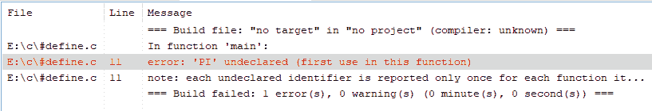

# #用 C 语言定义 vs # undef】

> 原文:[https://www . geesforgeks . org/define-vs-undf-in-c 语言/](https://www.geeksforgeeks.org/define-vs-undef-in-c-language/)

在本文中，我们将讨论 [C 语言](https://www.geeksforgeeks.org/c-language-set-1-introduction/)中 **#define** 和**# unde**预处理器的区别。

**预处理器:**

*   [预处理器](https://www.geeksforgeeks.org/cc-preprocessors/)是在编译之前执行的程序。
*   只注意到 **#** 开始语句。
*   **#** 称为预处理器指令。
*   每个预处理指令必须在自己的行上。
*   #之后的单词称为预处理器命令。

**#定义:**

[#define](https://www.geeksforgeeks.org/typedef-versus-define-c/) 指令定义了一个标识符和一个字符序列(一组字符)，每次在源文件中遇到该标识符时，它将被替换。

**语法:**

> #定义宏名字符序列。
> 标识符称为宏名，替换过程称为宏替换。

**示例:**

> #在此定义 PI 3.14
> 。PI 是宏名，3.14 是字符序列。

**程序 1:**

下面是演示#define 用法的 C 程序:

## C

```cpp
// C program illustrating the use of
// #define
#include <stdio.h>
#define PI 3.14

// Driver Code
int main()
{
    int r = 4;
    float a;

    a = PI * r * r;
    printf("area of circle is %f", a);

    return 0;
}
```

**Output:**

```cpp
area of circle is 50.240002

```

**说明:**

*   在这个例子中，PI 是宏名，字符序列是 3.14。
*   当程序运行时，编译器将首先检查#define 命令，并将 PI 指定为 3.14。
*   现在在整个程序中，只要编译器看到 **PI** 这个词，它就会用 **3.14** 来代替它。

**程序 2:**

下面是用#define 打印两个数字的 C 程序产品:

## C

```cpp
// C program to find the product of
// two numbers using #define

#include <stdio.h>
#define PRODUCT(a, b) a* b

// Driver Code
int main()
{
    printf("product of a and b is "
           "%d",
           PRODUCT(3, 4));

    return 0;
}
```

**Output:**

```cpp
product of a and b is 12

```

**说明:**

*   在本例中，定义了一个宏名作为乘积，并将两个参数作为 **a** 和 **b** 传递，并给出了作为这两个参数乘积的字符序列。
*   当编译器在 print 语句中看到[宏](https://www.geeksforgeeks.org/macros-and-its-types-in-c-cpp/)名称时，它会用 a 和 b 的乘积替换宏名称，并给出作为它们乘积的答案。

**#undef：**

**# unde**预处理器指令用于未定义的宏。

**语法:**

> # undef 宏名称

**程序 3:**

下面是 C 程序来说明**# unde**在程序中的使用:

## C

```cpp
// C program to illustrate the use
// of #undef in a program
#include <stdio.h>
#define PI 3.14
#undef PI

// Driver Code
int main()
{
    int r = 6;
    float a;
    a = PI * r * r;

    printf("area of circle is %f", a);

    return 0;
}
```

**输出:**



**说明:**在本例中，当使用 **#undef** 时，将删除 **#define** 命令，宏将变得未定义，编译器将显示错误。