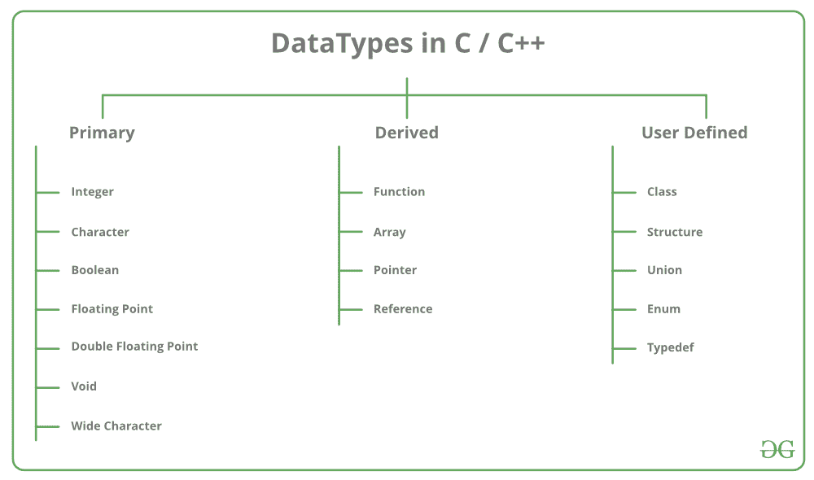

# c++中的派生数据类型

> 原文:[https://www.geeksforgeeks.org/derived-data-types-in-c/](https://www.geeksforgeeks.org/derived-data-types-in-c/)

**数据类型**是识别数据类型和处理数据的相关操作的手段。有三种数据类型:

1.  [预定义数据类型](https://www.geeksforgeeks.org/c-data-types/)
2.  派生数据类型
3.  [用户定义的数据类型](https://www.geeksforgeeks.org/user-defined-derived-data-types-in-c/)

[](https://media.geeksforgeeks.org/wp-content/cdn-uploads/20191113121619/DatatypesInC1.png) 
本文对派生数据类型进行了解释:

### 派生数据类型

从基元或内置数据类型派生的数据类型称为派生数据类型。这些可以是四种类型，即:

*   [功能](https://www.geeksforgeeks.org/functions-in-c/)
*   [阵列](https://www.geeksforgeeks.org/arrays-in-c-cpp/)
*   [指针](https://www.geeksforgeeks.org/pointers-c-examples/)
*   [参考文献](https://www.geeksforgeeks.org/references-in-c/)

让我们简要了解以下每个派生数据类型:

1.  **[Function:](https://www.geeksforgeeks.org/functions-in-c/)** A function is a block of code or program-segment that is defined to perform a specific well-defined task. A function is generally defined to save the user from writing the same lines of code again and again for the same input. All the lines of code are put together inside a single function and this can be called anywhere required. main() is a default function that is defined in every program of C++.

    **语法:**

    ```
    FunctionType FunctionName(parameters)
    ```

    **示例:**

    ```
    // C++ program to demonstrate
    // Function Derived Type

    #include <iostream>
    using namespace std;

    // max here is a function derived type
    int max(int x, int y)
    {
        if (x > y)
            return x;
        else
            return y;
    }

    // main is the default function derived type
    int main()
    {
        int a = 10, b = 20;

        // Calling above function to
        // find max of 'a' and 'b'
        int m = max(a, b);

        cout << "m is " << m;
        return 0;
    }
    ```

    **Output:**

    ```
    m is 20

    ```

2.  **[Array:](https://www.geeksforgeeks.org/arrays-in-c-cpp/)** An array is a collection of items stored at continuous memory locations. The idea of array is to represent many instances in one variable.
    

    **语法:**

    ```
    DataType ArrayName[size_of_array];
    ```

    **示例:**

    ```
    // C++ program to demonstrate
    // Array Derived Type

    #include <iostream>
    using namespace std;
    int main()
    {

        // Array Derived Type
        int arr[5];
        arr[0] = 5;
        arr[2] = -10;

        // this is same as arr[1] = 2
        arr[3 / 2] = 2;

        arr[3] = arr[0];

        cout<<arr[0]<<" "<<arr[1]<<" "<<arr[2]<<" "<<arr[3];

        return 0;
    }
    ```

    **Output:**

    ```
    5 2 -10 5

    ```

3.  **[Pointers:](https://www.geeksforgeeks.org/pointers-c-examples/)** Pointers are symbolic representation of addresses. They enable programs to simulate call-by-reference as well as to create and manipulate dynamic data structures. It’s general declaration in C/C++ has the format:

    **语法:**

    ```
    datatype *var_name;
    ```

    **示例:**

    ```
    int *ptr;   

    ptr points to an address
    which holds int data
    ```

    **示例:**

    ```
    // C++ program to illustrate
    // Pointers Derived Type

    #include <bits/stdc++.h>
    using namespace std;

    void geeks()
    {
        int var = 20;

        // Pointers Derived Type
        // declare pointer variable
        int* ptr;

        // note that data type of ptr
        // and var must be same
        ptr = &var;

        // assign the address of a variable
        // to a pointer
        cout << "Value at ptr = "
             << ptr << "\n";
        cout << "Value at var = "
             << var << "\n";
        cout << "Value at *ptr = "
             << *ptr << "\n";
    }

    // Driver program
    int main()
    {
        geeks();
    }
    ```

    **Output:**

    ```
    Value at ptr = 0x7ffc10d7fd5c
    Value at var = 20
    Value at *ptr = 20

    ```

4.  [**Reference:**](https://www.geeksforgeeks.org/references-in-c/) When a variable is declared as reference, it becomes an alternative name for an existing variable. A variable can be declared as reference by putting ‘&’ in the declaration.

    **示例:**

    ```
    // C++ program to illustrate
    // Reference Derived Type

    #include <iostream>
    using namespace std;

    int main()
    {
        int x = 10;

        // Reference Derived Type
        // ref is a reference to x.
        int& ref = x;

        // Value of x is now changed to 20
        ref = 20;
        cout << "x = " << x << endl;

        // Value of x is now changed to 30
        x = 30;
        cout << "ref = " << ref << endl;

        return 0;
    }
    ```

    **Output:**

    ```
    x = 20
    ref = 30

    ```