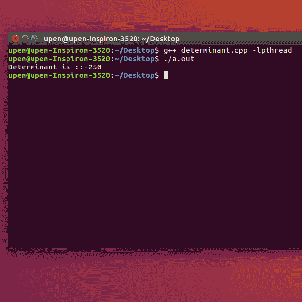

# 使用多线程的 N×N 矩阵的行列式

> 原文:[https://www . geesforgeks . org/行列式-n-x-n-矩阵-使用-多线程/](https://www.geeksforgeeks.org/determinant-n-x-n-matrix-using-multi-threading/)

给定一个 N×N 的矩阵，任务是使用多线程找到矩阵的行列式。

**示例:**

```cpp
Input : mat = {{0, 4, 0, -3},
               {1, 1, 5, 2},
               {1, -2, 0, 6},
               { 3, 0, 0, 1}}
Output : -250

Input :  mat = {{1, 0, 2, -1},
                {3, 0, 0, 5},
                {2, 1, 4, -3},
                {1, 0, 5, 0}}
Output: 30
```

**方法:**
众所周知，求一个矩阵的行列式的时间是非常昂贵的。因此，并行计算可能会导致成本相对较低的程序。一个代码可以使用线程并行化，这是一个轻量级的过程，将一个单流程序分成多个流程序。至于求矩阵的行列式，先求矩阵的子矩阵的行列式，把求子矩阵行列式的任务分配给线程，这些线程会并行运行，导致时间执行时间比顺序法少。

**注意:**代码是 Linux 特有的。

## C++

```cpp
// CPP program for finding determinant matrix
// with parallelizing the code
#include <iostream>
#include <vector>
#include <pthread.h>
#define size 4

using namespace std;

// matrix whose's determinant is required
int mat[][size] = { { 0, 4, 0, -3 },
                    { 1, 1, 5, 2 },
                    { 1, -2, 0, 6 },
                    { 3, 0, 0, 1 } };
int det[size];

// declaring variable for storing thread id
pthread_t thread[size];

// function for finding determinant
int determinant(vector<vector<int> > mat2, int s)
{

    if (s == 2) {

        // if size of matrix is 2X2
        // then returning the determinant
        return mat2[0][0] * mat2[1][1] -
               mat2[0][1] * mat2[1][0];
    }
    else {

        // else dividing the matrix in smaller part.
        vector<vector<int> > mat1(s - 1),
                      mat3(s - 1), mat4(s - 1);
        int k, l, m, i, j;

        for (i = 0; i < s - 1; i++) {
            mat1[i] = vector<int>(s - 1);
            mat3[i] = vector<int>(s - 1);
            mat4[i] = vector<int>(s - 1);
        }

        for (i = 1; i < s; i++) {
            k = 0;
            l = 0;
            m = 0;
            for (j = 0; j < s; j++) {
                if (j != 0) {
                    mat1[i - 1][k] = mat2[i][j];
                    k++;
                }
                if (j != 1) {
                    mat3[i - 1][l] = mat2[i][j];
                    l++;
                }
                if (j != 2) {
                    mat4[i - 1][m] = mat2[i][j];
                    m++;
                }
            }
        }

        return mat2[0][0] * determinant(mat1, s - 1) -
               mat2[0][1] * determinant(mat3, s - 1) +
               mat2[0][2] * determinant(mat4, s - 1);
    }
}

// function for finding determinant using first row
// with each element of row a thread is associated.
void* createTd(void* arg)
{
    int *ar = (int *)arg, i, j, k;
    vector<vector<int> > mat2(size - 1);

    for (i = 0; i < size - 1; i++)
        mat2[i] = vector<int>(size - 1);

    // extracting the matrix smaller by size one.
    // for finding the determinant.
    for (i = 1; i < size; i++) {
        k = 0;
        for (j = 0; j < size; j++) {
            if (j != (*ar)) {
                mat2[i - 1][k] = mat[i][j];
                k++;
            }
        }
    }

    // calling determinant function
    det[*ar] = det[*ar] * determinant(mat2, size - 1);
}

// driver function
int main()
{
    int i, j, detfin = 0;
    int p[size];

    // storing the first row in a array
    // for later multiplying with the determinant
    // of smaller matrix
    for (i = 0; i < size; i++)
        det[i] = mat[0][i];

    // creating thread
    for (i = 0; i < size; i++) {
        p[i] = i;
        pthread_create(&thread[i], NULL, &createTd, (void*)&p[i]);
    }

    // waiting for all the threads to join
    pthread_join(thread[0], NULL);
    pthread_join(thread[1], NULL);
    pthread_join(thread[2], NULL);
    pthread_join(thread[3], NULL);
    for (i = 0; i < size; i++) {
        if (i % 2 == 0)
            detfin += det[i];
        else
            detfin -= det[i];
    }

    cout << detfin << endl;

    return 0;
}
```

**输出:**

