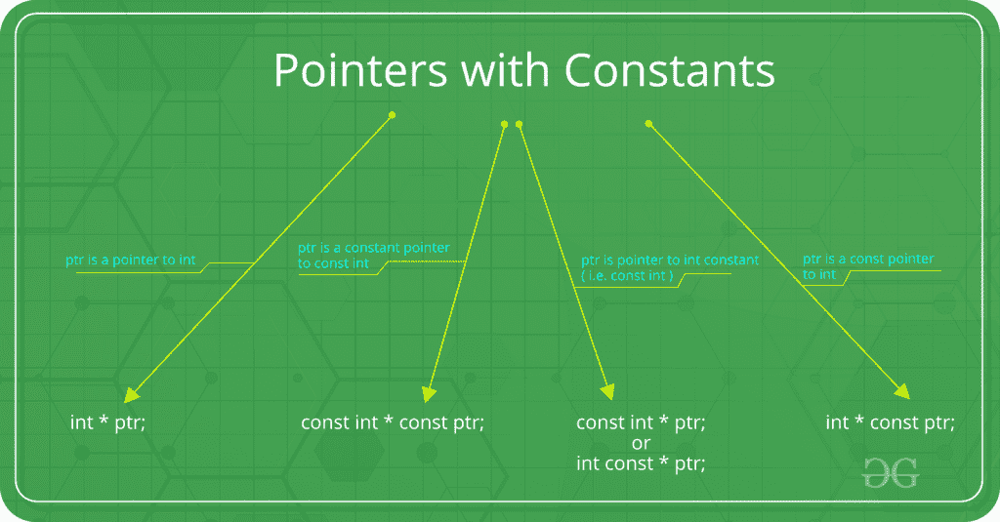
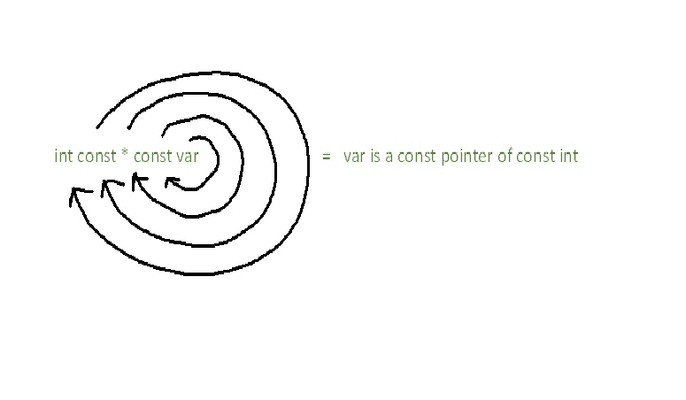
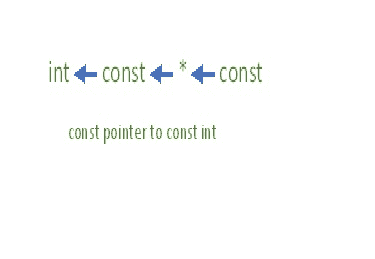

# const int *、const int * const 和 int const *

之间的差异

> 原文:[https://www . geesforgeks . org/difference-const-int-const-int-const-and-int-const/](https://www.geeksforgeeks.org/difference-between-const-int-const-int-const-and-int-const/)



## int const*

**int const*** 是指向常数整数的指针
这意味着被声明的变量是指向常数整数的指针。实际上，这意味着指针指向一个不应该改变的值。在这种情况下，Const 限定符不影响指针，因此允许指针指向其他地址。
第一个 const 关键字可以放在数据类型的任意一边，因此 **int const*** 相当于 **const int*** 。

```
#include <stdio.h>

int main(){
    const int q = 5;
    int const* p = &q;

    //Compilation error
    *p = 7;

    const int q2 = 7;

    //Valid
    p = &q2; 

    return 0;
}
```

## int *const

**int *const** 是整数的常量指针

这意味着被声明的变量是一个指向整数的常量指针。实际上，这意味着指针不应该指向其他地址。在这种情况下，Const 限定符不影响整数值，因此存储在地址中的值可以改变。

```
#include <stdio.h>

int main(){
    const int q = 5;
    //Compilation error
    int *const p = &q;

    //Valid
    *p = 7; 

    const int q2 = 7;

    //Compilation error
    p = &q2; 

    return 0;
}
```

## 常量 int*常量

**常量 int*常量**是一个指向常量整数的常量指针

这意味着被声明的变量是指向常数整数的常数指针。实际上，这意味着常量指针指向常量值。因此，指针不应该指向新地址，被指向的值也不应该改变。
第一个 const 关键字可以放在数据类型的任意一边，因此 **const int* const** 相当于 **int const* const** 。

```
#include <stdio.h>

int main(){
    const int q = 5;

    //Valid
    const int* const p = &q;

    //Compilation error
    *p = 7;

    const int q2 = 7;

    //Compilation error
    p = &q2;

    return 0;
}
```

## 内存印象图

记住语法的一种方法(根据比雅尼·斯特劳斯特鲁普的说法)是螺旋规则-
规则说，从变量的名称开始，顺时针移动到下一个指针或类型。重复，直到表达式结束。



这个规则也可以看作是从右向左解码语法。



因此，

*   **int const*** 是**指针**指向 **const** **int**
*   **int *const** 是 **const** **指针**到 **int**
*   **int const* const** 是**const**T4】指针到**const**T8】int

使用这个规则，即使是复杂的声明也可以被解码，

*   **int ** const** 是一个 **const** **指针**到**指针**到一个 **int** 。
*   **int * const *** 是指向**const**T6 的**指针**和指向 **int** 的指针。
*   **int const **** 是一个**指针**指向一个**指针**指向一个**const**T8】int。
*   **int * const * const** 是一个 **const** **指针**指向一个 **const** **指针**指向一个 **int** 。