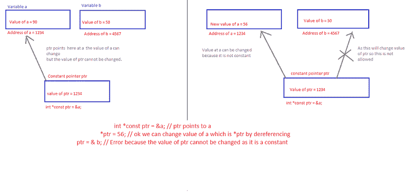
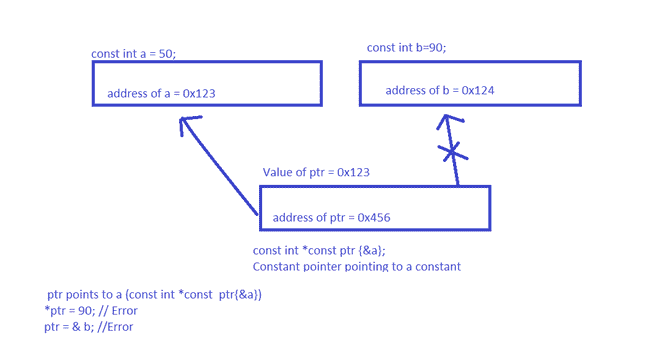

# 常量指针、常量指针和常量指针之间的区别

> 原文:[https://www . geesforgeks . org/常量指针指向常量和常量指针指向常量的区别/](https://www.geeksforgeeks.org/difference-between-constant-pointer-pointers-to-constant-and-constant-pointers-to-constants/)

在本文中，我们将讨论**常量指针**、**常量指针** & **常量指针**的区别。指针是保存其他变量、常数或函数地址的变量。有几种方法可以使用**常量**限定指针。

*   指向常量的指针。
*   常数指针。
*   指向常量的常量指针。

**<u>指向常量的指针</u> :**

在指向常量的指针中，指针指向的数据是常量，不能更改。虽然，指针本身可以改变并指向其他地方(因为指针本身是一个变量)。

下面是同样的程序来说明:

## C++

```
// C++ program to illustrate concept
// of the pointers to constant
#include <iostream>
using namespace std;

// Driver Code
int main()
{

    int high{ 100 };
    int low{ 66 };
    const int* score{ &high };

    // Pointer variable are read from
    // the right to left
    cout << *score << "\n";

    // Score is a pointer to integer
    // which is constant *score = 78

    // It will give you an Error:
    // assignment of read-only location
    // ‘* score’ because value stored in
    // constant cannot be changed
    score = &low;

    // This can be done here as we are
    // changing the location where the
    // score points now it points to low
    cout << *score << "\n";

    return 0;
}
```

**Output:**

```
100
66

```

**<u>常量指针</u> :**

在常量指针中，指针指向一个固定的[存储位置](https://www.geeksforgeeks.org/read-and-write-operations-in-memory/)，该位置的值可以改变，因为它是一个变量，但是指针将总是指向同一个位置，因为它在这里被设为常量。

下面是一个关于引用的常量指针的例子。可以假设[引用](https://www.geeksforgeeks.org/references-in-c/)为自动取消引用的常量指针。实际参数中传递的值可以更改，但引用指向同一个变量。



下面是同样的程序来说明:

## C++

```
// C++ program to illustrate concept
// of the constant pointers
#include <iostream>
using namespace std;

// Driver Code
int main()
{

    int a{ 90 };
    int b{ 50 };

    int* const ptr{ &a };
    cout << *ptr << "\n";
    cout << ptr << "\n";

    // Address what it points to

    *ptr = 56;

    // Acceptable to change the
    // value of a

    // Error: assignment of read-only
    // variable ‘ptr’
    // ptr = &b;

    cout << *ptr << "\n";
    cout << ptr << "\n";

    return 0;
}
```

**Output:**

```
90
0x7ffc641845a8
56
0x7ffc641845a8

```

**<u>常量指针</u> :**

在指向常量的常量指针中，指针指向的数据是常量，不能更改。指针本身是不变的，不能改变，不能指向别的地方。下图说明了同样的情况:



下面是同样的程序来说明:

## C++

```
// C++ program to illustrate concept of
// the constant pointers to pointers
#include <iostream>
using namespace std;

// Driver Code
int main()
{

    const int a{ 50 };
    const int b{ 90 };

    // ptr points to a
    const int* const ptr{ &a };

    // *ptr = 90;
    // Error: assignment of read-only
    // location ‘*(const int*)ptr’

    // ptr = &b;
    // Error: assignment of read-only
    // variable ‘ptr’

    // Address of a
    cout << ptr << "\n";

    // Value of a
    cout << *ptr << "\n";

    return 0;
}
```

**Output:**

```
0x7ffea7e22d68
50

```