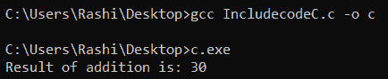

# C/c++ 中#include <和#include“”的区别，示例

> 原文:[https://www . geeksforgeeks . org/include 和 include-in-c-c-with-examples/](https://www.geeksforgeeks.org/difference-between-include-and-include-in-c-c-with-examples/)

**先决条件:**[C/c++ 头文件及其用途](https://www.geeksforgeeks.org/header-files-in-c-cpp-and-its-uses/)

这两种类型的区别在于预处理器搜索要包含在代码中的文件的位置。

> **#包括<文件名>** //标准库标题
> 
> **#包含“文件名”** //用户自定义标题

**<u>#包括<文件名></u>T3】**

**#包含< >** 是针对预定义的头文件。如果头文件是预定义的，那么只需将头文件名称写在尖括号中。

**示例:**

> #包含 <iostream>#包含<stdio . h>
> #包含< stdlib.h ></iostream>

[预处理器](https://www.geeksforgeeks.org/cc-preprocessors/)以依赖于实现的方式进行搜索，通常是在由[编译器/IDE](https://www.geeksforgeeks.org/top-5-free-online-ide-compilers-in-2020/) 预先指定的搜索目录中。这意味着编译器将搜索标准库头所在的位置。头文件可以在 **/usr/include** 或 **/usr/local/include** 等默认位置找到。此方法通常用于包含标准库头文件。

**示例:**下面是演示上述概念的 C++ 程序:

## C

```cpp
// C program to demonstrate 
// the above concept
#include <stdio.h>

// Driver code
int main() 
{
  printf("GeeksforGeeks | ");
  printf("A computer science portal for geeks");
  return 0;
}
```

**输出:**

> 极客博客|极客的计算机科学门户

**<u>#包含“FILE _ NAME”</u>**

**#include " "** 是程序员定义的头文件。如果一个程序员写了他/她自己的头文件，那么就用引号把头文件的名字写出来。

**示例:**

> #包含“mult.h”
> 这里，mult . h 是程序员写的头文件。

预处理器在包含指令的文件所在的目录中进行搜索。编译器将在当前文件夹或我定义的文件夹中搜索这些头文件。此方法通常用于包含程序员定义的头文件。

**mul.h 头文件:**

> // mul.h
> int mul(int a，int b)
> {
> return(a * b)；
> }

下面是包含和使用头文件 mul.h 的 C 程序:

## C

```cpp
// C program to demonstrate 
// the above approach

// Include user-defined 
// header file
#include "mul.h"

// Driver code
int main()
{
  int a = 10;
  int b = 20;

  // Invoke the function defined in
  // header file
  int c = mul(a, b);
  printf("%d", c);

  return 0;
}
```

**输出:**

> Two hundred

**<u>#包含<>vs #包含“</u>**

<figure class="table">

| **S 号** | **# contains < file name >** | **# contains "file name"** |
| one | The preprocessor searches in the search directory specified by the compiler/IDE in advance. | The preprocessor searches in the directory where the file containing the instruction is located. |
| Two | Header files can be found in the default location, such as /usr/include or /usr/local/include. | Header files can be found in the folder defined by-i. |
| three | This method is usually used in stdlib.h. | This method is usually used for programmer-defined header files. |

</figure>

**情况 1:** 使用符号#include " "包含标准库标题。

## C

```cpp
// C program to demonstrate 
// the difference
// Header file
#include "stdio.h"

// Driver code
int main() 
{
  int a = 10;
  printf("%d", a);
  return 0;
}
```

**输出:**

> Ten

**解释:**
#包含“”将搜索。/第一。然后它将搜索默认的包含路径。可以使用下面的命令打印包含路径。

> gcc -v -o a 文件名. c

**案例 2:** 使用符号#include < >包含标准头文件

## C

```cpp
// C program to demonstrate 
// the difference
// Header file
#include <stdio.h>

// Driver code
int main() 
{
  int a = 10;
  printf("%d", a);
  return 0;
}
```

**输出:**

> Ten

**情况 3:** 使用#include " "和#include < >符号包含标准头文件，如 **stdio.h**

> // stdio.h
> int add(int a，int b)
> {
> return(a+b)；
> }

## C

```cpp
// C program to demonstrate 
// the difference between 
// ""  and <>

// This will include the standard
// header file
#include <stdio.h>

// This will include the user-defined
// header file
#include "stdio.h"

// Driver code
int main()
{
  int a = 10;
  int b = 20;

  // Invoke the function defined in
  // header file
  int c = add(a, b);
  printf("Result of addition is: %d", c);

  return 0;
}
```

**输出:**



**说明:**

1.当在当前目录中创建 stdio.h 时，**案例 1** 中的代码将产生错误，但**案例 2** 中的代码将正常工作。
2。“”和< >可以一起包含在同一个代码中，并且该代码可以正常工作，因为这两种符号的搜索路径优先级不同。这里，“”将包括用户定义的头文件，< >将包括标准头文件。