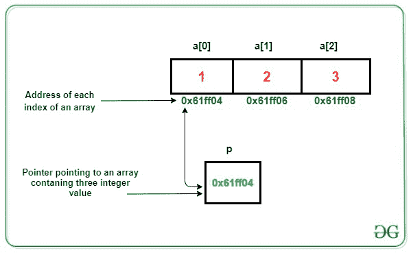
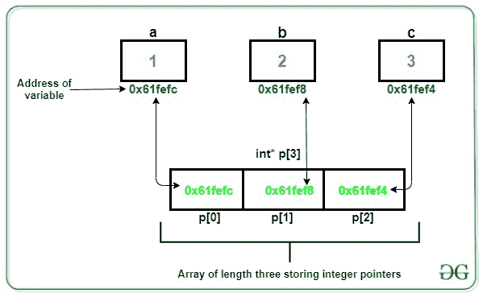

# int(* p)[3]和 int* p[3]的区别？

> 原文:[https://www . geesforgeks . org/difference-int-P3-and-int-P3/](https://www.geeksforgeeks.org/difference-between-int-p3-and-int-p3/)

[指针](https://www.geeksforgeeks.org/pointers-in-c-and-c-set-1-introduction-arithmetic-and-array/)存储变量的地址或存储位置。指针是地址的符号表示。它们使程序能够模拟引用调用，以及创建和操纵动态[数据结构](https://www.geeksforgeeks.org/data-structures/)。它在 C/C++中的一般声明具有以下格式:

**语法:**

> 数据类型 *var_name;

**示例:**

> **int * ptr；**
> 
> 在本例中，“ptr”是保存整数变量地址的指针的变量名。

在本文中，重点是区分指针的两种声明，即 **int (*p)[3]** 和 **int *p[3]。**

对于 **int (*p)[3]:** 这里**“p”**是指针的变量名，可以指向三个整数的数组。

[](https://media.geeksforgeeks.org/wp-content/uploads/20201123001107/gfg2.jpg)

下面举例说明 **int (*p)[3]** 的用法:

## C++

```
// C++ program to illustrate the use
// of int (*p)[3]
#include <iostream>
using namespace std;

// Driver Code
int main()
{
    // Declaring a pointer to store address
    // pointing to an array of size 3
    int(*p)[3];

    // Define an array of size 3
    int a[3] = { 1, 2, 3 };

    // Store the base address of the
    // array in the pointer variable
    p = &a;

    // Print the results
    for (int i = 0; i < 3; i++) {
        cout << *(*(p) + i) << " ";
    }

    return 0;
}
```

**Output:**

```
1 2 3

```

对于 **int *p[3]:** 这里**“p”**是大小为 3 的数组，可以存储整数指针。

[](https://media.geeksforgeeks.org/wp-content/uploads/20201123001106/gfg11.jpg)

下面举例说明 **int *p[3]** 的用法:

## C++

```
// C++ program to illustrate the use
// of int*p[3]
#include <bits/stdc++.h>
using namespace std;

// Driver Code
int main()
{
    // Declare an array of size 3 which
    // will store integer pointers
    int* p[3];

    // Integer variables
    int a = 1, b = 2, c = 3;

    // Store the address of integer
    // variable at each index
    p[0] = &a;
    p[1] = &b;
    p[2] = &c;

    // Print the result
    for (int i = 0; i < 3; i++) {
        cout << *p[i] << " ";
    }

    return 0;
}
```

**Output:**

```
1 2 3

```