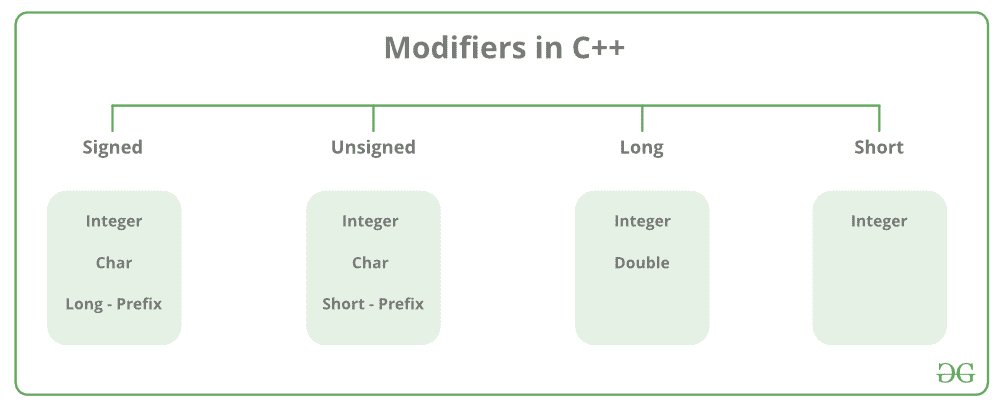

# C/c++中 long int 和 long long int 的区别

> 原文:[https://www . geesforgeks . org/long-int-和 long-long-int-in-c-cpp/](https://www.geeksforgeeks.org/difference-between-long-int-and-long-long-int-in-c-cpp/) 之间的差异

所有[变量](https://www.geeksforgeeks.org/variables-and-keywords-in-c/)在声明过程中使用[数据类型](https://www.geeksforgeeks.org/c-data-types/)来限制要存储的数据类型。因此，我们可以说数据类型用于告诉变量它可以存储的数据类型。每当在 [C++](https://www.geeksforgeeks.org/c-plus-plus/) 中定义一个变量时，编译器[会根据其声明的数据类型为该变量分配一些内存](https://www.geeksforgeeks.org/dynamic-memory-allocation-in-c-using-malloc-calloc-free-and-realloc/)。不同的数据类型需要不同数量的[内存](https://www.geeksforgeeks.org/memory-layout-of-c-program/)。

**整数:**整数数据类型使用的关键字是 int。整数通常需要 4 字节的内存空间，范围从 **-2147483648** 到 **2147483647** 。

**数据类型修饰符:**顾名思义，[数据类型修饰符](https://www.geeksforgeeks.org/interesting-facts-about-data-types-and-modifiers-in-c-cpp/)与内置数据类型一起使用，以修改特定数据类型可以容纳的数据长度。



以下是 32 位 GCC 编译器[的内存要求和格式说明符范围列表。](https://www.geeksforgeeks.org/compile-32-bit-program-64-bit-gcc-c-c/)

<figure class="table"> [| **S 号** | **数据类型** | **内存****(字节)** | **range** |
| one | （同 Internationalorganizations）国际组织 |](https://www.geeksforgeeks.org/compile-32-bit-program-64-bit-gcc-c-c/) </figure>

[Long long](https://www.geeksforgeeks.org/maximum-value-of-long-long-int-in-c/) 相比 Long 取双倍内存。但是在不同的系统上也可能不同。其范围取决于应用类型。不同数据类型的保证最小可用位大小:

*   **char:** 8
*   **短:** 16
*   **int:** 16
*   **长:** 32
*   **长龙:** 64

**递减顺序为:**长>=长>= int>=短> =char

**程序 1:**

在各种竞争性编码平台中，约束条件介于**10<sup>7</sup>T3】到 **10 <sup>18</sup>** 之间。下面是理解这个概念的程序:**

## C++

```
// C++ program to implement
// the above approach
#include <iostream>
using namespace std;

// Driver code
int main()
{
    // Value of p 10^5
    int p = 100000;

    // Value of q 10^5
    int q = 100000;

    int result = p * q;
    cout << result << endl;
    return 0;
}
```

**Output:**

```
1410065408

```

如上，输出不正确，因为 int 不能存储一个**10<sup>10</sup>T3】值(超出其范围)。在这种情况下，应该使用 long long。**

**程序 2:**

下面是 C++程序，演示了将 int 转换为 long 如何影响输出:

## C++

```
// C++ program to implement
// the above approach
#include <iostream>
using namespace std;

// Driver code
int main()
{
    // Value of p 10^5
    int p = 100000;

    // Value of q 10^5
    int q = 100000;

    long long int result = p * q;
    cout << result << endl;
    return 0;
}
```

**Output:**

```
1410065408

```

**解释:**上面的程序即使在将 int 转换为 long long int 之后也给出了相同的输出，因为一开始，结果被声明为 long long。但是在赋值 p 和 q 相乘之前，它已经溢出了。现在，为了防止[溢出条件](https://www.geeksforgeeks.org/check-for-integer-overflow/)，需要在赋值结果值之前将 int 结果转换为 long long int，这样才不会出现溢出条件。

**程序 3:**

下面是实现上述方法的 C++程序:

## C++

```
// C++ program to implement
// the above approach
#include <iostream>
using namespace std;

// Driver code
int main()
{
    // Value of p 10^5
    int p = 100000;

    // Value of q 10^5
    int q = 100000;

    long long int result = (long long int)p * q;
    cout << result << endl;
    return 0;
}
```

**Output:**

```
10000000000

```

**说明:**之后给出正确的输出，是**10<sup>10</sup>T5，当范围达到 **10 <sup>18</sup>** 时，可以很容易的存储成很长很长的数据类型。**