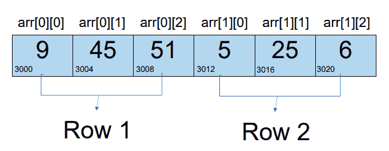

# c++ 和 Java 中多维数组的区别

> 原文:[https://www . geesforgeks . org/CPP 和 java 中多维数组的区别/](https://www.geeksforgeeks.org/difference-between-multidimensional-array-in-cpp-and-java/)

**先决条件:**c++ 中的[多维数组](https://www.geeksforgeeks.org/multidimensional-arrays-c-cpp/)，Java 中的[多维数组](https://www.geeksforgeeks.org/multidimensional-arrays-in-java/)

### <u>多维数组</u>:

多维[数组](https://www.geeksforgeeks.org/array-data-structure/)是存储多个元素的数组的表格表示。这些维度可以是 1D [阵](https://www.geeksforgeeks.org/introduction-to-arrays/)、[2D-阵](https://www.geeksforgeeks.org/multidimensional-arrays-c-cpp/)等。多维数组在 [C++ ](https://www.geeksforgeeks.org/c-plus-plus/) 和 [Java](https://www.geeksforgeeks.org/java/) 中都有，但是它们的实现和一些属性是不同的。

## **<u>在 C/C++ </u> 中实现:**

在 C++ 中，多维数组在内部被创建为一个巨大的线性数组。C++ 语法将这个线性内存块抽象成二维或三维行为，使程序员很容易理解。

**示例:**

维度为 2 行 x 3 列{{9，45，51}，{5，25，6}}的 **2D 数组**实现如下(假设整数取 4 字节):

[](https://media.geeksforgeeks.org/wp-content/uploads/20210202172129/image20210202115122.png)

因此，特定索引处内部元素的内部公式如下:

> arr[row index][colindex]= arr+(row index * noofcols * sizeof data type)+colindex * sizeof data type

假设基址为 **3000** 。然后**arr[1][1]=**3000+(1 * 3 * 4)+1 * 4 = 3000+12+4**= 3016**。

由于这样的实现，每行的列数必须相等，并且在声明时必须指定列大小，以便正确访问元素。

下面是多维数组在 C++ 中的实现:

## C++

```cpp
// C++ program for multidimention array
// implementation
#include <iostream>
using namespace std;

// Driver Code
int main()
{
    // Create a 2d integer array,
    // dimensions: 3rows X 5cols
    int arr[3][5] = {
        { 23, 56, 34, 52, 63 },
        { 40, 20, 96, 43, 97 },
        { 75, 51, 10, 82, 43 }
    };

    // Traversing of 2D array
    cout << "Printing entire 2d array: "
         << endl;

    // Iterate over the rows
    for (int i = 0; i < 3; i++) {

        // Iterate over the cols
        for (int j = 0; j < 5; j++) {

            cout << "arr[" << i << "][" << j
                 << "]:" << arr[i][j]
                 << "      ";
        }
        cout << endl;
    }

    return 0;
}
```

**Output:** 

```cpp
Printing entire 2d array: 
arr[0][0]:23      arr[0][1]:56      arr[0][2]:34      arr[0][3]:52      arr[0][4]:63      
arr[1][0]:40      arr[1][1]:20      arr[1][2]:96      arr[1][3]:43      arr[1][4]:97      
arr[2][0]:75      arr[2][1]:51      arr[2][2]:10      arr[2][3]:82      arr[2][4]:43
```