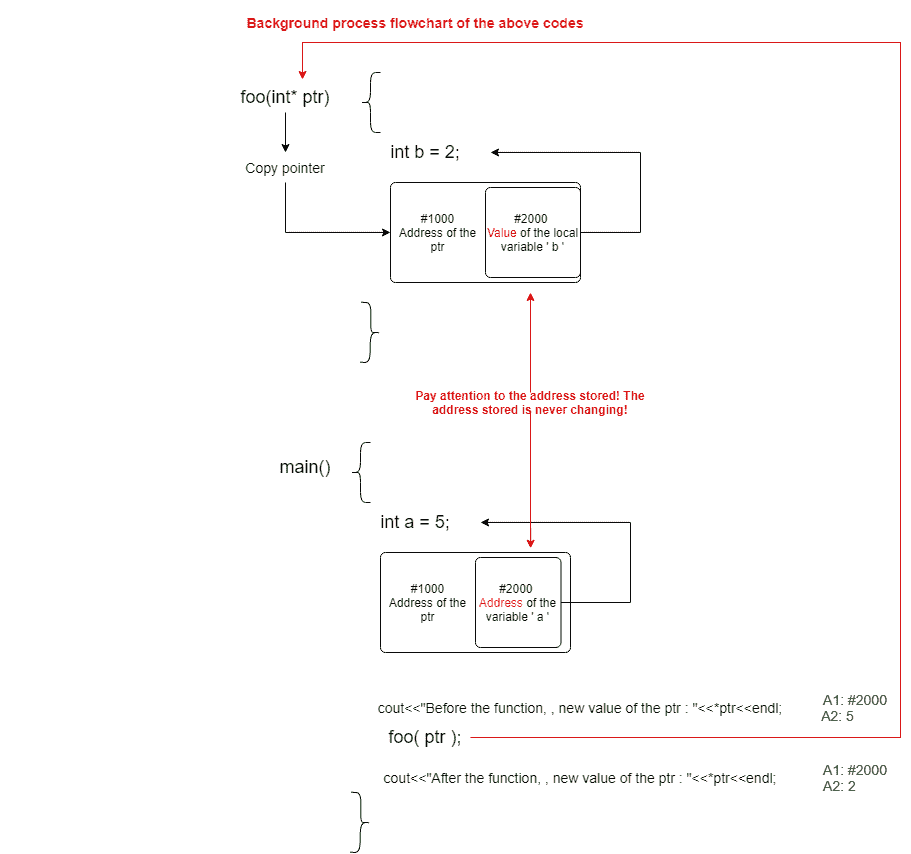
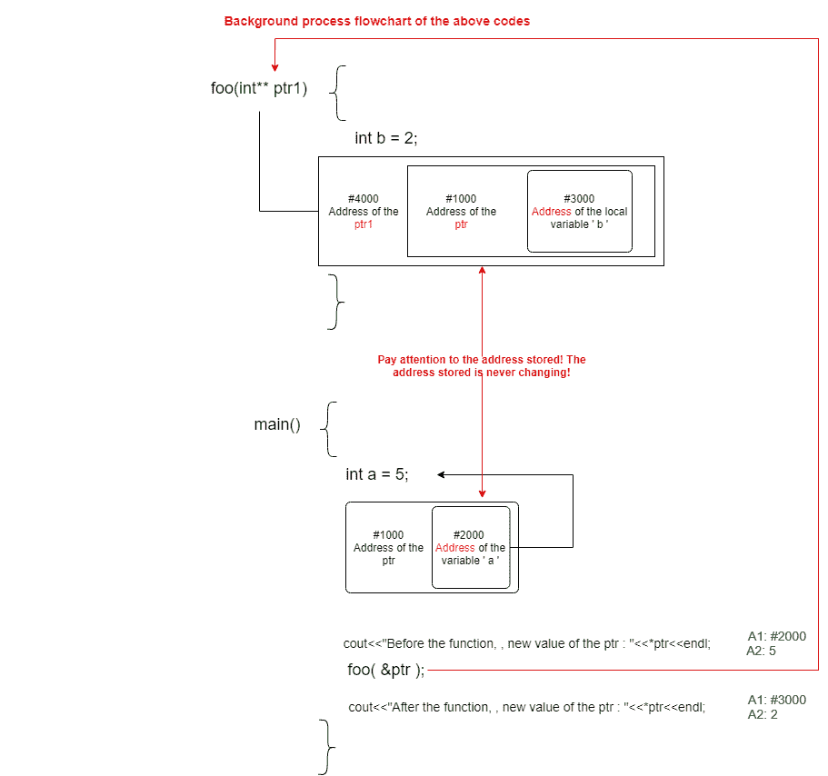

# 将指针传递给指针和指针地址传递给任何函数的区别

> 原文:[https://www . geesforgeks . org/指针到指针的传递和指针到任意函数的地址之间的区别/](https://www.geeksforgeeks.org/difference-between-passing-pointer-to-pointer-and-address-of-pointer-to-any-function/)

在本文中，将“指针指向指针”和“指针地址”传递给函数之间的区别。在 [C](https://www.geeksforgeeks.org/c/) 或 [C++ ](https://www.geeksforgeeks.org/c-plus-plus/) 编程语言中，已知[指针](https://www.geeksforgeeks.org/pointers-in-c-and-c-set-1-introduction-arithmetic-and-array/)保存变量或任何[存储位置](https://www.geeksforgeeks.org/difference-between-register-and-memory/)的地址。如果指针指向内存位置，它可以用来改变变量值。

至于函数，任何指针都可以自己传递，也可以通过指针的[地址传递。但是，如果指针的存储位置要在函数外永久改变，则必须在函数内使用](https://www.geeksforgeeks.org/pointers-in-c-and-c-set-1-introduction-arithmetic-and-array/)[引用](https://www.geeksforgeeks.org/references-in-c/)或[双指针](https://www.geeksforgeeks.org/double-pointer-pointer-pointer-c/)来捕获，即假设在本地函数内创建了任何存储器。

之后，它被指向由函数捕获的指针，而没有任何引用或任何双指针。在这种情况下，主函数内部没有变化，因为它没有被[函数定义](https://www.geeksforgeeks.org/functions-in-c/)内部的引用或双击所捕获。

**程序 1:**

## C++

```cpp
// C++ program to illustrate the
// concepts pointers

#include <iostream>
#include <stdlib.h>
using namespace std;

// Function to assign the value of
// pointer ptr to another location
void foo(int* ptr)
{
    int b = 2;

    // ptr= (int*)malloc(sizeof(int));
    // It can be executed instead of
    // the ptr=&b but nothing change
    ptr = &b;
}

// Driver Code
int main()
{
    int a = 5;
    int* ptr = &a;

    cout << "Before the function ptr: "
         << *ptr << endl;
    foo(ptr);

    cout << "After the function ptr: "
         << *ptr << endl;

    return 0;
}
```

**Output:**

```cpp
Before the function ptr: 5
After the function ptr: 5

```

**说明:**输出没有变化的原因是为函数创建了一个**复制指针**。所以，指针地址的变化并没有反映出函数的变化。引用或双指针可用于此。

**程序 2:**

## C++

```cpp
// C++ program to illustrate the
// concepts of pointer

#include <iostream>
#include <stdlib.h>
using namespace std;

// Function to change the pointer ptr
void foo(int* ptr)
{
    int b = 2;

    // The change will only be for
    // the new value of the ptr
    *ptr = b;
}

// Driver Code
int main()
{

    int a = 5;
    int* ptr = &a;

    cout << "Before the function, "
         << "new value of the ptr: "
         << *ptr << endl;

    // Function Call
    foo(ptr);

    cout << "After the function, "
         << "new value of the ptr: "
         << *ptr << endl;

    return 0;
}
```

**Output:**

```cpp
Before the function, new value of the ptr: 5
After the function, new value of the ptr: 2

```

**说明:**

[](https://media.geeksforgeeks.org/wp-content/uploads/20210311010106/flowchartofthecode15.png)

如果想要在 **foo()功能**完成时替换存储在 **ptr** 中的内存，则 **ptr** 必须使用 **foo()功能**中的参考或双指针来捕获。

**程序 3:**

## C++

```cpp
// C++ program to illustrate the
// concepts of pointer
#include <iostream>
#include <stdlib.h>
using namespace std;

// Function to change the value of
// the pointers ptr1
void foo(int** ptr1)
{
    int b = 2;

    // ptr = &b;
    // For this assignment, the
    // captured value will be like
    // void foo(int* &ptr)
    *ptr1 = &b;
}

// Driver Code
int main()
{
    int a = 5;
    int* ptr = &a;

    cout << "Before the function, "
         << "new value of the ptr: "
         << *ptr << endl;

    // Function Call
    foo(&ptr);

    cout << "After the function, "
         << "new value of the ptr: "
         << *ptr << endl;

    return 0;
}
```

**Output:**

```cpp
Before the function, new value of the ptr: 5
After the function, new value of the ptr: 2

```

**说明:**

[](https://media.geeksforgeeks.org/wp-content/uploads/20210311010626/flowchartofthecode2.png)