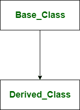
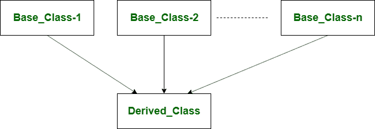

# c++中单遗传和多遗传的区别

> 原文:[https://www . geeksforgeeks . org/c 中单一继承和多重继承的区别/](https://www.geeksforgeeks.org/difference-between-single-and-multiple-inheritance-in-c/)

**[单一继承](https://www.geeksforgeeks.org/inheritance-in-c/) :**
单一继承是派生类公开、私下或受保护地继承单一基类的继承。在单一继承中，派生类使用单一基类的功能或成员。这些基类成员可以根据继承父类或基类时指定的[访问说明符](https://www.geeksforgeeks.org/access-modifiers-in-c/)由派生类或子类访问。



**语法:**

```cpp
Class DerivedClass_name : access_specifier Base_Class
{
    //Class's Body 
}; 
```

**单一继承示例:**

```cpp
#include<iostream>
using namespace std;
class A {
public:
    int k = 1000;
    float salary = 80000;
};
class B : public A {
public:
    float bonus = 8000;
    void ts()
    {
        cout<<"Total salary.."<<(salary + bonus)<<endl;
    }
};
int main()
{
    B b1;
    cout<<"Salary:"<<b1.salary<<endl;
    cout<<"Bonus:"<<b1.bonus<<endl;
    b1.ts();
    return 0;
}
```

**输出:**

```cpp
Salary: 80000
Bonus: 8000
total salary..88000 
```

在本例中，A 是基类或父类，B 是派生类或子类。

**[多重继承](https://www.geeksforgeeks.org/multiple-inheritance-in-c/) :**
多重继承是派生类获取两个或多个基类的继承。在多重继承中，派生类被允许使用继承基类的联合特性。每个基类都由派生类继承，方法是为每个基类通知单独的[访问说明符](https://www.geeksforgeeks.org/access-modifiers-in-c/)。派生类或子类可以根据继承父类或基类时指定的访问说明符来访问基类成员。



**语法:**

```cpp
Class DerivedClass_name : access_specifier Base_Class1, access_specifier Base_Class2
{
    //Class's Body 
}; 
```

**多重继承示例:**

```cpp
#include<iostream>
using namespace std;
class A {
public:
    float salary = 80000;
};

class B {
public:
    float bonus = 8000;
};

class C : public A, public B {
public:
    void ts()
    {
        cout<<"Total salary.."<<(salary + bonus)<<endl;
    }
};
int main()
{
    C b1;
    b1.ts();
    return 0;
}
```

**输出:**

```cpp
Total salary..88000 
```

在这个例子中，A 和 B 是基类，C 是派生类。

**单倍遗传与多倍遗传的区别:**

<center>

| S.NO | 单一继承 | 多重继承 |
| --- | --- | --- |
| 1. | 单一继承是指派生类继承单一基类。 | 而多重继承是派生类获取两个或更多基类的继承。 |
| 2. | 在单一继承中，派生类使用单一基类的特性。 | 在多重继承中，派生类使用继承基类的联合特性。 |
| 3. | 与多重继承相比，单一继承需要更少的运行时间，因为开销更少。 | 而多重继承由于开销更大，与单一继承相比需要更多的运行时间。 |
| 4. | 单一继承是很多接近专业化。 | 相比之下，多重继承更接近泛化。 |
| 5. | 单一继承实现为**类 derived Class _ name:access _ 说明符 Base _ Class { }；**。 | 而多重继承实现为**类派生类名:access _ 说明符 Base_Class1，access _ 说明符 Base_Class2，…。{};**。 |
| 6. | 与多重继承相比，单一继承更简单。 | 而多重继承与单一继承相比是复杂的。 |
| 7. | 单一继承可以用任何编程语言实现。 | C++支持多重继承，但多重继承在任何编程语言中都无法实现(C#，Java 不支持多重继承)。 |

</center>