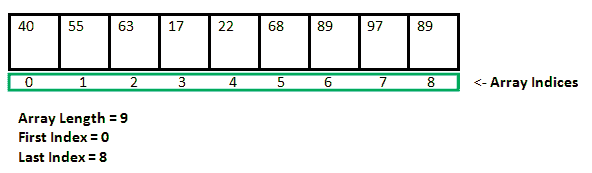

# C 中结构和数组的区别

> 原文:[https://www . geesforgeks . org/c 中结构与数组的区别/](https://www.geeksforgeeks.org/difference-between-structure-and-array-in-c/)

### [C 中的数组](https://www.geeksforgeeks.org/arrays-in-c-cpp/)

[数组](https://www.geeksforgeeks.org/arrays-in-c-cpp/)是存储在连续存储位置的项目集合。

### [结构在 C](https://www.geeksforgeeks.org/structures-c/)

A [结构](https://www.geeksforgeeks.org/structures-c/)是 C/C++中用户自定义的数据类型。结构创建的数据类型可用于将可能不同类型的项组合成单一类型。

**结构与阵列的区别**

<figure class="table">

| 排列 | 结构 |
| --- | --- |
| ARRAY refers to a collection of elements of homogeneous data type. | Structure refers to a collection of elements of heterogeneous data types. |
| Use array subscript or "[]" (square brackets) for element access. | Use the structure "."(dot operator) to access elements. |
| The array is a pointer to the first element of the collection. | Not a structure pointer. |
| Instantiation of an array is impossible. | Instantiation of the structure is possible. |
| The array size is fixed, which is basically the number of elements multiplied by the size of one element. | The size of the structure is not fixed, because each element of the structure can have different types and sizes. |
| Bit fields are not possible in arrays. | Bit fields are possible in the structure. |
| Array declaration is simply done by using [] instead of any keyword. | Complete the structure declaration with the help of "struct" keyword. |
| Array is non-primitive data type. | Structure is a user-defined data type. |
| Array traversal and search are simple and quick. | Traversing and searching are complex and slow. |
| data _ type array _ name[size]； | struct sruct _ name { data _ type 1 ele 1；data _ type 2 ele 2 }； |
| Elements are stored in contiguous memory locations. | Elements may or may not be stored in consecutive storage units. |
| The array is accessed by its index number through subscripts. | Structure elements are accessed by name by using dot operators. |

</figure>