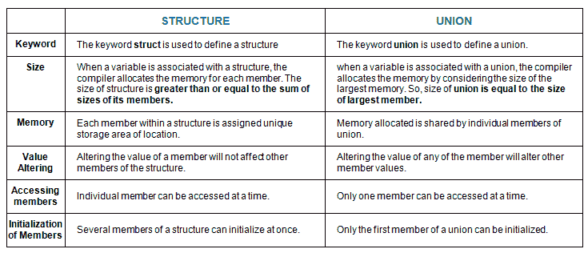

# C 中结构与并集的区别

> 原文:[https://www.geeksforgeeks.org/difference-structure-union-c/](https://www.geeksforgeeks.org/difference-structure-union-c/)

[**建筑在丙**](https://www.geeksforgeeks.org/structures-c/)

结构是 C 语言中用户定义的数据类型，允许组合不同种类的数据项。结构用于表示记录。

**定义结构:**要定义结构，必须使用**结构**语句。struct 语句定义了一个新的数据类型，其成员多于或等于一个。struct 语句的格式如下:

```cpp
   struct [structure name]
   {
       member definition;
       member definition;
       ...
       member definition;
   };
```

[**联盟**T3】](https://www.geeksforgeeks.org/union-c/)

联合是 C 语言中可用的一种特殊数据类型，它允许在同一个内存位置存储不同的数据类型。您可以定义一个包含多个成员的联合，但在任何给定时间只有一个成员可以包含一个值。联合提供了一种为多种目的使用同一个内存位置的有效方法。

**定义联合:**要定义联合，您必须使用**联合**语句，方式与定义结构时相同。union 语句为程序定义了一个包含多个成员的新数据类型。联合声明的格式如下:

```cpp
    union [union name]
    {
       member definition;
       member definition;
       ...
       member definition;
    };
```

**结构和联合的相似之处**

1.  两者都是用户定义的数据类型，用于将不同类型的数据存储为一个单元。
2.  它们的成员可以是任何类型的对象，包括其他结构、联合或数组。一个成员也可以由一个位字段组成。
3.  结构和联合都只支持赋值=和 sizeof 运算符。分配中的两个结构或联合必须具有相同的成员和成员类型。
4.  结构或联合可以按值传递给函数，也可以按值由函数返回。参数必须与函数参数具有相同的类型。结构或联合通过值传递，就像标量变量作为相应的参数一样。
5.  **' . '**运算符用于访问成员。

**差异:**



## C

```cpp
// C program to illustrate differences
// between structure and Union
#include <stdio.h>
#include <string.h>

// declaring structure
struct struct_example
{
    int integer;
    float decimal;
    char name[20];
};

// declaring union

union union_example
{
    int integer;
    float decimal;
    char name[20];
};

void main()
{
    // creating variable for structure
    // and initializing values difference
    // six
    struct struct_example s={18,38,"geeksforgeeks"};

    // creating variable for union
    // and initializing values
    union union_example u={18,38,"geeksforgeeks"};

    printf("structure data:\n integer: %d\n"
                "decimal: %.2f\n name: %s\n",
                s.integer, s.decimal, s.name);
    printf("\nunion data:\n integer: %d\n"
                 "decimal: %.2f\n name: %s\n",
                u.integer, u.decimal, u.name);

    // difference two and three
    printf("\nsizeof structure : %d\n", sizeof(s));
    printf("sizeof union : %d\n", sizeof(u));

    // difference five
    printf("\n Accessing all members at a time:");
    s.integer = 183;
    s.decimal = 90;
    strcpy(s.name, "geeksforgeeks");

    printf("structure data:\n integer: %d\n "
                "decimal: %.2f\n name: %s\n",
            s.integer, s.decimal, s.name);

    u.integer = 183;
    u.decimal = 90;
    strcpy(u.name, "geeksforgeeks");

    printf("\nunion data:\n integer: %d\n "
                "decimal: %.2f\n name: %s\n",
            u.integer, u.decimal, u.name);

    printf("\n Accessing one member at time:");

    printf("\nstructure data:");
    s.integer = 240;
    printf("\ninteger: %d", s.integer);

    s.decimal = 120;
    printf("\ndecimal: %f", s.decimal);

    strcpy(s.name, "C programming");
    printf("\nname: %s\n", s.name);

    printf("\n union data:");
    u.integer = 240;
    printf("\ninteger: %d", u.integer);

    u.decimal = 120;
    printf("\ndecimal: %f", u.decimal);

    strcpy(u.name, "C programming");
    printf("\nname: %s\n", u.name);

    //difference four
    printf("\nAltering a member value:\n");
    s.integer = 1218;
    printf("structure data:\n integer: %d\n "
                " decimal: %.2f\n name: %s\n",
                s.integer, s.decimal, s.name);

    u.integer = 1218;
    printf("union data:\n integer: %d\n"
           " decimal: %.2f\n name: %s\n",
            u.integer, u.decimal, u.name);
}
```

**输出:**

```cpp
structure data:
 integer: 18
 decimal: 38.00
 name: geeksforgeeks

union data:
 integer: 18
 decimal: 0.00
 name: ?

sizeof structure: 28
sizeof union: 20

 Accessing all members at a time: structure data:
 integer: 183
 decimal: 90.00
 name: geeksforgeeks

union data:
 integer: 1801807207
 decimal: 277322871721159510000000000.00
 name: geeksforgeeks

 Accessing one member at a time:
structure data:
integer: 240
decimal: 120.000000
name: C programming

 union data:
integer: 240
decimal: 120.000000
name: C programming

Altering a member value:
structure data:
 integer: 1218
 decimal: 120.00
 name: C programming
union data:
 integer: 1218
 decimal: 0.00
 name: ?
```

在我看来，结构更好，因为当记忆在联合中被分享时，歧义更多。
[**建筑与联盟问答**](https://www.geeksforgeeks.org/c-language-2-gq/structure-union-gq/)
本文由**哈里什·库马尔供稿。**如果你喜欢 GeeksforGeeks 并且愿意投稿，你也可以用 write.geeksforgeeks.org 写一篇文章或者把你的文章邮寄到 review-team@geeksforgeeks.org。看到你的文章出现在极客博客主页上，帮助其他极客。
如果发现有不正确的地方，或者想分享更多关于上述话题的信息，请写评论。