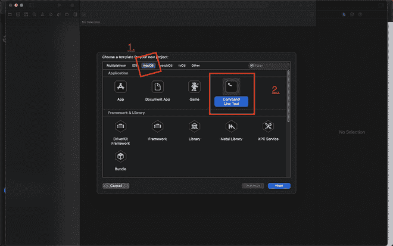

# 在 Mac 中设置 C++ 编程环境的不同方法

> 原文:[https://www . geeksforgeeks . org/不同的设置方式-环境-CPP-编程-in-mac/](https://www.geeksforgeeks.org/different-ways-to-setting-up-environment-for-cpp-programming-in-mac/)

Xcode 是苹果自己开发的一个 IDE，用于为 macOS 和 iOS 或苹果开发的所有其他操作系统开发应用程序。它还支持内置的 C/C++ 语言。在这里，为 macOS 系统找到一个 C++ IDE 是相当容易的。要在 Mac 上用 C++ 运行一个程序，我们必须为 Xcode 安装 Xcode 或命令行工具。

**方式:**

因此，在 Mac 上运行 C++ 程序有两种选择。

1.  从苹果应用商店下载并安装
2.  使用命令行工具下载并安装，并使用任何首选的集成开发环境或代码编辑器来编写 C 或 C++ 代码。

**方式一**:从苹果 Appstore 下载安装

> **注意:**Visual Studio 的 macOS 版本不适用于 C 或 C++，因为我们可以开发 C#但不能开发 C/C++。

**程序:**

**步骤 1:** 在要编写程序的机器上安装 Xcode 软件。所以下载 Xcode 应用程序后，稍后打开它，你会看到如下所示的弹出窗口


第一步。

**第二步:**现在点击链接“*新建一个 Xcode 项目*”。

**步骤 3:** 同样，如果有一个现有项目，您将单击“打开一个项目或文件”，或者如果该项目在源代码管理中，则单击“克隆一个现有项目”。

**第四步:**点击 macOS 标签，然后点击命令行应用，因为这是我们唯一可以用 C 和 C++ 开发应用的地方。



第二步

**第 5 步:**现在它将显示一个界面，给产品或应用程序一个名称和包名，作为一个普通的 IDE。在给出该名称后，将有一个下拉列表来选择一种语言。因此，您可以选择 C 或 C++ 并单击“下一步”按钮，而不是 swift。


第三步。

**第六步:**然后它会询问项目在你机器上的位置，并且，完成！，您现在可以打开或创建 C 或 C++ 文件。


**方式 2:安装 Xcode 命令行工具并使用任何首选 IDE**

在这种方法中，我们需要使用**终端**，因为我们只需要下载和安装部分 **Xcode** ，而不是整个 Xcode。如果您的存储空间有限或出于其他原因，此方法非常有用。我们将下载 Xcode 的 2GB 部分，而不是整个 28GB Xcode，因为我们只需要 C 和 C++ 编译器。

**程序:**

按照以下步骤设置 C++ 的运行环境

**步骤 1:** 打开终端，键入或复制并粘贴此命令“xcode-select-install”，现在 Xcode 命令行工具将会安装，您将获得如下界面:

```cpp
xcode-select --install
```


**第二步:**现在点击安装它会询问你的设备密码，所以输入密码后它会安装 Xcode 命令行工具。现在我们可以创建一个 C 或 C++ 文件并编辑它。

**第三步:**现在使用 VScode 或者由你选择，因为它是最好的免费代码，并为 C++ 安装两个扩展。

> 注:第一个是 C/C++ 官方扩展，第二个是**代码运行器**


C/C++ 扩展


代码运行器扩展

现在一个 C /C++ 代码可以在 VScode 中运行。