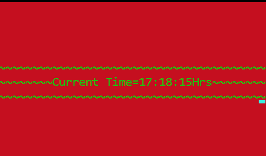

# c++ 中从用户设定时间开始的数字钟

> 原文:[https://www . geesforgeks . org/digital-clock-start-from-user-set-time-in-CPP/](https://www.geeksforgeeks.org/digital-clock-starting-from-user-set-time-in-cpp/)

在本文中，我们将讨论[**C++ 语言**](https://www.geeksforgeeks.org/introduction-to-c-programming-language/) 中的**数字钟**。这是一个应用程序，允许个人时钟在自定义设置的时间开始，并显示从那时起的时间。本文描述了如何制作这样一个带有 **HH:MM:SS** 槽的 **24 小时格式**的时钟，并从您希望的位置开始计时，然后从该位置向前移动。

**功能:**这是一个简单的数字时钟，使用基本的 [C++ 概念](https://www.geeksforgeeks.org/c-plus-plus/)开发，显示**小时**、**分钟**和**秒**。

**方法:**这个程序的要求只是 [**数据类型**](https://www.geeksforgeeks.org/c-data-types/)**[**变量**](https://www.geeksforgeeks.org/variables-in-c/)[**操纵器**](https://www.geeksforgeeks.org/manipulators-in-c-with-examples/)[**控制语句**](https://www.geeksforgeeks.org/decision-making-c-c-else-nested-else/)**条件语句、**等的基本概念。以下是步骤:**

*   **创建一个屏幕，显示您所在位置的**“当前时间”**，这将使用 C++ 中使用的简单输出方法来实现，即 [cout](https://www.geeksforgeeks.org/basic-input-output-c/) ，以及一个操纵器“[**【setw()**](https://www.geeksforgeeks.org/iomanip-setw-function-in-c-with-examples/)”。**
*   **在前面提到的屏幕中，执行 **HH** 列、 **MM** 列、 **SS** 列，这将包含时间。**
*   **使用**系统(“彩色 4A”)，**颜色将采用十六进制格式，控制台可以使用两位十六进制代码 **(0 到 F)** 来实现它们，这又会改变输出控制台中的文本颜色。**
*   **在最后一个屏幕上，可以看到一个数字时钟最终实现，并从输入的时间运行。**

****使用的功能:****

*   ****系统(“cls”):**用于清除控制台或屏幕。如果有人想看屏幕上出现的任何东西，这是可以避免的。**
*   ****setw():** 这个函数是用来在括号里留下你可以写的特定字符的空格。在 [< iomanip >头文件](https://www.geeksforgeeks.org/header-files-in-c-c-with-examples/)中声明。这里使用 setw(70)。**
*   ****系统(“彩色 4A”):**该功能用于将背景**设为红色**，文本为**浅绿色。****
*   ****Sleep():** sleep 是在 **< windows.h >** 头文件中声明的函数。它实际上将程序的执行暂时挂起一段时间，以毫秒为单位。**

**下面是上述方法的实现:**

## **C++**

```cpp
// C++ program to illustrate the digital
// clock starting from the entered time

#include <iomanip>
#include <iostream>
#include <stdlib.h>
#include <windows.h>
using namespace std;

// Driver Code
int main()
{
    system("color 4A");

    // Background color and Foreground
    int hour, min, sec;
    cout << setw(70)
         << "*Enter Current time*\n";

    // Use of manipulator for taking
    // input from the user
    cout << "HH- ";
    cin >> hour;
    cout << "MM- ";
    cin >> min;
    cout << "SS- ";
    cin >> sec;

    // Background color and the
    // Foreground for 2nd screen
    system("color 4A");

    // Cases for the Wrong Time Input
    if (hour > 23) {
        cout << "Wrong Time input";
    }
    else if (min > 60) {
        cout << "Wrong Time Input";
    }
    else if (sec > 60) {
        cout << "Wrong Time Input";
    }

    // Otherwise
    else {
        while (1)

        // Run Block infinitely
        {
            system("cls");

            // Clear the console

            // Code for Showing Time
            for (hour; hour < 24; hour++) {

                for (min; min < 60; min++) {

                    for (sec; sec < 60; sec++) {
                        system("cls");

                        cout << "\n\n\n\n~~~~~~~~~"
                                "~~~~~~~~~~~~~~~~~~~~~"
                                "~~~~~~~~~~~~~~~~~~"
                                "Current Time = "
                             << hour << ":" << min << ":"
                             << sec
                             << "Hrs~~~~~~~~~~~~~~~~~~"
                                "~~~~~~~~~~~~~~~~~~~~~"
                                "~~~~~~~~~";

                        // HH:MM:SS columns in output

                        Sleep(1000);

                        // Pause for 1 sec
                    }
                    sec = 0;
                }
                min = 0;
            }
        }
    }
}
```

****输入:****

**[](https://media.geeksforgeeks.org/wp-content/uploads/20210325124005/Screenshot470.png)**

****输出:****

**[](https://media.geeksforgeeks.org/wp-content/uploads/20210325123824/Screenshot471.png)**