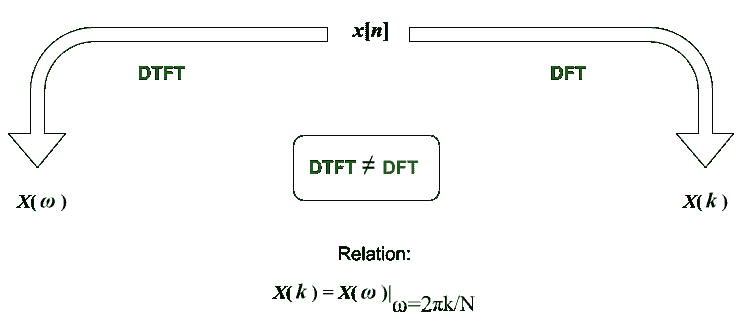
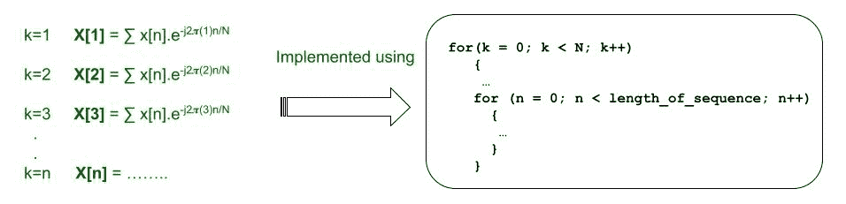
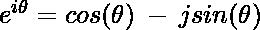
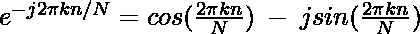
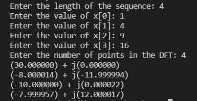
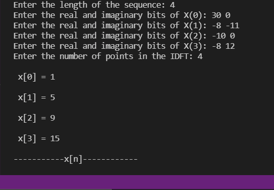

# 离散傅里叶变换及其用 C 求逆

> 原文:[https://www . geeksforgeeks . org/discrete-Fourier-transform-and-its-inverse-use-c/](https://www.geeksforgeeks.org/discrete-fourier-transform-and-its-inverse-using-c/)

几十年来，一直存在着无法找到最完美的傅里叶变换计算方法的问题。早在 19 世纪，高斯就已经阐明了他的观点，一个世纪后，一些研究人员也是如此，但解决办法在于必须用离散傅立叶变换[解决。这是一个相当好的近似，人们可以通过它真正接近于描绘连续时间信号，它工作得很好(计算机和整个经济一直在使用它)，即使它是有限的，同时不受时间限制或频带限制。此外，它没有考虑到信号中的所有样本。然而，它是有效的，并且是一个相当公认的成功。](https://www.geeksforgeeks.org/how-to-compute-a-discrete-fourier-transform-coefficients-directly-in-java/)

**离散傅里叶变换(DFT):** 理解离散傅里叶变换是这里的基本目标。逆只是另一个的数学重排，非常简单。傅立叶变换是将一个函数从时域转换到频域。人们可以断言，除了离散化的信号之外，离散傅立叶变换也做同样的事情。但是，不要将此与离散时间傅立叶变换混淆。区别解释如下:

*   有限长度的序列计算离散傅立叶变换，而无限长度的序列计算离散傅立叶变换。这就是为什么 DTFTs 中的求和范围从-∞到+∞。
*   DTFTs 的特点是输出频率本质上是连续的，即 **ω** 。另一方面，DFT 给出的输出具有离散化的频率。
*   仅对于 **ω** 的采样值，DTFTs 等于 DFT。这是我们从另一个中得到一个的唯一方法。

[](https://media.geeksforgeeks.org/wp-content/uploads/20210625114402/DFTDTFT.png)

DFT 和 IDFT 的一般表达式如下。注意，k 的整数值是从 0 开始计算直到 N-1。k 只是一个变量，用来表示函数的采样值。然而，由于 IDFT 是离散傅立叶变换的逆变换，所以不使用 k。而是使用“n”。许多人觉得混淆了哪个是哪个。将 DFT 与大写字母“X”联系起来，将 IDFTs 与小写字母“X”联系起来，这是一种无压力的活动。

**离散傅立叶变换公式:**

> ![X(k) = \sum_{n=0}^{N-1}\ x[n].e^{\frac{-j2\pi kn}{N}}](img/1f22551f28e35fdd24f9ec6eea7b737e.png "Rendered by QuickLaTeX.com")

**IDFT 方程式:**

> ![x(n) = \sum_{k=0}^{N-1}\ X[k].e^{\frac{j2\pi kn}{N}}](img/ce8d1090b8eedab9eae713ab0119d9af.png "Rendered by QuickLaTeX.com")

编写上述表达式时，首先想到的是从求和开始。实际上，这是通过运行[循环](https://www.geeksforgeeks.org/loops-in-c-and-cpp/)并迭代 **n** (在 DFT 中)和 **k** (在 IDFT 中)的不同值来实现的。一定要注意如何找到不同的输出值。当 k=1 时，人们可以很容易地计算出 X[k=1]。然而，在其他应用中，如绘制星等谱图，我们也必须为不同的 k 值计算相同的值。因此，必须引入两个循环或一对嵌套循环。

[](https://media.geeksforgeeks.org/wp-content/uploads/20210626145430/DFTalgo.jpg)

还有一个问题是如何翻译表达式的后半部分，即欧拉常数上升到一个复指数。读者一定还记得用正弦和余弦描述欧拉常数的公式。具体如下-

> 

这就让我们把求和项的后半部分解释如下-

> 

可以导入库(在 C 语言的情况下)，当编写这个表达式时，可能在确保代码易读性方面有问题。然而，一点数学洞察力和简单的转换是这里的完美要求。许多人会同意。请注意，这导致表达式的虚部和实部——余弦项是实部，正弦项都是虚部。一个相当直观的视角也可以实现——将序列表示为矩阵，并使用向量形式的离散傅立叶变换和 IDFT 进行计算。这最好在 MATLAB 中解决。

**算法(DFT):**

*   初始化所有必需的库。
*   提示用户输入离散傅立叶变换中的点数。
*   现在，您可以初始化数组，并相应地要求输入序列。这纯粹是因为无法在 c 语言中声明空数组，动态内存分配是解决方案之一。然而，简单地重新排序提示本身就是一个公平的解决方案。
*   执行 2 个循环，计算特定值 k 和 N 的 X(k)值。请记住，欧拉公式将用于替代 **e <sup>-j2kπn/N</sup>** 。这需要除法，我们分别计算表达式的实部和虚部。
*   运行计算时显示结果。

下面是实现上述方法的 [C 程序](https://www.geeksforgeeks.org/c/):

## C

```
// C program for the above approach
#include <math.h>
#include <stdio.h>

// Function to calculate the DFT
void calculateDFT(int len)
{
    int xn[len];
    float Xr[len];
    float Xi[len];
    int i, k, n, N = 0;

    for (i = 0; i < len; i++) {

        printf("Enter the value "
               "of x[%d]: ",
               i);
        scanf("%d", &xn[i]);
    }

    printf("Enter the number of "
           "points in the DFT: ");
    scanf("%d", &N);
    for (k = 0; k < N; k++) {
        Xr[k] = 0;
        Xi[k] = 0;
        for (n = 0; n < len; n++) {
            Xr[k]
                = (Xr[k]
                   + xn[n] * cos(2 * 3.141592 * k * n / N));
            Xi[k]
                = (Xi[k]
                   + xn[n] * sin(2 * 3.141592 * k * n / N));
        }

        printf("(%f) + j(%f)\n",
               Xr[k], Xi[k]);
    }
}

// Driver Code
int main()
{
    int len = 0;
    printf("Enter the length of "
           "the sequence: ");
    scanf("%d4", &len);
    calculateDFT(len);

    return 0;
}
```

**输入:**

```
>> Enter the length of the sequence: 4
>> Enter the value of x[0]: 1
>> Enter the value of x[1]: 4
>> Enter the value of x[2]: 9
>> Enter the value of x[3]: 16
>> Enter the number of points in the DFT: 4
```

**输出:**



**算法(IDFT):**

*   初始化所有必需的库。
*   提示用户输入序列的长度。这将被替换为 n 的值。初始化负责存储输入的实部和虚部的[阵列](https://www.geeksforgeeks.org/introduction-to-arrays/)。
*   现在使用“循环”的[逐个获得序列的实部和虚部。请记住，我们实际上是在颠倒为离散傅立叶变换计算定义的过程。](https://www.geeksforgeeks.org/loops-in-c-and-cpp/)
*   定义θ。θ是 e <sup>iθ</sup> 的欧拉转换中 e 升高到的指数，即θ= 2kπn/n。
*   用余弦和正弦计算 x[n]。使用表达中的符号时要小心。
*   将得到的输出除以长度或乘以 1/N 打印结果。

下面是实现上述方法的 C 程序:

## C

```
// C program for the above approach

#include <math.h>
#include <stdio.h>

// Function to calculate the inverse
// discrete fourier transformation
void calculate_IDFT(int len)
{
    int x[len];
    float Xr[len];
    float Xi[len];
    int i, k, n, N = 0;
    for (i = 0; i < len; i++) {
        printf(
            "Enter the real and "
            "imaginary bits of X(%d): ",
            i);
        scanf("%f %f", &Xr[i], &Xi[i]);
    }

    printf("Enter the number of "
           "points in the IDFT: ");
    scanf("%d", &N);

    for (n = 0; n < N; n++) {
        x[n] = 0;
        for (k = 0; k < N; k++) {
            int theta = (2 * 3.141592 * k * n) / N;
            x[n] = x[n] + Xr[k] * cos(theta)
                   + Xi[k] * sin(theta);
        }
        x[n] = x[n] / N;
        printf("\n x[%d] = %d\n", n,
               x[n]);
    }

    printf("\n-----------x[n]------------\n\n");
}

// Driver Code
int main()
{
    int len = 0;
    printf("Enter the length of "
           "the sequence: ");
    scanf("%d", &len);
    calculate_IDFT(len);

    return 0;
}
```

**输入:**

```
>> Enter the length of the sequence: 4
>> Enter the real and imaginary bits of X(0): 30 0
>> Enter the real and imaginary bits of X(1): -8 -11
>> Enter the real and imaginary bits of X(2): -10 0
>> Enter the real and imaginary bits of X(3): -8 12
>> Enter the number of points in the IDFT: 4
```

先前获得的离散傅立叶变换的输出(不完全是；除了一些偏差)被用作 IDFT 的输入。

**输出:**

