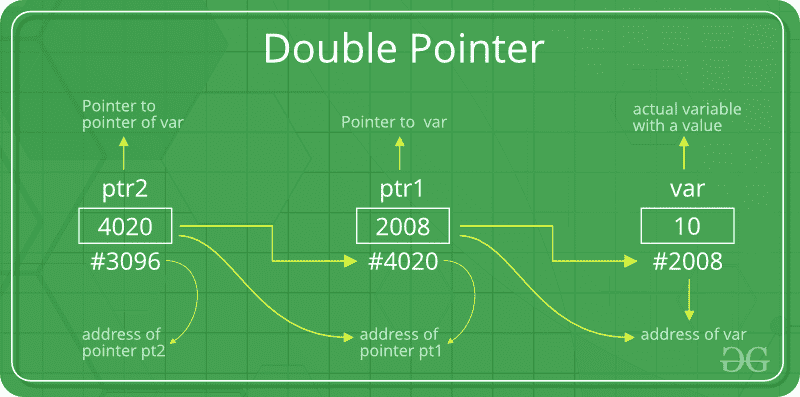
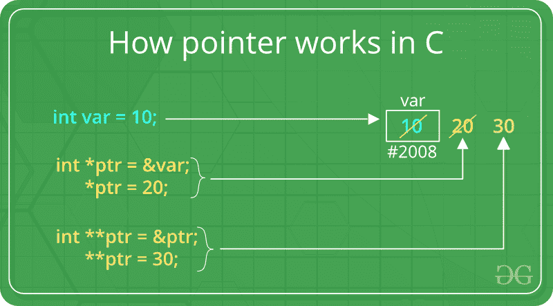

# C

中的双指针(指针对指针)

> 原文:[https://www . geesforgeks . org/double-pointer-pointer-c/](https://www.geeksforgeeks.org/double-pointer-pointer-pointer-c/)

先决条件:[C 和 C++中的指针](https://www.geeksforgeeks.org/pointers-in-c-and-c-set-1-introduction-arithmetic-and-array/)

我们已经知道，指针指向内存中的一个位置，因此用于存储变量的地址。当我们定义一个指向指针的指针时。第一个指针用于存储变量的地址。第二指针用于存储第一指针的地址。这就是为什么它们也被称为双指针。

**如何在 C 语言中声明一个指向指针的指针？**
声明指针指向指针类似于在 c 语言中声明指针，不同的是我们要在指针的名字前加一个' * '。
**语法**:

```cpp
int **ptr;    // declaring double pointers

```

下图解释了双指针的概念:



上图显示了指向指针的指针的内存表示。第一个指针 ptr1 存储变量的地址，第二个指针 ptr2 存储第一个指针的地址。



借助以下程序，让我们更清楚地了解这一点:

```cpp
#include <stdio.h>

// C program to demonstrate pointer to pointer
int main()
{
    int var = 789;

    // pointer for var
    int *ptr2;

    // double pointer for ptr2
    int **ptr1;

    // storing address of var in ptr2
    ptr2 = &var;

    // Storing address of ptr2 in ptr1
    ptr1 = &ptr2;

    // Displaying value of var using
    // both single and double pointers
    printf("Value of var = %d\n", var );
    printf("Value of var using single pointer = %d\n", *ptr2 );
    printf("Value of var using double pointer = %d\n", **ptr1);

  return 0;
} 
```

输出:

```cpp
Value of var = 789
Value of var using single pointer = 789
Value of var using double pointer = 789

```

**Related Post :**[Function Pointer in C](https://www.geeksforgeeks.org/function-pointer-in-c/)

本文由 [**哈什·阿加瓦尔**](https://www.facebook.com/harsh.agarwal.16752) 供稿。如果你喜欢 GeeksforGeeks 并想投稿，你也可以使用[contribute.geeksforgeeks.org](http://www.contribute.geeksforgeeks.org)写一篇文章或者把你的文章邮寄到 contribute@geeksforgeeks.org。看到你的文章出现在极客博客主页上，帮助其他极客。

如果你发现任何不正确的地方，或者你想分享更多关于上面讨论的话题的信息，请写评论。