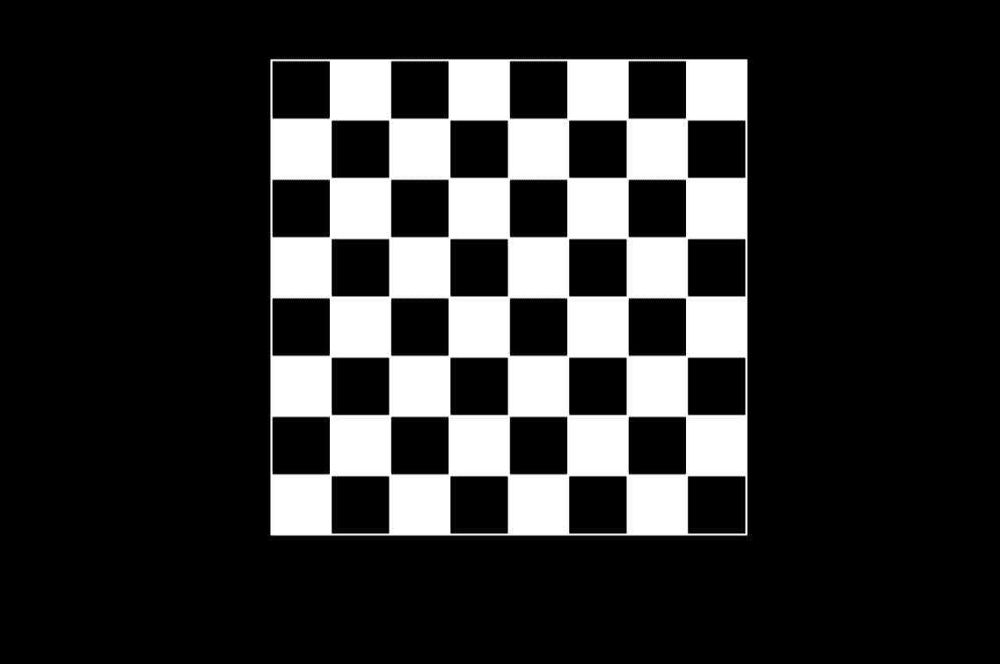

# 用 C 语言图形编程绘制棋盘

> 原文:[https://www . geesforgeks . org/draw-a-chess-board-use-graphics-programming-in-c/](https://www.geeksforgeeks.org/draw-a-chess-board-using-graphics-programming-in-c/)

**先决条件:**[graphics.h](https://www.geeksforgeeks.org/add-graphics-h-c-library-gcc-compiler-linux/)[如何在 CodeBlocks 中包含 graphics . h？](https://www.geeksforgeeks.org/include-graphics-h-codeblocks/)

在[计算机图形学](https://www.geeksforgeeks.org/computer-graphics-2/)中，我们使用 **[graphics.h](https://www.geeksforgeeks.org/add-graphics-h-c-library-gcc-compiler-linux/)** 提供直接绘制不同坐标形状(如圆形、矩形等)的功能。通过使用这些功能，我们可以绘制不同的物体，如汽车，小屋，树木等。在本程序中，任务是使用[图形](https://www.geeksforgeeks.org/basic-graphic-programming-in-c/)中的功能绘制**棋盘**。

要运行该程序，我们需要包含以下头文件:

```cpp
#include <graphic.h>

```

**方法:**我们将借助以下功能创建一个棋盘:

1.  **[矩形(左、上、右、下)](https://www.geeksforgeeks.org/intersecting-rectangle-when-bottom-left-and-top-right-corners-of-two-rectangles-are-given/) :** 来自 **graphics.h** 头文件的一个函数，用于绘制矩形。绘制矩形需要左上角和右下角的坐标。左指定左上角的 X 坐标，上指定左上角的 Y 坐标，右指定右下角的 X 坐标，下指定右下角的 Y 坐标。
2.  **delay():** 这个函数存在于库**“dos . h”**中，用于短时间保存程序输出，因为处理速度很快，所以使用它来查看结果。
3.  **[setcolor()](https://www.geeksforgeeks.org/setcolor-function-c/):**graphics . h 头文件中设置指针(光标)颜色的函数。计算机图形学中有一些预定义的颜色。这里 n 是色号。
4.  **[setfillstyle():](https://www.geeksforgeeks.org/setfillstyle-floodfill-c/)** 来自 **graphics.h** 头文件的一个函数，用于设置当前填充模式和填充颜色。
5.  **[漫填()](https://www.geeksforgeeks.org/setfillstyle-floodfill-c/) :** 来自 **graphics.h** 头文件的函数，用于填充封闭区域。

下面是用 C 语言图形绘制**棋盘**的实现:

```cpp
// C program to create a chess board
#include <conio.h>
#include <dos.h>
#include <graphics.h>
#include <stdio.h>

// Driver Code
void main()
{
    // Auto detection
    int gr = DETECT, gm;
    int r, c, x = 30, y = 30, black = 0;

    // Initialize graphics mode by passing
    // three arguments to initgraph function

    // &gdriver is the address of gdriver
    // variable, &gmode is the address of
    // gmode and  "C:\\Turboc3\\BGI" is the
    // directory path where BGI files are stored
    initgraph(&gr, &gm, "C:\\TURBOC3\\BGI");

    // Iterate over 8 rows
    for (r = 0; r < 8; r++) {

        // iterate over 8 cols
        for (c = 1; c <= 8; c++) {

            // If current block is to
            // color as black
            if (black == 0) {

                // set next color as white
                setcolor(WHITE);

                // sets the current fill
                // pattern and fill color
                // for black boxes
                setfillstyle(SOLID_FILL, BLACK);

                // creating rectangle
                // with length and breadth
                // with size 30
                rectangle(x, y, x + 30, y + 30);

                // Fill an enclosed area
                floodfill(x + 1, y + 1, WHITE);

                // Set black to true
                black = 1;
            }

            // If current block is to
            // color as white
            else {
                setcolor(WHITE);

                // sets the current fill
                // pattern and fill color
                // for whitw boxes
                setfillstyle(SOLID_FILL, WHITE);

                // creating rectangle
                // with length and breadth
                // with size 30
                rectangle(x, y, x + 30, y + 30);

                // Fill an enclosed area
                floodfill(x + 1, y + 1, WHITE);

                // Set black to false
                black = 0;
            }

            // Increment for next row
            x = x + 30;

            // delay function under library
            // "dos.h" for holding the
            // function for some time
            delay(30);
        }
        if (black == 0)
            black = 1;
        else
            black = 0;

        delay(30);
        x = 30;
        y = 30 + y;
    }

    // getch is used to hold the output screen
    // and wait until user gives any type of
    // input in turbo c
    getch();

    // close graph function is used to exit
    // from the graphics screen
    closegraph();
}
```

**输出:**
下面是上面程序的输出:
[](https://media.geeksforgeeks.org/wp-content/uploads/20200615050856/chessGfg.png)