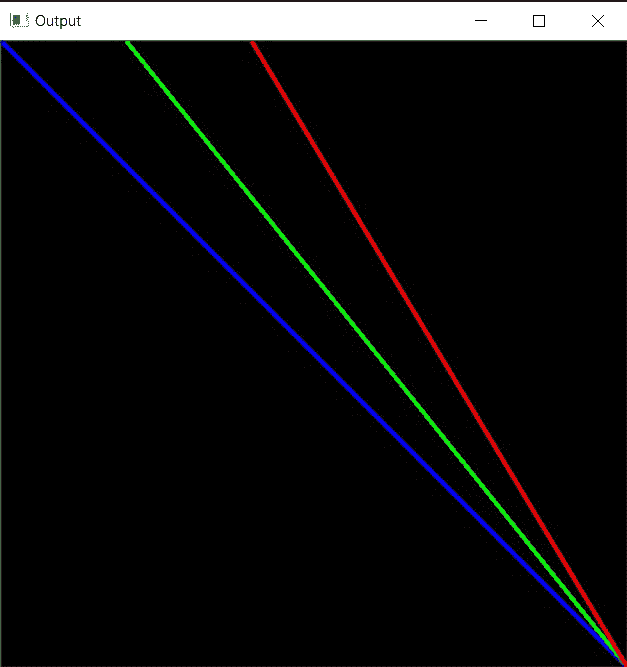

# 用 C++中的 OpenCV 画线

> 原文:[https://www . geesforgeks . org/draw-a-line-use-opencv-in-c/](https://www.geeksforgeeks.org/draw-a-line-using-opencv-in-c/)

在本文中，我们将讨论如何在 [C++](https://www.geeksforgeeks.org/c-plus-plus/) 中使用 [OpenCV](https://www.geeksforgeeks.org/opencv-c-program-face-detection/) 绘制一条线。想法是使用 OpenCV C++库中的 **line()函数**。

**语法:**

> 线(img、pt1、pt2、颜色、厚度、线型、偏移)

**参数:**

*   **img:** 这是图像文件。
*   **起点:**线段的起点。线段两端的第一个点。它是两个坐标(x 坐标，y 坐标)的元组。
*   **终点:**线段的终点。线段两端的第二个点。它是两个坐标(x 坐标，y 坐标)的元组。
*   **颜色:**待画线的颜色。它是一个代表 3 种颜色的元组..(蓝色、绿色、红色)。
*   **厚度:**所画线条的厚度。
*   **线型:**线条的类型。有 3 种类型的线路:
    *   **LINE_4:** 使用 4 连通[布雷森汉算法](https://www.geeksforgeeks.org/bresenhams-line-generation-algorithm/)绘制直线。
    *   **LINE_8:** 使用 8 连通 Bresenham 算法绘制的直线。
    *   **LINE_AA:** 使用[高斯滤波器](https://www.geeksforgeeks.org/gaussian-filter-generation-c/)绘制抗锯齿线。
*   **nshift:** 是点坐标中的小数位数。

**返回值:**返回图像。

**程序 1:**

下面的程序展示了如何在自形成的背景图像上绘制所有类型的线条:

## C++

```cpp
// C++ program for the above approach
#include <iostream>
#include <opencv2/core/core.hpp>

// Library to include for
// drawing shapes
#include <opencv2/highgui/highgui.hpp>
#include <opencv2/imgproc.hpp>
using namespace cv;
using namespace std;

// Driver Code
int main(int argc, char** argv)
{
    // Create a blank image of size
    // (500 x 500) with black
    // background (B, G, R) : (0, 0, 0)
    Mat image(500, 500, CV_8UC3,
              Scalar(0, 0, 0));

    // Check if the image is created
    // successfully
    if (!image.data) {
        cout << "Could not open or find"
             << " the image";

        return 0;
    }

    Point p1(0, 0), p2(100, 0);
    Point p3(200, 0), p4(500, 500);
    int thickness = 2;

    // Line drawn using 8 connected
    // Bresenham algorithm
    line(image, p1, p4, Scalar(255, 0, 0),
         thickness, LINE_8);

    // Line drawn using 4 connected
    // Bresenham algorithm
    line(image, p2, p4, Scalar(0, 255, 0),
         thickness, LINE_4);

    // Antialiased line
    line(image, p3, p4, Scalar(0, 0, 255),
         thickness, LINE_AA);

    // Show our image inside window
    imshow("Output", image);
    waitKey(0);

    return 0;
}
```

**输出:**

[](https://media.geeksforgeeks.org/wp-content/uploads/20210115151355/out1.jpg)

**程序 2:**

下面是演示如何在加载的图像上画线的程序:

## C++

```cpp
// C++ program for the above approach
#include <iostream>
#include <opencv2/core/core.hpp>

// Library to include for
// drawing shapes
#include <opencv2/highgui/highgui.hpp>
#include <opencv2/imgproc.hpp>
using namespace cv;
using namespace std;

// Driver code
int main(int argc, char** argv)
{
    // Path of the image file
    Mat image = imread(
        "C:/Users/harsh/Downloads/geeks.png",
        IMREAD_COLOR);

    // Check if the image is loaded
    // successfully
    if (!image.data) {
        std::cout << "Could not open or "
                     "find the image";
        return 0;
    }

    Point p1(0, 0), p2(250, 250);
    int thickness = 2;

    // Line drawn using 8 connected
    // Bresenham algorithm
    line(image, p1, p2, Scalar(255, 0, 0),
         thickness, LINE_8);

    // Show our image inside window
    imshow("Output", image);
    waitKey(0);

    return 0;
}
```

**输出:**

[](https://media.geeksforgeeks.org/wp-content/uploads/20210115152457/out1.jpg)