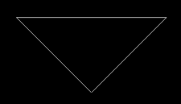

# 在 C++图形中画一个三角形

> 原文:[https://www . geesforgeks . org/draw-a-triangle-in-c-graphics/](https://www.geeksforgeeks.org/draw-a-triangle-in-c-graphics/)

**先决条件:**[graphics.h](https://www.geeksforgeeks.org/add-graphics-h-c-library-gcc-compiler-linux/)[如何在 CodeBlocks 中包含 graphics . h？](https://www.geeksforgeeks.org/include-graphics-h-codeblocks/)

任务是编写一个 [C 程序](https://www.geeksforgeeks.org/c-programming-language/)用[图形](https://www.geeksforgeeks.org/basic-graphic-programming-in-c/)的[线](https://www.geeksforgeeks.org/draw-line-c-graphics/)功能做一个三角形。

要运行该程序，我们必须包含以下头文件:

```
#include <graphic.h>

```

**方法:** 想法是借助几条线创建一个三角形。我们将通过向 line()传递 4 个数字来在图形 中绘制一条线，函数为:

> *线(a、b、c、d)*
> *以上功能将在输出窗口中从坐标* ***(a、b)*** *到* ***(c、d)*** *画一条线。*

下面是上述方法的实现:

## C++

```
// C++ program for drawing a triangle
#include <graphics.h>
#include <iostream>

// Driver code
int main()
{
    // gm is Graphics mode which
    // is a computer display
    // mode that generates
    // image using pixels.
    // DETECT is a macro
    // defined in "graphics.h"
    // header file
    int gd = DETECT, gm;

    // initgraph initializes
    // the graphics system
    // by loading a graphics
    // driver from disk
    initgraph(&gd, &gm, "");

    // Triangle

    // line for x1, y1, x2, y2
    line(150, 150, 450, 150);

    // line for x1, y1, x2, y2
    line(150, 150, 300, 300);

    // line for x1, y1, x2, y2
    line(450, 150, 300, 300);

    // closegraph function closes
    // the graphics mode and
    // deallocates all memory
    // allocated by graphics system
    getch();

    // Close the initialized gdriver
    closegraph();
}
```

**输出:**
下面是上面程序的输出:
[](https://media.geeksforgeeks.org/wp-content/uploads/20200829230441/Triangle.png)