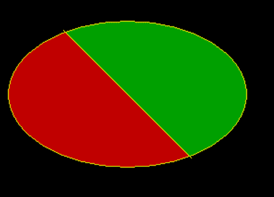

# 在 C++ Graphics 中画一个被直线分割成两个彩色部分的椭圆

> 原文:[https://www . geeksforgeeks . org/画一个被直线分割成两种颜色的 c 形部分的椭圆/](https://www.geeksforgeeks.org/draw-an-ellipse-divided-by-straight-line-into-two-colored-part-in-c-graphics/)

**先决条件:** [如何包含 graphics.h？](https://www.geeksforgeeks.org/include-graphics-h-codeblocks/)， [graphics.h](https://www.geeksforgeeks.org/add-graphics-h-c-library-gcc-compiler-linux/)
任务是画一个椭圆，该椭圆与一条对角穿过椭圆中心的直线相交。然后用不同的颜色给两段上色。

**方法:**要运行程序，我们需要包含以下头文件:

```cpp
#include <graphic.h>

```

我们将借助以下函数创建所需的椭圆:

*   [**空心椭圆(int x，int y，int from_angle，int to_angle，int x_rad，int y_rad)**](https://www.geeksforgeeks.org/draw-ellipse-c-graphics/) **:** 一个来自 **graphics.h** 头文件的函数负责在屏幕上创建椭圆。
*   [**【空行(int x1，int y1，int x2，int y2)**](https://www.geeksforgeeks.org/draw-line-c-graphics/) **:** 一个函数从 graphics.h 头文件里面画一条线。

*   [**【空隙漫填(int x，int y，int border _ color)**](https://www.geeksforgeeks.org/setfillstyle-floodfill-c/)**:**一个来自 **graphics.h** 头文件的负责函数用于填充一个封闭区域。当前填充图案和填充颜色用于填充该区域。

下面是上述方法的实现:

## C++

```cpp
// C++ program for the above approach
#include <graphics.h>

// Function to set the pattern and
// color to be filled in the given
// segment
void fill(int x, int y,
          int color, int boundary)
{  
    //It will sets the current fill
    //pattern and fill color

    setfillstyle(SOLID_FILL,color);

    // fill the color in segment
    // having point (x, y) and
    // border color = boundary
    floodfill(x, y, boundary);
}

// Function to create the ellipse
// using graphic library
void drawEllipse()
{
    // gm is Graphics mode which is a
    // computer display mode that
    // generates image using pixels

    // DETECT is a macro defined in
    // "graphics.h" header file
    int gd = DETECT, gm, error;

    // initgraph initializes the
    // graphics system
    initgraph(&gd, &gm, "");

    // set the color used for drawing
    setcolor(YELLOW);

    // Center of ellipse
    int x = 150, y = 150;

    // Draw complete ellipse angle will
    // be from 0 to 360
    int from_angle = 0, to_angle = 360;

    // Radius of ellipse
    int x_rad = 130, y_rad = 80;

    // Ellipse function
    ellipse(x, y, from_angle,
            to_angle, x_rad, y_rad);

    // End points of a line passing
    // through center of above ellipse
    int x1 = 80, y1 = 80, x2 = 220, y2 = 220;

    // Line for above end points
    line(x1, y1, x2, y2);

    // Fill different color in two
    // parts of ellipse, choose point
    // (x-1, y) and (x+1, y)
    // because line is passing diagonally
    fill(x - 1, y, RED, YELLOW);
    fill(x + 1, y, GREEN, YELLOW);

    getch();

    // closegraph function closes
    // graphics mode and deallocates
    // all memory allocated by graphics
    closegraph();
}

// Driver Code
int main()
{
    // Function call
    drawEllipse();
    return 0;
}
```

**输出:**

