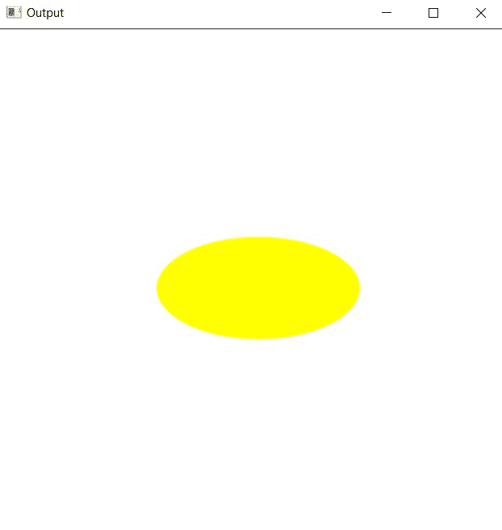

# 在 C++中使用 OpenCV 绘制椭圆

> 原文:[https://www . geesforgeks . org/绘制椭圆-使用-opencv-in-cpp/](https://www.geeksforgeeks.org/draw-an-ellipse-using-opencv-in-cpp/)

在本文中，任务是使用 [C++](https://www.geeksforgeeks.org/c-plus-plus/) 中的 [OpenCV](https://www.geeksforgeeks.org/introduction-to-opencv/) 绘制一个椭圆。将使用 OpenCV C++库中的[椭圆()](https://www.geeksforgeeks.org/draw-ellipse-c-graphics/)函数。

**语法:**

> 椭圆(图像、中心坐标、轴长度、角度、开始角度、结束角度、颜色、厚度、线型、偏移)

**参数:**

*   **图像:**是要在其上绘制椭圆的图像。
*   **中心坐标:**椭圆中心的坐标。(两个坐标的元组(X 坐标，Y 坐标))
*   **axesLength:** 包含椭圆长轴和短轴(长轴长度、短轴长度)的元组。
*   **角度:**椭圆旋转角度，单位为度。
*   **起始角度:**椭圆弧的起始角度(度)。
*   **endAngle:** 椭圆弧的结束角度(度)。
*   **颜色:**是要绘制的椭圆的边界线的颜色。表示 3 种颜色的元组 **(B，G，R)** ，即(蓝，绿，红)。
*   **厚度:**是 **px** 中椭圆边界线的厚度。 **-1 px** 的厚度会以指定的颜色填充椭圆形状。
*   **线型:**线条的类型。有 3 种类型的线路:
    *   **LINE_4:** 使用 4 连通 Bresenham 算法绘制直线。
    *   **LINE_8:** 使用 8 连通 Bresenham 算法绘制直线。
    *   **LINE_AA:** 使用 [**高斯滤镜**](https://www.geeksforgeeks.org/gaussian-filter-generation-c/) 绘制抗锯齿线。
*   **移位:**点坐标中的小数位数。

**返回值:**返回图像。

**程序 1:**

下面是 [C++](https://www.geeksforgeeks.org/c-plus-plus/) 程序，演示如何在自形成的背景图像上绘制椭圆:

## C++

```cpp
// C++ program to demonstrating ellipse
// over a self-formed background image
#include <iostream>
#include <opencv2/core/core.hpp>

// Drawing shapes
#include <opencv2/imgproc.hpp>

#include <opencv2/highgui/highgui.hpp>
using namespace cv;
using namespace std;

// Driver Code
int main(int argc, char** argv)
{
    // Creating a blank image with
    // white background
    Mat image(500, 500, CV_8UC3,
              Scalar(255, 255, 255));

    // Check if the image is created
    // successfully or not
    if (!image.data) {
        std::cout << "Could not open or "
                  << "find the image\n";

        return 0;
    }

    // Drawing the ellipse
    ellipse(image, Point(256, 256),
            Size(100, 50), 0, 0,
            360, Scalar(0, 255, 255),
            -1, LINE_AA);

    // Showing image inside a window
    imshow("Output", image);
    waitKey(0);

    return 0;
}
```

**输出:**

[](https://media.geeksforgeeks.org/wp-content/uploads/20210123132944/gg.jpg)

**说明:**在上述程序中，以 **0 度**的角度画出一个椭圆，即水平椭圆。

**程序 2:**

下面是 C++程序在加载的图像上显示的矩形，GFG 徽标周围有一个椭圆:

## C++

```cpp
// C++ program to demonstrate rectangle
// over a loaded image with an ellipse
// around the GFG logo
#include <iostream>
#include <opencv2/core/core.hpp>

// Drawing shapes
#include <opencv2/imgproc.hpp>

#include <opencv2/highgui/highgui.hpp>
using namespace cv;
using namespace std;

// Driver Code
int main(int argc, char** argv)
{
    // Reading the Image
    Mat image = imread("C:/Users/harsh/Downloads/geeks.png",
                       IMREAD_COLOR);

    // Check if the image is created
    // successfully or not
    if (!image.data) {
        std::cout << "Could not open or "
                  << "find the image\n";
        return 0;
    }

    // Drawing the ellipse
    ellipse(image, Point(115, 110),
            Size(105, 55), 0, 0,
            360, Scalar(0, 255, 255),
            1, LINE_AA);

    // Show our image inside a window
    imshow("Output", image);
    waitKey(0);

    return 0;
}
```

**输出:**

[](https://media.geeksforgeeks.org/wp-content/uploads/20210123133458/gg.jpg)