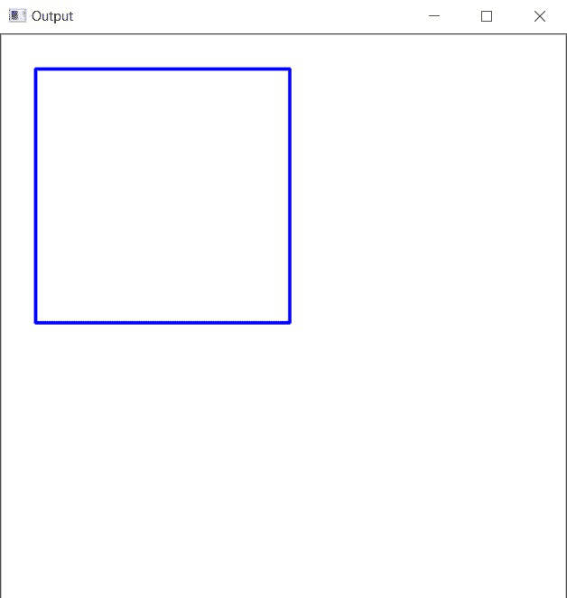
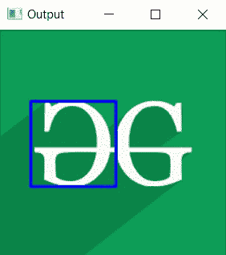
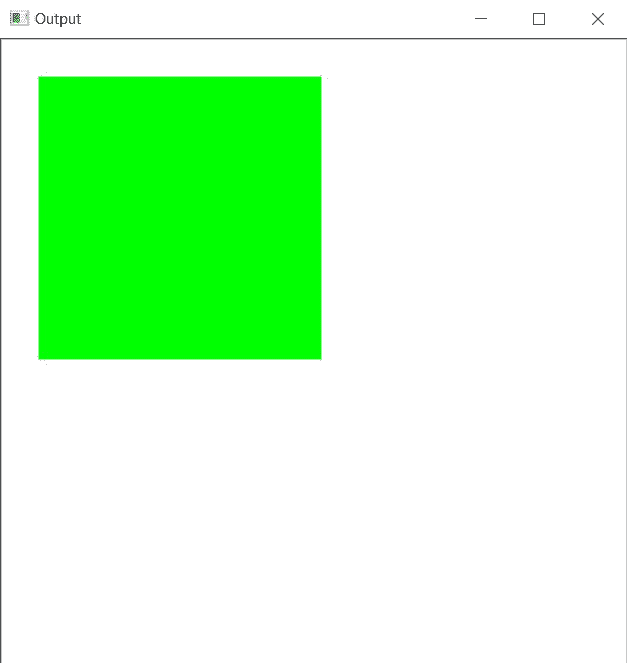

# 在 C++中使用 OpenCV 绘制一个矩形

> 原文:[https://www . geesforgeks . org/draw-an-rectangle-use-opencv-in-CPP/](https://www.geeksforgeeks.org/draw-an-rectangle-using-opencv-in-cpp/)

在本文中，任务是使用 [C++](https://www.geeksforgeeks.org/c-plus-plus/) 中的 [OpenCV](https://www.geeksforgeeks.org/introduction-to-opencv/) 绘制一个矩形。将使用 OpenCV [C++库](https://www.geeksforgeeks.org/the-c-standard-template-library-stl/)中的[矩形()函数](https://www.geeksforgeeks.org/draw-rectangle-c-graphics/)。

**语法:**

> 矩形(img、pt1、pt2、颜色、厚度、线型、移位)

**参数:**

*   **图像:**是要在其上绘制矩形的图像。
*   **start(pt1):** 是矩形的左上角，表示为两个坐标的元组，即(x 坐标，y 坐标)。
*   **end(pt2):** 是矩形的右下角，表示为两个坐标的元组，即(x 坐标，y 坐标)。
*   **颜色:**是要绘制的矩形的边界线的颜色。表示 3 种颜色的元组 **(B，G，R)** ，即(蓝，绿，红)。
*   **厚度:**是 **px** 中矩形边界线的厚度。 **-1 px** 的厚度会以指定的颜色填充矩形。
*   **线型:**线条的类型。有 3 种类型的线路:
    *   **LINE_4:** 使用 4 连通 Bresenham 算法绘制直线。
    *   **LINE_8:** 使用 8 连通 Bresenham 算法绘制直线。
    *   **LINE_AA:** 使用 [**高斯滤镜**](https://www.geeksforgeeks.org/gaussian-filter-generation-c/) 绘制抗锯齿线。
*   **移位:**点坐标中的小数位数。

**返回值:**返回图像。

**程序 1:**

下面是 [C++](https://www.geeksforgeeks.org/c-plus-plus/) 程序，演示如何在自形成的背景图像上绘制一个矩形:

## C++

```
// C++ program to demonstrate rectangle
// over a self-formed background image

#include <iostream>
#include <opencv2/core/core.hpp>

// Drawing shapes
#include <opencv2/imgproc.hpp>

#include <opencv2/highgui/highgui.hpp>
using namespace cv;
using namespace std;

// Driver Code
int main(int argc, char** argv)
{
    // Creating a blank image with
    // white background
    Mat image(500, 500, CV_8UC3,
              Scalar(255, 255, 255));

    // Check if the image is created
    // successfully or not
    if (!image.data) {
        std::cout << "Could not open or "
                  << "find the image\n";

        return 0;
    }

    // Top Left Corner
    Point p1(30, 30);

    // Bottom Right Corner
    Point p2(255, 255);

    int thickness = 2;

    // Drawing the Rectangle
    rectangle(image, p1, p2,
              Scalar(255, 0, 0),
              thickness, LINE_8);

    // Show our image inside a window
    imshow("Output", image);
    waitKey(0);

    return 0;
}
```

**输出:**

[](https://media.geeksforgeeks.org/wp-content/uploads/20210123125516/gg.jpg)

**程序 2:**

下面是 [C++](https://www.geeksforgeeks.org/c-plus-plus/) 程序，演示如何在 GFG 徽标的图像上绘制一个矩形:

## C++

```
// C++ program to demonstrate rectangle
// over a loaded image of GFG logo

#include <iostream>
#include <opencv2/core/core.hpp>

// Drawing shapes
#include <opencv2/imgproc.hpp>

#include <opencv2/highgui/highgui.hpp>
using namespace cv;
using namespace std;

// Driver Code
int main(int argc, char** argv)
{
    // Reading the Image
    Mat image = imread("C:/Users/harsh/Downloads/geeks.png",
                       IMREAD_COLOR);

    // Check if the image is created
    // successfully or not
    if (!image.data) {
        std::cout << "Could not open or "
                  << "find the image\n";
        return 0;
    }

    // Top Left Coordinates
    Point p1(30, 70);

    // Bottom Right Coordinates
    Point p2(115, 155);

    int thickness = 2;

    // Drawing the Rectangle
    rectangle(image, p1, p2,
              Scalar(255, 0, 0),
              thickness, LINE_8);

    // Show our image inside a window
    imshow("Output", image);
    waitKey(0);

    return 0;
}
```

**输出:**

[](https://media.geeksforgeeks.org/wp-content/uploads/20210123124652/gg.jpg)

**程序 3:**

下面是 [C++](https://www.geeksforgeeks.org/c-plus-plus/) 程序演示如何画一个充满颜色的矩形:

## C++

```
// C++ program to demonstrate rectangle
// filled with any color

#include <iostream>
#include <opencv2/core/core.hpp>

// Drawing shapes
#include <opencv2/imgproc.hpp>

#include <opencv2/highgui/highgui.hpp>
using namespace cv;
using namespace std;

// Driver Code
int main(int argc, char** argv)
{
    // Creating a blank image with
    // white background
    Mat image(500, 500, CV_8UC3,
              Scalar(255, 255, 255));

    // Check if the image is created
    // successfully or not
    if (!image.data) {
        std::cout << "Could not open or "
                  << "find the image\n";

        return 0;
    }

    // Top Left Corner
    Point p1(30, 30);

    // Bottom Right Corner
    Point p2(255, 255);

    int thickness = -1;

    // Drawing the Rectangle
    rectangle(image, p1, p2,
              Scalar(0, 255, 0),
              thickness, LINE_8);

    // Show our image inside a window
    imshow("Output", image);
    waitKey(0);

    return 0;
}
```

**输出:**

[](https://media.geeksforgeeks.org/wp-content/uploads/20210123130021/gg.jpg)