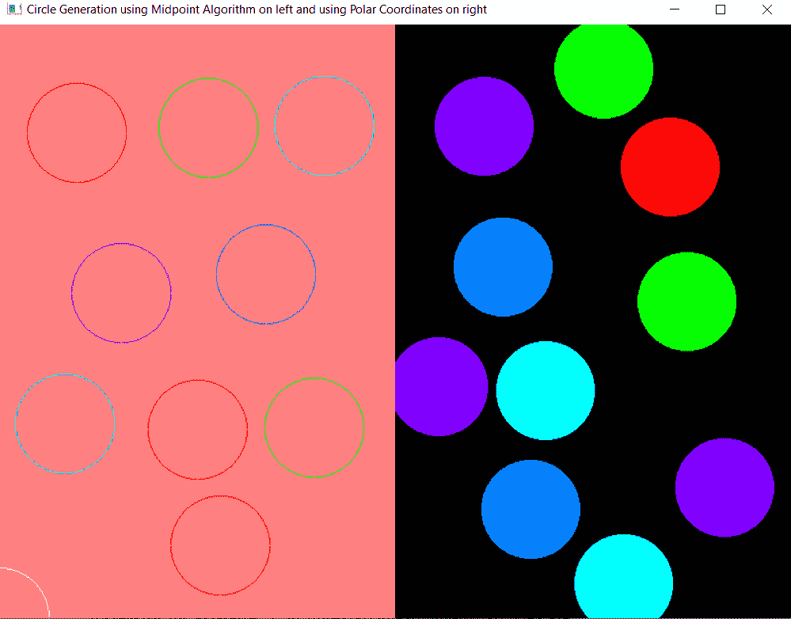

# 在 C++

中使用 openGL 在同一控制台上使用极坐标和中点圆绘制算法绘制圆

> 原文:[https://www . geesforgeks . org/绘制圆-使用极坐标和中点圆-在同一控制台中绘制算法-使用 opengl-in-cpp/](https://www.geeksforgeeks.org/draw-circles-using-the-polar-coordinates-and-mid-point-circle-drawing-algorithm-in-the-same-console-using-opengl-in-cpp/)

在本文中，任务是使用两种不同的[算法](https://www.geeksforgeeks.org/fundamentals-of-algorithms/)在两个不同的子窗口中绘制圆圈，并且使用鼠标单击创建圆圈。

**进场:**

*   有两个子窗口，它们都使用不同的算法来创建圆。
*   左侧子窗口使用[中点圆绘制算法](https://www.geeksforgeeks.org/mid-point-circle-drawing-algorithm/)创建圆，右侧子窗口实现极坐标的[概念。](https://www.geeksforgeeks.org/python-program-to-convert-complex-numbers-to-polar-coordinates/)
*   只需单击鼠标左键，即可在控制台上的任何位置创建一个圆，创建的圆的[中心的坐标](https://www.geeksforgeeks.org/find-center-circle-using-endpoints-diameter/)取决于单击的位置。
*   要改变圆的颜色，右击鼠标。
*   完成所有操作后，只需按下键盘上的 **Esc 键**即可跳出程序。

下面是上述方法的实现:

## C++

```cpp
// C++ program to implement onClick
// functionality in OpenGL to draw
// a circle using polar coordinates
// and midpoint algorithm
#include <GL/glut.h>
#include <iostream>
#include <math.h>
#include <stdlib.h>
#define xpix 500
#include <cstring>
using namespace std;

float r, g, b, x, y;
bool flag = true;
int counter = 0;

// Function to plot the coordinates
void plot(int x1, int y1)
{
    // Initialize the points
    glBegin(GL_POINTS);

    // Draw the vertex
    glVertex2i(x1 + x, y1 + y);

    // End
    glEnd();
}

// Function works on mouse click
void mouse(int button, int state,
           int mousex, int mousey)
{
    // Check if the current click
    // is left-click or not
    if (button == GLUT_LEFT_BUTTON
        && state == GLUT_DOWN) {
        flag = true;
        x = mousex;
        y = 600 - mousey;
    }

    // Check if the current click
    // is right-click or not
    else if (button == GLUT_RIGHT_BUTTON
             && state == GLUT_DOWN) {
        if (counter > 4) {
            counter = 0;
        }

        counter++;

        // Redisplay
        glutPostRedisplay();
    }
}

// Function that exits from program
void keyboard(unsigned char key,
              int x, int y)
{
    switch (key) {
    case 27:
        glutHideWindow();
    }
}

// Function to draw the circles using
// the midpoint circle algorithms
void midPointCircleDraw(void)
{
    // Change the color of circles on
    // the right click
    if (counter == 1) {
        glColor3f(1, 0, 0);
    }
    else if (counter == 2) {
        glColor3f(0, 1, 0);
    }
    else if (counter == 3) {
        glColor3f(0, 1, 1);
    }
    else if (counter == 4) {
        glColor3f(0.5, 0, 1);
    }
    else if (counter == 5) {

        glColor3f(0, 0.5, 1);
    }

    // Matrix mode
    glMatrixMode(GL_PROJECTION);
    glLoadIdentity();

    // Given the coordinates
    gluOrtho2D(0.0, 400.0, 0.0, 600.0);
    int r = 50;

    if (flag) {

        // Begin the pointer
        glBegin(GL_POLYGON);
        int x1 = 0;
        int y1 = r;

        // Initialising the value
        // of the decision
        float decision = 5 / 4 - r;

        // Print the initial point on
        // the axes after translation
        plot(x1, y1);

        while (y1 > x1) {

            // Mid-point is inside or
            // on the perimeter
            if (decision < 0) {
                x1++;
                decision += 2 * x1 + 1;
            }

            // Mid-point is outside
            // the perimeter
            else {
                y1--;
                x1++;
                decision += 2 * (x1 - y1) + 1;
            }

            // Plot the points in the
            // different octants
            plot(x1, y1);
            plot(x1, -y1);
            plot(-x1, y1);
            plot(-x1, -y1);
            plot(y1, x1);
            plot(-y1, x1);
            plot(y1, -x1);
            plot(-y1, -x1);
        }
    }

    glFlush();
}

// Function to draw the circle using
// the polar coordinates
void polarCoordinateCircleDraw(void)
{
    float angle_theta;

    // Change the color of the circles
    // on right click
    if (counter == 1) {
        glColor3f(1, 0, 0);
    }
    else if (counter == 2) {
        glColor3f(0, 1, 0);
    }
    else if (counter == 3) {
        glColor3f(0, 1, 1);
    }
    else if (counter == 4) {
        glColor3f(0.5, 0, 1);
    }
    else if (counter == 5) {

        glColor3f(0, 0.5, 1);
    }

    // Matrix mode
    glMatrixMode(GL_PROJECTION);
    glLoadIdentity();

    // Given the coordinates
    gluOrtho2D(0.0, 800.0, 0.0, 600.0);
    if (flag) {

        // Begin the pointer
        glBegin(GL_POLYGON);

        // Iterate through all the
        // 360 degrees
        for (int i = 0; i < 360; i++) {

            angle_theta = i * 3.142 / 180;
            glVertex2f(x + 50 * cos(angle_theta),
                       y + 50 * sin(angle_theta));
        }

        // Set the vertex
        glEnd();
    }

    // Flushes the frame buffer to
    // the screen
    glFlush();
}

// Driver Code
int main(int argc, char** argv)
{
    // Initialize the drivers
    glutInit(&argc, argv);

    // Initialize the display mode
    glutInitDisplayMode(
        GLUT_SINGLE | GLUT_RGB);

    // Update the window size
    glutInitWindowSize(800, 600);

    // Update the window position
    glutInitWindowPosition(100, 100);

    int mainWindow = glutCreateWindow(
        "Circle Generation using "
        "Midpoint Algorithm on "
        "left and using Polar "
        "Coordinates on right");

    // Set the background color of
    // the right sub-window
    glClearColor(0, 0, 0, 0);

    // Clears the frame buffer
    glClear(GL_COLOR_BUFFER_BIT);

    // Links display event with the
    // display the event handler
    // (polarCoordinateCircleDraw)
    glutDisplayFunc(
        polarCoordinateCircleDraw);

    // Mouse event handler
    glutMouseFunc(mouse);

    // Create the sub-window to implement
    // midpoint algorithm on left
    int subWindow1
        = glutCreateSubWindow(
            mainWindow, 0, 0, 400, 600);

    glutInitWindowPosition(100, 100);

    // Sets the background color of
    // the left sub-window
    glClearColor(1, 0.5, 0.5, 1);

    // Clears the frame buffer
    glClear(GL_COLOR_BUFFER_BIT);

    // Links display event with the
    // display the event handler
    // (midPointCircleDraw)
    glutDisplayFunc(midPointCircleDraw);

    // Mouse event handler
    glutMouseFunc(mouse);

    // Keyboard event handler
    glutKeyboardFunc(keyboard);

    // Loops the current event
    glutMainLoop();
}
```

**输出:**

[](https://media.geeksforgeeks.org/wp-content/uploads/20210218225034/article9img.PNG)