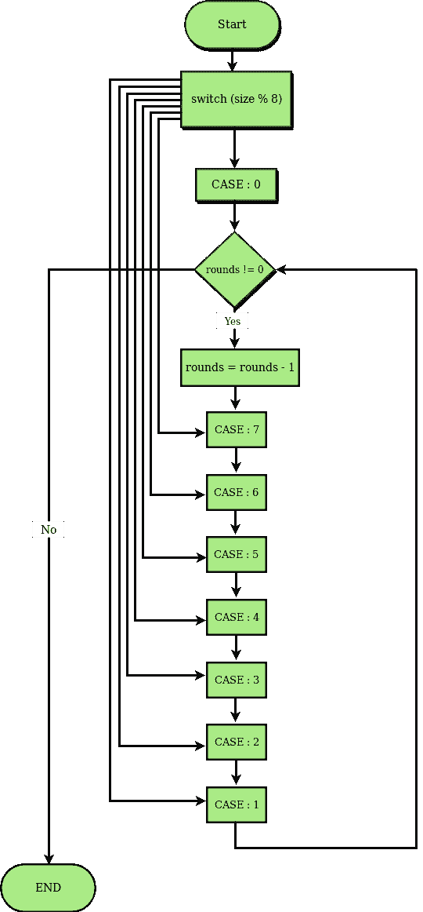

# 达夫的设备是如何工作的？

> 原文:[https://www.geeksforgeeks.org/duffs-device-work/](https://www.geeksforgeeks.org/duffs-device-work/)

Duff 的设备是一个技巧，不用额外的代码来处理剩余的部分循环，直接用 C 或 C++来表达循环展开。技巧是使用一个 switch 语句，其中除了一个 casess 标签之外，所有的 case 标签都在 while 循环的中间。此外，所有的情况都会延续到 while 循环的末尾。尽管印象深刻，但它使达夫的设备是合法的 C 和 C++代码(然而，它在 Java 中是无效的)。

**怎么有用？**

达夫的设备有两个关键之处。

1.  首先，展开循环。我们通过避免检查循环是否完成和跳回循环顶部所涉及的一些开销来获得更高的速度。当中央处理器执行直线代码而不是跳转时，它可以运行得更快。然而，代码变得更大。
2.  第二个方面是 switch 语句。它允许代码在第一次通过时跳到循环的中间。对大多数人来说，令人惊讶的是这样的事情是允许的。嗯，这是允许的。

**例**

```cpp
// C program to illustrate the working of
// Duff's Device. The program copies given
// number of elements bool array src[] to
// dest[]
#include<stdio.h>
#include<string.h>
#include <stdlib.h>

// Copies size bits from src[] to dest[]
void copyBoolArray(bool src[], bool dest[],
                               int size)
{
    // Do copy in rounds of size 8.
    int rounds = size / 8;

    int i = 0;
    switch (size % 8)
    {
    case 0:
        while (!(rounds == 0))
        {
            rounds = rounds - 1;
            dest[i] = src[i];
            i = i + 1;

        // An important point is, the switch
        // control can directly reach below labels
        case 7:
            dest[i] = src[i];
            i = i + 1;
        case 6:
            dest[i] = src[i];
            i = i + 1;
        case 5:
            dest[i] = src[i];
            i = i + 1;
        case 4:
            dest[i] = src[i];
            i = i + 1;
        case 3:
            dest[i] = src[i];
            i = i + 1;
        case 2:
            dest[i] = src[i];
            i = i + 1;
        case 1:
            dest[i] = src[i];
            i = i + 1;
        };
    }
}

// Driver code
int main()
{
    int size = 20;
    bool dest[size], src[size];

    // Assign some random values to src[]
    int i;
    for (i=0; i<size; i++)
        src[i] = rand()%2;

    copyBoolArray(src, dest, size);

    for (i=0; i<size ; i++)
        printf("%d\t%d\n", src[i], dest[i]);
}
```

输出:

```cpp
1    1
0    0
1    1
1    1
1    1
1    1
0    0
0    0
1    1
1    1
0    0
1    1
0    0
1    1
1    1
0    0
0    0
0    0
0    0
1       1

```

**以上程序是如何工作的？**
在上面的例子中，我们处理 20 个字节，并将这 20 个随机位从 src 数组复制到目的数组。它将运行的遍数也取决于源数组的大小。

对于第一遍，执行从计算出的事例标签开始，然后像任何其他 switch 语句一样，执行到每个连续的赋值语句。在最后一个案例标签之后，执行到达循环的底部，此时它跳回顶部。循环的顶部在 switch 语句内部，因此不会再对 switch 进行重新评估。

原始循环展开八次，因此迭代次数除以八。如果要复制的字节数不是 8 的倍数，那么还剩下一些字节。大多数一次复制字节块的算法会在最后处理剩余的字节，但达夫的设备会在开始时处理它们。该函数计算 switch 语句的计数% 8 来计算余数，跳转到这么多字节的大小写标签，并复制它们。然后，循环继续在左遍中复制八个字节的组。



**第一遍:**

```cpp
rounds = count / 8;

// rounds = 2 for count =20
i = 0;
switch(count % 8)
{

// The remainder is 4 (20 modulo 8)
// so jump to the case 4
case 0:
    while( !(rounds == 0) )
    {
        //[skipped]
        rounds = rounds - 1;
        dest[i] = src[i];
        i = i + 1;

    case 7:
        dest[i] = src[i];
        i = i + 1;     //[skipped]
    case 6:
        dest[i] = src[i];
        i = i + 1;     //[skipped]
    case 5:
        dest[i] = src[i];
        i = i + 1;     //[skipped]

    case 4:
        dest[i] = src[i];
        i = i + 1;     //Start here. Copy 1 byte (total 1)
    case 3:
        dest[i] = src[i];
        i = i + 1;     //Copy 1 byte (total 2)
    case 2:
        dest[i] = src[i];
        i = i + 1;     //Copy 1 byte (total 3)
    case 1:
        dest[i] = src[i];
        i = i + 1;     //Copy 1 byte (total 4)
    };
}

```

**第二遍:**

```cpp
rounds = count / 8;
i = 0;
switch(count % 8)
{
case 0:
    while( !(rounds == 0) )
    {
        // rounds is decremented by 1 as while
        // loop works, now rounds=1
        rounds = rounds - 1;
        dest[i] = src[i];
        i = i + 1;     // Copy 1 byte (total 5)
    case 7:
        dest[i] = src[i];
        i = i + 1; // Copy 1 byte (total 6)
    case 6:
        dest[i] = src[i];
        i = i + 1; // Copy 1 byte (total 7)
    case 5:
        dest[i] = src[i];
        i = i + 1; // Copy 1 byte (total 8)
    case 4:
        dest[i] = src[i];
        i = i + 1; // Copy 1 byte (total 9)
    case 3:
        dest[i] = src[i];
        i = i + 1; // Copy 1 byte (total 10)
    case 2:
        dest[i] = src[i];
        i = i + 1; // Copy 1 byte (total 11)
    case 1:
        dest[i] = src[i];
        i = i + 1; // Copy 1 byte (total 12)
    }
}

```

**第三关:** 

```cpp
rounds = count / 8;
i = 0;
switch(count % 8)
{
case 0:
    while( !(rounds == 0) )
    {
        //now while loop works
        rounds = rounds - 1;    //rounds is decremented by 1, now rounds=0
        dest[i] = src[i];
        i = i + 1;         // Copy 1 byte (total 13)

    case 7:
        dest[i] = src[i];
        i = i + 1;    // Copy 1 byte (total 14)
    case 6:
        dest[i] = src[i];
        i = i + 1;    // Copy 1 byte (total 15)
    case 5:
        dest[i] = src[i];
        i = i + 1;    // Copy 1 byte (total 16)
    case 4:
        dest[i] = src[i];
        i = i + 1;    // Copy 1 byte (total 17)
    case 3:
        dest[i] = src[i];
        i = i + 1;     // Copy 1 byte (total 18)
    case 2:
        dest[i] = src[i];
        i = i + 1;     // Copy 1 byte (total 19)
    case 1:
        dest[i] = src[i];
        i = i + 1;     // Copy 1 byte (total 20)
    };
}

```

**参考文献:**T2[维基百科](https://en.wikipedia.org/wiki/Duff%27s_device)T5[http://www.lysator.liu.se/c/duffs-device.html](http://www.lysator.liu.se/c/duffs-device.html)

本文由 **[尼基尔·库马尔·夏尔马](https://www.facebook.com/niks.kumar.50?fref=ts)** 供稿。如果你喜欢 GeeksforGeeks 并想投稿，你也可以使用[contribute.geeksforgeeks.org](http://www.contribute.geeksforgeeks.org)写一篇文章或者把你的文章邮寄到 contribute@geeksforgeeks.org。看到你的文章出现在极客博客主页上，帮助其他极客。

如果你发现任何不正确的地方，或者你想分享更多关于上面讨论的话题的信息，请写评论。