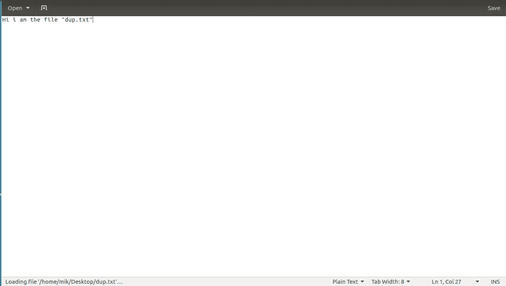
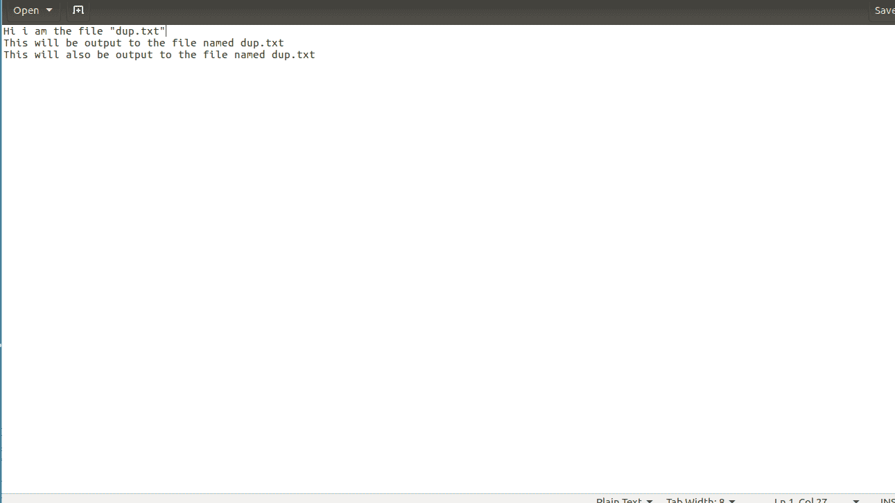
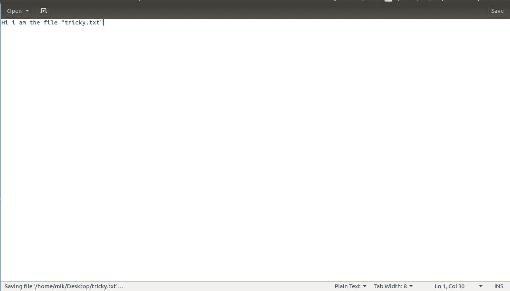
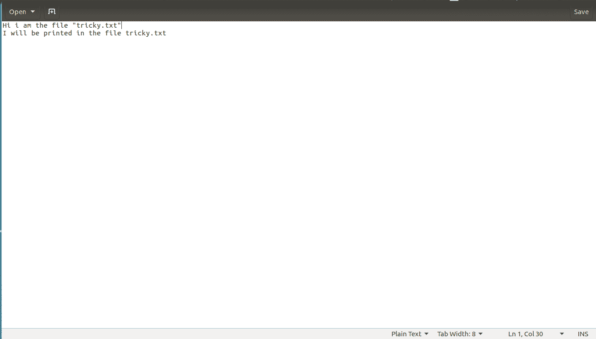

# dup()和 dup2() Linux 系统调用

> 原文:[https://www.geeksforgeeks.org/dup-dup2-linux-system-call/](https://www.geeksforgeeks.org/dup-dup2-linux-system-call/)

**dup()**

dup()系统调用创建文件描述符的副本。

*   它使用编号最低的未使用描述符作为新描述符。
*   如果副本创建成功，则原始和副本文件描述符可以互换使用。
*   它们都引用相同的打开文件描述，因此共享文件偏移量和文件状态标志。

**语法:**

```
int dup(int oldfd);
oldfd: old file descriptor whose copy is to be created.

```

```
// CPP program to illustrate dup() 
#include<stdio.h>
#include <unistd.h>
#include <fcntl.h>

int main()
{
    // open() returns a file descriptor file_desc to a 
    // the file "dup.txt" here"

    int file_desc = open("dup.txt", O_WRONLY | O_APPEND);

    if(file_desc < 0)
        printf("Error opening the file\n");

    // dup() will create the copy of file_desc as the copy_desc
    // then both can be used interchangeably.

    int copy_desc = dup(file_desc);

    // write() will write the given string into the file
    // referred by the file descriptors

    write(copy_desc,"This will be output to the file named dup.txt\n", 46);

    write(file_desc,"This will also be output to the file named dup.txt\n", 51);

    return 0;
}
```

请注意，该程序不会在联机编译器中运行，因为它包括打开文件并在上面写入。

**解释:**open()将文件描述符 file_desc 返回给名为“dup.txt”的文件。file_desc 可以用来对文件“dup.txt”进行一些文件操作。在使用 dup()系统调用后，将创建一个 file_desc 的副本 copy_desc。这个副本也可以用来对同一个文件“dup.txt”进行一些文件操作。在两次写入操作(一次使用 file_desc，另一次使用 copy_desc)之后，同一文件被编辑，即“dup.txt”。

运行代码前，让写操作前的文件“dup.txt”如下所示:


运行完上面显示的 C 程序后，文件“dup.txt”如下所示:


**dup2()**

dup2()系统调用与 dup()类似，但它们之间的基本区别在于，它使用的不是编号最低的未使用文件描述符，而是用户指定的描述符编号。
**语法:**

```
int dup2(int oldfd, int newfd);
oldfd: old file descriptor
newfd new file descriptor which is used by dup2() to create a copy.
```

**要点:** 

*   包括使用 dup()和 dup2()系统调用的头文件 unistd.h。
*   如果描述符 newfd 以前是打开的，那么它在被重用之前会被静默关闭。
*   如果 oldfd 不是有效的文件描述符，则调用失败，newfd 不会关闭。
*   如果 oldfd 是一个有效的文件描述符，并且 newfd 与 oldfd 具有相同的值，那么 dup2()什么都不做
    ，返回 newfd。

 **dup2()系统调用的一个巧妙用法:**和在 dup2()中一样，任何文件描述符都可以代替 newfd。下面是一个 C 实现，其中使用了标准输出的文件描述符。这将导致所有 printf()语句被写入旧文件描述符引用的文件中。

```
// CPP program to illustrate dup2() 
#include<stdlib.h>
#include<unistd.h>
#include<stdio.h>
#include<fcntl.h>

int main()
{
    int file_desc = open("tricky.txt",O_WRONLY | O_APPEND);

    // here the newfd is the file descriptor of stdout (i.e. 1)
    dup2(file_desc, 1) ; 

    // All the printf statements will be written in the file
    // "tricky.txt"
    printf("I will be printed in the file tricky.txt\n");

return 0;
}
```

这可以在下图中看到:
让 dup2()操作之前的文件“棘手. txt”如下所示:


运行完上面显示的 C 程序后，文件“棘手. txt”如下所示:


参考:[dup(2)–Linux 手册页](https://linux.die.net/man/2/dup)

本文由 [**MAZHAR IMAM KHAN**](https://www.linkedin.com/in/mazhar-imam-khan-95a34ab3/) 供稿。如果你喜欢 GeeksforGeeks 并想投稿，你也可以使用[contribute.geeksforgeeks.org](http://www.contribute.geeksforgeeks.org)写一篇文章或者把你的文章邮寄到 contribute@geeksforgeeks.org。看到你的文章出现在极客博客主页上，帮助其他极客。

如果你发现任何不正确的地方，或者你想分享更多关于上面讨论的话题的信息，请写评论。