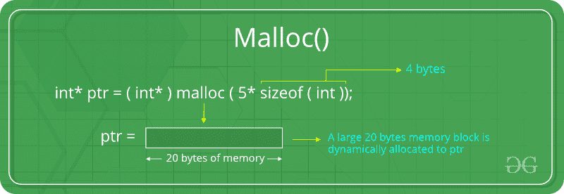

# 使用 malloc()、calloc()、free()和 realloc()

在 C 中进行动态内存分配

> 原文:[https://www . geesforgeks . org/dynamic-memory-allocation-in-c-use-malloc-calloc-free-and-real loc/](https://www.geeksforgeeks.org/dynamic-memory-allocation-in-c-using-malloc-calloc-free-and-realloc/)

因为 C 是一种结构化语言，所以它有一些固定的编程规则。其中之一包括改变数组的大小。数组是存储在连续内存位置的项的集合。


可以看出，上面制作的阵列的长度(大小)是 9。但是如果有要求改变这个长度(大小)怎么办。例如，

*   如果在这个数组中只需要输入 5 个元素。在这种情况下，剩下的 4 个索引只是在这个数组中浪费内存。因此，需要将数组的长度(大小)从 9 减少到 5。
*   再举一个例子。在这种情况下，有一个 9 个元素的数组，所有 9 个索引都已填充。但是需要在这个数组中再输入 3 个元素。在这种情况下，还需要 3 个索引。所以数组的长度(大小)需要从 9 改为 12。

这个过程在 C 中被称为**动态内存分配。
因此，C **动态内存分配**可以定义为在运行时改变数据结构(如数组)大小的过程。
C 提供了一些功能来实现这些任务。在 **< stdlib.h >** 头文件下定义了 4 个 C 提供的库函数，方便 C 编程中的动态内存分配。它们是:**

1.  malloc()
2.  卡洛克（）
3.  免费()
4.  realloc()

让我们更详细地看看它们。

### C malloc()方法

C 语言中的**【malloc】**或**【内存分配】**方法用于动态分配单个指定大小的大内存块。它返回一个 void 类型的指针，该指针可以转换成任何形式的指针。它不会在执行时初始化内存，因此它最初会用默认的垃圾值初始化每个块。

**语法:**

```cpp
ptr = (cast-type*) malloc(byte-size)
For Example:
```

> **ptr =(int *)malloc(100 * sizeof(int))；**
> 由于 int 的大小是 4 字节，这个语句将分配 400 字节的内存。指针 ptr 保存分配内存中第一个字节的地址。



如果空间不足，分配将失败并返回空指针。

**示例:**

## C

```cpp
#include <stdio.h>
#include <stdlib.h>

int main()
{

    // This pointer will hold the
    // base address of the block created
    int* ptr;
    int n, i;

    // Get the number of elements for the array
    printf("Enter number of elements:");
    scanf("%d",&n);
    printf("Entered number of elements: %d\n", n);

    // Dynamically allocate memory using malloc()
    ptr = (int*)malloc(n * sizeof(int));

    // Check if the memory has been successfully
    // allocated by malloc or not
    if (ptr == NULL) {
        printf("Memory not allocated.\n");
        exit(0);
    }
    else {

        // Memory has been successfully allocated
        printf("Memory successfully allocated using malloc.\n");

        // Get the elements of the array
        for (i = 0; i < n; ++ i) {
            ptr[i] = i + 1;
        }

        // Print the elements of the array
        printf("The elements of the array are: ");
        for (i = 0; i < n; ++ i) {
            printf("%d, ", ptr[i]);
        }
    }

    return 0;
}
```

**Output:** 

```cpp
Enter number of elements: 5
Memory successfully allocated using malloc.
The elements of the array are: 1, 2, 3, 4, 5,
```