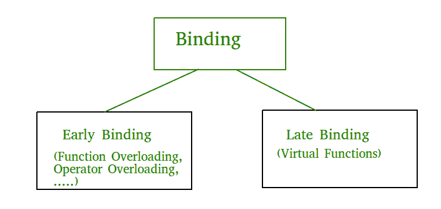

# c++ 中的早结合和晚结合

> 原文:[https://www.geeksforgeeks.org/early-binding-late-binding-c/](https://www.geeksforgeeks.org/early-binding-late-binding-c/)

绑定是指将标识符(如变量名和性能名)转换为地址的过程。对每个变量和函数进行绑定。对于函数，这意味着编译器将调用与正确的函数定义相匹配。它发生在编译时或运行时。



**早期绑定(编译时多态性)**顾名思义，编译器(或链接器)直接将地址与函数调用相关联。它用机器语言指令代替调用，告诉主机跳到函数的地址。

默认情况下，早期绑定发生在 C++ 中。后期绑定(下面讨论)是借助[虚拟关键字](https://www.geeksforgeeks.org/virtual-function-cpp/)实现的)

```cpp
// CPP Program to illustrate early binding.
// Any normal function call (without virtual)
// is binded early. Here we have taken base
// and derived class example so that readers
// can easily compare and see difference in
// outputs.
#include<iostream>
using namespace std;

class Base
{
public:
    void show() { cout<<" In Base \n"; }
};

class Derived: public Base
{
public:
    void show() { cout<<"In Derived \n"; }
};

int main(void)
{
    Base *bp = new Derived;

    // The function call decided at 
    // compile time (compiler sees type
    // of pointer and calls base class
    // function.
    bp->show();  

    return 0;
}
```

输出:

```cpp
In Base
```

**后期绑定:(运行时多态性)**在这种情况下，编译器会在运行时添加标识对象种类的代码，然后将调用与正确的函数定义进行匹配(有关详细信息，请参考[本](https://www.geeksforgeeks.org/virtual-functions-and-runtime-polymorphism-in-c-set-1-introduction/))。这可以通过声明一个[虚拟函数](https://www.geeksforgeeks.org/virtual-function-cpp/)来实现。

```cpp
// CPP Program to illustrate late binding
#include<iostream>
using namespace std;

class Base
{
public:
    virtual void show() { cout<<" In Base \n"; }
};

class Derived: public Base
{
public:
    void show() { cout<<"In Derived \n"; }
};

int main(void)
{
    Base *bp = new Derived;
    bp->show();  // RUN-TIME POLYMORPHISM
    return 0;
}
```

输出:

```cpp
In Derived
```