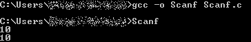

# 在 C

的 scanf()函数中添加空白的效果

> 原文:[https://www . geeksforgeeks . org/在-scanf-function-in-c 中添加空白的效果/](https://www.geeksforgeeks.org/effect-of-adding-whitespace-in-the-scanf-function-in-c/)

在本文中，我们将讨论关于在 [C 编程语言](https://www.geeksforgeeks.org/c/)中的 [scanf()函数](https://www.geeksforgeeks.org/scanf-and-fscanf-in-c-simple-yet-poweful/)的格式说明符之前或之后添加空格的场景。

在 [**scanf()函数**](https://www.geeksforgeeks.org/scanf-and-fscanf-in-c-simple-yet-poweful/) 中添加空白字符会导致它读取元素并尽可能忽略所有空白字符，并继续搜索非空白字符。

```cpp
scanf("%d ");
scanf(" %d");

scanf("%d\n"); This is different
from scanf("%d"); function.
```

**示例 1:**scanf 函数在读取数字后开始进一步读取，直到它在输入中找到一个非空白字符并打印第一个键入的数字。

> **在 scanf 函数**
> scanf("%d ")的格式说明符后添加空白或" \ n "；
> 或
> scanf("%d\n "，)；

下面是实现上述方法的 C 程序:

## C

```cpp
// C program to demonstrate the
// above approach

#include <stdio.h>

// Driver Code
int main()
{
    // Declaring integer variable a
    int a;

    // Reading value in "a" using scanf
    // and adding whitespace after
    // format specifier
    scanf("%d ", &a);

    // Or scanf("%d\n", &a);

    // Both work the same and
    // print the same value
    printf("%d", a);

    return 0;
}
```

**输出:**


**说明:**在上例中，程序执行时，首先程序会要求第一次输入。

*   在这种情况下，输入**2**，之后给出空白，仍然没有输出，而是等待下一个输入。
*   当输入**3**时，输出被打印，这是输入的第一个数字，即 **2** 。
*   类似地，在输入第一个输入，即上述情况中的 **2** 后，如果用户按下回车键并进入下一行，程序仍在等待输入，并且在输入第二个输入后，结果被打印出来。

**示例 2:**scanf 函数忽略空白字符，只读取元素一次。

> **在 scanf 函数**
> scanf(" %d ")的格式说明符前添加空白；

下面是实现上述方法的 C 程序:

## C

```cpp
// C program to demonstrate the
// above approach
#include <stdio.h>

// Driver Code
int main()
{
    // Declaring integer variable
    int a;

    // Reading value in a using scanf
    // and adding whitespace before
    // format specifier
    scanf(" %d", &a);

    // Printing value of a
    printf("%d", a);

    return 0;
}
```

**输出:**



**解释:**在这段代码中，一输入数字就有输出，因为除了**“% c”、“%n”和“%[”**”之外，几乎所有格式说明符前的空格都被**scanf**%-转换忽略了。因此，建议在 scanf 功能中尽可能避免空格，除非您确信它的用途和必要性。