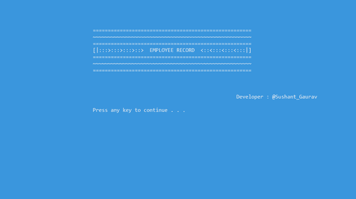
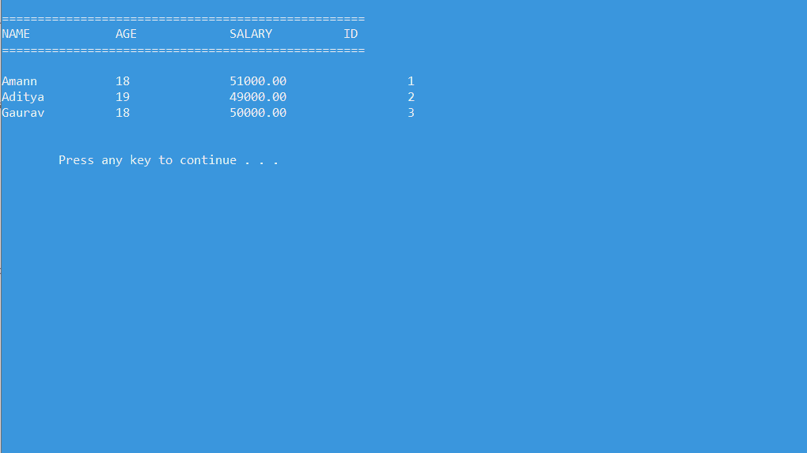
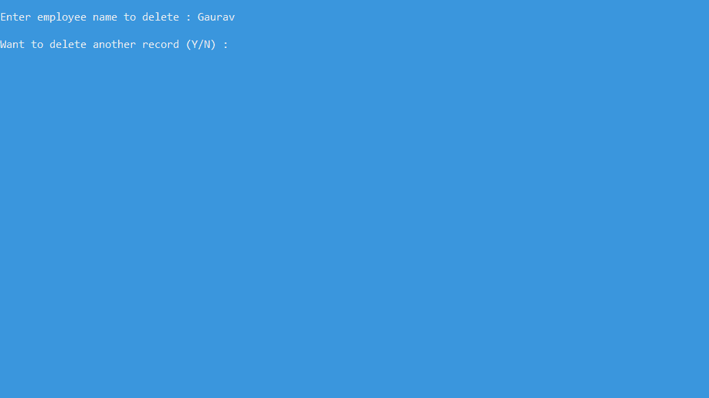
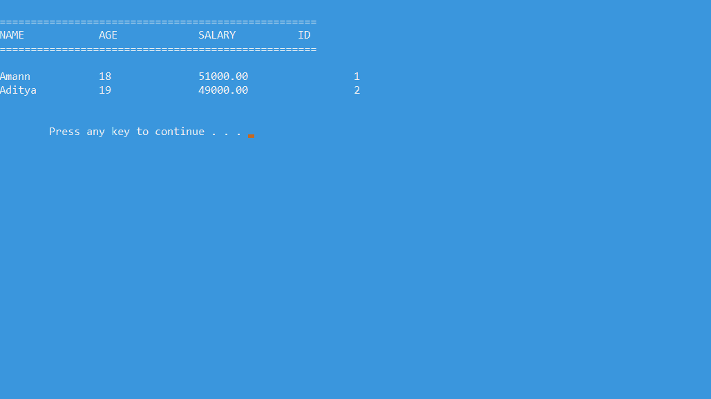
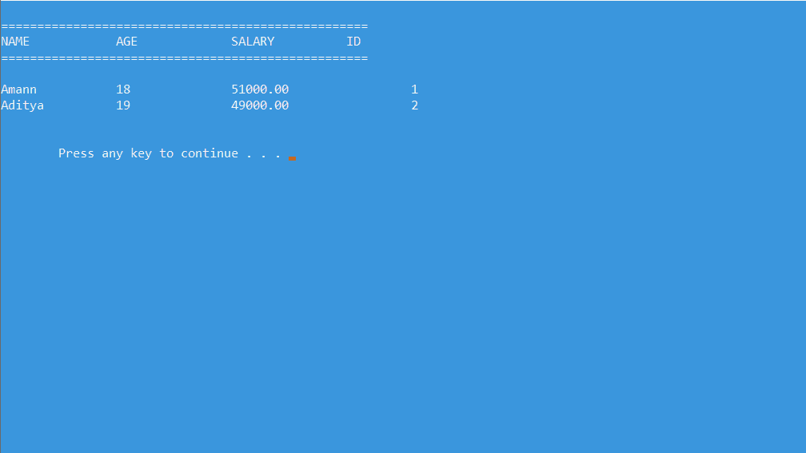

# 使用文件处理的丙员工记录系统

> 原文:[https://www . geesforgeks . org/employee-record-system-in-c-use-file-handling/](https://www.geeksforgeeks.org/employee-record-system-in-c-using-file-handling/)

员工记录系统是用来处理公司主要内务管理功能的软件。ERS 帮助公司跟踪所有员工及其记录。它被用来使用计算机系统管理公司。这个软件是为处理任何公司员工的记录而开发的。它将帮助公司将所有员工的记录保存在一个文件中。

**员工记录系统的目标:**将为用户提供 5 个选项:

*   添加新记录。
*   删除记录。
*   修改记录。
*   查看所有记录。
*   出口。

**员工数据:**

*   名字。
*   年龄。
*   工资。
*   员工编号。

**方式:**所有功能将在[开关箱](https://www.geeksforgeeks.org/switch-statement-cc/)下提供。其思想是利用[文件处理](https://www.geeksforgeeks.org/basics-file-handling-c/)的概念将[数据写入文本文件](https://www.geeksforgeeks.org/reading-writing-text-files-python/)中，并读取写入的数据。我们还需要在同一个文件夹中添加一个 **data.txt** 文件。

**进场:**

*   **开始框架由应用程序的名称和开发人员组成:**它是使用一些 [printf](https://www.geeksforgeeks.org/how-to-print-using-printf/) 语句和一个名为 system()的预定义函数创建的。[系统()功能](https://www.geeksforgeeks.org/system-call-in-c/)是 [C](https://www.geeksforgeeks.org/c-programming-language/) / [C++](https://www.geeksforgeeks.org/c-plus-plus/) [标准库](https://www.geeksforgeeks.org/the-c-standard-template-library-stl/)的一部分。用于传递可以在[操作系统](https://www.geeksforgeeks.org/operating-systems/)的命令处理器或终端执行的命令，完成后最终返回命令。
*   **系统(“彩色 3F”)**将改变控制台的颜色，即背景(3)和控制台上的文本，即前景(F)。
*   **系统(“暂停”**)会暂停屏幕，所以用户会得到一条信息:按任意键继续。。。
*   **gotoxy()功能:**有助于设置显示数据的坐标。
*   [**【切换案例】**](https://www.geeksforgeeks.org/switch-statement-cc/) **:** 切换案例下的所需功能将根据用户的输入执行。简单的[文件处理](https://www.geeksforgeeks.org/file-handling-c-classes/)概念，比如打开文件、关闭文件、写入文件、读取文件等。用于开发代码。

以下是员工记录系统的 C 程序:

## C

```cpp
// C program for  the above approach
#include <stdio.h>
#include <stdlib.h>
#include <string.h>
#include <windows.h>

// Structure of the employee
struct emp {
    char name[50];
    float salary;
    int age;
    int id;
};
struct emp e;

// size of the structure
long int size = sizeof(e);

// In the start coordinates
// will be 0, 0
COORD cord = { 0, 0 };

// function to set the
// coordinates
void gotoxy(int x, int y)
{
    cord.X = x;
    cord.Y = y;
    SetConsoleCursorPosition(
        GetStdHandle(STD_OUTPUT_HANDLE),
        cord);
}

FILE *fp, *ft;

// Function to add the records
void addrecord()
{
    system("cls");
    fseek(fp, 0, SEEK_END);
    char another = 'y';

    while (another == 'y') {
        printf("\nEnter Name : ");
        scanf("%s", e.name);

        printf("\nEnter Age : ");
        scanf("%d", &e.age);

        printf("\nEnter Salary : ");
        scanf("%f", &e.salary);

        printf("\nEnter EMP-ID : ");
        scanf("%d", &e.id);

        fwrite(&e, size, 1, fp);

        printf("\nWant to add another"
               " record (Y/N) : ");
        fflush(stdin);

        scanf("%c", &another);
    }
}

// Function to delete the records
void deleterecord()
{
    system("cls");
    char empname[50];
    char another = 'y';

    while (another == 'y') {
        printf("\nEnter employee "
               "name to delete : ");
        scanf("%s", empname);

        ft = fopen("temp.txt", "wb");
        rewind(fp);

        while (fread(&e, size,
                     1, fp)
               == 1) {
            if (strcmp(e.name,
                       empname)
                != 0)
                fwrite(&e, size, 1, ft);
        }

        fclose(fp);
        fclose(ft);
        remove("data.txt");
        rename("temp.txt", "data.txt");
        fp = fopen("data.txt", "rb+");

        printf("\nWant to delete another"
               " record (Y/N) :");
        fflush(stdin);
        another = getche();
    }
}

// Function to display the record
void displayrecord()
{
    system("cls");

    // sets pointer to start
    // of the file
    rewind(fp);

    printf("\n========================="
           "==========================="
           "======");
    printf("\nNAME\t\tAGE\t\tSALARY\t\t"
           "\tID\n",
           e.name, e.age,
           e.salary, e.id);
    printf("==========================="
           "==========================="
           "====\n");

    while (fread(&e, size, 1, fp) == 1)
        printf("\n%s\t\t%d\t\t%.2f\t%10d",
               e.name, e.age, e.salary, e.id);

    printf("\n\n\n\t");
    system("pause");
}

// Function to modify the record
void modifyrecord()
{
    system("cls");
    char empname[50];
    char another = 'y';

    while (another == 'y') {
        printf("\nEnter employee name"
               " to modify : ");
        scanf("%s", empname);

        rewind(fp);

        // While File is open
        while (fread(&e, size, 1, fp) == 1) {
            // Compare the employee name
            // with ename
            if (strcmp(e.name, empname) == 0) {
                printf("\nEnter new name:");
                scanf("%s", e.name);
                printf("\nEnter new age :");
                scanf("%d", &e.age);
                printf("\nEnter new salary :");
                scanf("%f", &e.salary);
                printf("\nEnter new EMP-ID :");
                scanf("%d", &e.id);

                fseek(fp, -size, SEEK_CUR);
                fwrite(&e, size, 1, fp);
                break;
            }
        }

        // Ask for modifying another record
        printf("\nWant to modify another"
               " record (Y/N) :");
        fflush(stdin);
        scanf("%c", &another);
    }
}

// Driver code
int main()
{
    int choice;

    // opening the file
    fp = fopen("data.txt", "rb+");

    // showing error if file is
    // unable to open.
    if (fp == NULL) {
        fp = fopen("data.txt", "wb+");
        if (fp == NULL) {
            printf("\nCannot open file...");
            exit(1);
        }
    }

    system("Color 3F");
    printf("\n\n\n\n\t\t\t\t============="
           "============================="
           "===========");
    printf("\n\t\t\t\t~~~~~~~~~~~~~~~~~~~"
           "~~~~~~~~~~~~~~~~~~~~~~~~~~~~~"
           "~~~~~");
    printf("\n\t\t\t\t==================="
           "============================="
           "=====");
    printf("\n\t\t\t\t[|:::>:::>:::>::>  "
           "EMPLOYEE RECORD  <::<:::<:::"
           "<:::|]\t");
    printf("\n\t\t\t\t==================="
           "============================="
           "=====");
    printf("\n\t\t\t\t~~~~~~~~~~~~~~~~~~~~"
           "~~~~~~~~~~~~~~~~~~~~~~~~~~~~~~"
           "~~~");
    printf("\n\t\t\t\t====================="
           "==============================\n");
    printf("\n\n\n\t\t\t\t\t\t\t\t\t\t"
           "Developer : @Sushant_Gaurav"
           "\n\n\t\t\t\t");

    system("pause");

    while (1) {
        // Clearing console and asking the
        // user for input
        system("cls");
        gotoxy(30, 10);
        printf("\n1\. ADD RECORD\n");
        gotoxy(30, 12);
        printf("\n2\. DELETE RECORD\n");
        gotoxy(30, 14);
        printf("\n3\. DISPLAY RECORDS\n");
        gotoxy(30, 16);
        printf("\n4\. MODIFY RECORD\n");
        gotoxy(30, 18);
        printf("\n5\. EXIT\n");
        gotoxy(30, 20);
        printf("\nENTER YOUR CHOICE...\n");
        fflush(stdin);
        scanf("%d", &choice);

        // Switch Case
        switch (choice) {
        case 1:

            // Add the records
            addrecord();
            break;

        case 2:

            // Delete the records
            deleterecord();
            break;

        case 3:

            // Display the records
            displayrecord();
            break;

        case 4:

            // Modify the records
            modifyrecord();
            break;

        case 5:
            fclose(fp);
            exit(0);
            break;

        default:
            printf("\nINVALID CHOICE...\n");
        }
    }

    return 0;
}
```

**输出:**

*   **首先显示软件名称:**
    [](https://media.geeksforgeeks.org/wp-content/uploads/20210105172553/front.png)
*   **显示所有选项:**
    [](https://media.geeksforgeeks.org/wp-content/uploads/20210105172057/1.png)
*   **新增记录:**
    [](https://media.geeksforgeeks.org/wp-content/uploads/20210105172059/2.png)
*   **显示记录:**
    [](https://media.geeksforgeeks.org/wp-content/uploads/20210105172100/3.png)
*   **删除一条记录:**
    [](https://media.geeksforgeeks.org/wp-content/uploads/20210105172102/4.png)

*   **删除后的记录:**
    [](https://media.geeksforgeeks.org/wp-content/uploads/20210105172104/5.png)*   **修改或编辑记录:**
    *   **修改后的记录:**
    [](https://media.geeksforgeeks.org/wp-content/uploads/20210105172106/6.png)