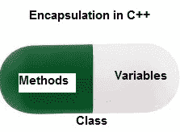

# c++ 中的封装

> 原文:[https://www.geeksforgeeks.org/encapsulation-in-c/](https://www.geeksforgeeks.org/encapsulation-in-c/)

正常情况下**封装**定义为将数据和信息封装在一个单元下。在面向对象编程中，封装被定义为将数据和操作它们的函数绑定在一起。
考虑一个真实的封装例子，在一个公司中有不同的部分，如账户部分、财务部分、销售部分等。财务科处理所有财务交易，并记录所有与财务有关的数据。同样，销售部门处理所有与销售相关的活动，并保存所有销售记录。现在可能会出现这样一种情况，出于某种原因，财务部的一名官员需要某个特定月份的所有销售数据。在这种情况下，不允许他直接访问销售部门的数据。他首先必须联系销售部门的其他官员，然后要求他提供具体数据。这就是封装。这里，销售部门的数据和能够操纵这些数据的员工被包装在一个名称“销售部门”下。



封装还会导致数据抽象或隐藏。因为使用封装也隐藏了数据。在上面的例子中，任何部分的数据，如销售、财务或账户，对任何其他部分都是隐藏的。

在 C++ 中，封装可以使用类和[访问修饰符](https://www.geeksforgeeks.org/access-modifiers-in-c/)来实现。请看下面的程序:

```cpp
// c++ program to explain
// Encapsulation

#include<iostream>
using namespace std;

class Encapsulation
{
    private:
        // data hidden from outside world
        int x;

    public:
        // function to set value of 
        // variable x
        void set(int a)
        {
            x =a;
        }

        // function to return value of
        // variable x
        int get()
        {
            return x;
        }
};

// main function
int main()
{
    Encapsulation obj;

    obj.set(5);

    cout<<obj.get();
    return 0;
}
```

输出:

```cpp
5

```

在上面的程序中，变量 **x** 是私有的。只能使用类中的函数 get()和 set()来访问和操作该变量。因此，我们可以说，在这里，变量 x 和函数 get()和 set()绑定在一起，这只是封装。

**访问说明符在封装中的作用**

正如我们在上面的例子中看到的，访问说明符在 C++ 中实现封装时起着重要的作用。实现封装的过程可以细分为两个步骤:

1.  应该使用**私有**访问说明符将数据成员标记为私有
2.  操纵数据成员的成员函数应该使用 **public** 访问说明符标记为 public

本文由 [**哈什·阿加瓦尔**](https://www.facebook.com/harsh.agarwal.16752) 供稿。如果你喜欢 GeeksforGeeks 并想投稿，你也可以使用[write.geeksforgeeks.org](https://write.geeksforgeeks.org)写一篇文章或者把你的文章邮寄到 review-team@geeksforgeeks.org。看到你的文章出现在极客博客主页上，帮助其他极客。

如果你发现任何不正确的地方，或者你想分享更多关于上面讨论的话题的信息，请写评论。