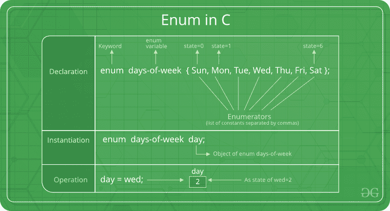

# C

中的枚举(或枚举)

> 原文:[https://www.geeksforgeeks.org/enumeration-enum-c/](https://www.geeksforgeeks.org/enumeration-enum-c/)

枚举(或 enum)是 c 语言中用户定义的数据类型，主要用于给整型常量赋值，这些名字使程序易于阅读和维护。



```
enum State {Working = 1, Failed = 0}; 
```

关键字“enum”用于在 C 和 C++中声明新的枚举类型。下面是枚举声明的一个示例。

```
// The name of enumeration is "flag" and the constant
// are the values of the flag. By default, the values
// of the constants are as follows:
// constant1 = 0, constant2 = 1, constant3 = 2 and 
// so on.
enum flag{constant1, constant2, constant3, ....... };

```

也可以定义枚举类型的变量。它们可以用两种方式定义:

```
// In both of the below cases, "day" is 
// defined as the variable of type week. 

enum week{Mon, Tue, Wed};
enum week day;

// Or

enum week{Mon, Tue, Wed}day;

```

```
// An example program to demonstrate working
// of enum in C
#include<stdio.h>

enum week{Mon, Tue, Wed, Thur, Fri, Sat, Sun};

int main()
{
    enum week day;
    day = Wed;
    printf("%d",day);
    return 0;
} 
```

输出:

```
2

```

在上面的例子中，我们将“day”声明为变量，并将“Wed”的值分配给 day，即 2。因此，打印了 2。

枚举的另一个例子是:

```
// Another example program to demonstrate working
// of enum in C
#include<stdio.h>

enum year{Jan, Feb, Mar, Apr, May, Jun, Jul, 
          Aug, Sep, Oct, Nov, Dec};

int main()
{
   int i;
   for (i=Jan; i<=Dec; i++)      
      printf("%d ", i);

   return 0;
}
```

输出:

```
0 1 2 3 4 5 6 7 8 9 10 11

```

在本例中，for 循环将从 i = 0 运行到 i = 11，因为最初 I 的值是 0 的 Jan，Dec 的值是 11。

**关于枚举初始化的有趣事实。**
**1。**两个枚举名称可以具有相同的值。例如，在下面的 C 程序中，“失败”和“冻结”具有相同的值 0。

```
#include <stdio.h>
enum State {Working = 1, Failed = 0, Freezed = 0};

int main()
{
   printf("%d, %d, %d", Working, Failed, Freezed);
   return 0;
}
```

输出:

```
1, 0, 0
```

**2。**如果我们没有为枚举名称显式赋值，编译器默认会从 0 开始赋值。例如，在下面的 C 程序中，星期日得到值 0，星期一得到 1，依此类推。

```
#include <stdio.h>
enum day {sunday, monday, tuesday, wednesday, thursday, friday, saturday};

int main()
{
    enum day d = thursday;
    printf("The day number stored in d is %d", d);
    return 0;
}
```

输出:

```
The day number stored in d is 4
```

**3。**我们可以按任意顺序给某个名称赋值。所有未分配的名称的值都是前一个名称加 1 的值。

```
#include <stdio.h>
enum day {sunday = 1, monday, tuesday = 5,
          wednesday, thursday = 10, friday, saturday};

int main()
{
    printf("%d %d %d %d %d %d %d", sunday, monday, tuesday,
            wednesday, thursday, friday, saturday);
    return 0;
}
```

输出:

```
1 2 5 6 10 11 12
```

**4。**分配给枚举名称的值必须是某个整数常量，即该值必须在最小可能整数值到最大可能整数值的范围内。

**5。**所有枚举常量在其范围内必须是唯一的。例如，以下程序编译失败。

```
enum state  {working, failed};
enum result {failed, passed};

int main()  { return 0; }
```

输出:

```
Compile Error: 'failed' has a previous declaration as 'state failed'
```

**练习:**
预测以下 C 程序的输出

计划 1:

```
#include <stdio.h>
enum day {sunday = 1, tuesday, wednesday, thursday, friday, saturday};

int main()
{
    enum day d = thursday;
    printf("The day number stored in d is %d", d);
    return 0;
}
```

程序二:

```
#include <stdio.h>
enum State {WORKING = 0, FAILED, FREEZED};
enum State currState = 2;

enum State FindState() {
    return currState;
}

int main() {
   (FindState() == WORKING)? printf("WORKING"): printf("NOT WORKING");
   return 0;
}
```

**Enum vs Macro**
我们也可以用宏来定义名字常量。例如，我们可以使用以下宏定义“工作”和“失败”。

```
#define Working 0
#define Failed 1
#define Freezed 2
```

当许多相关的命名常量具有整数值时，使用枚举比使用宏有多种优势。
a)枚举遵循范围规则。
b)枚举变量被自动赋值。下面更简单

```
enum state  {Working, Failed, Freezed};
```

Please write comments if you find anything incorrect, or you want to share more information about the topic discussed above

本文引言部分由 **Piyush Vashistha** 供稿。如果你喜欢 GeeksforGeeks 并想投稿，你也可以使用[write.geeksforgeeks.org](https://write.geeksforgeeks.org)写一篇文章或者把你的文章邮寄到 review-team@geeksforgeeks.org。看到你的文章出现在极客博客主页上，帮助其他极客。