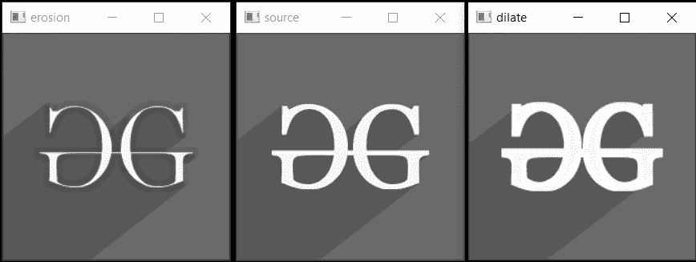

# 侵蚀和膨胀| c++ 中 OpenCV 的形态转换

> 原文:[https://www . geeksforgeeks . org/侵蚀-扩张-形态-转化-in-opencv-in-cpp/](https://www.geeksforgeeks.org/erosion-and-dilation-morphological-transformations-in-opencv-in-cpp/)

[形态变换](https://www.geeksforgeeks.org/python-morphological-operations-in-image-processing-opening-set-1/)是基于图像形状的简单操作，通常在二值图像上执行。它采用我们的输入图像和决定操作性质的结构元素(内核)。

在这篇文章中，我们将讨论两个基本的形态过滤器侵蚀和膨胀。[侵蚀](https://www.geeksforgeeks.org/erosion-dilation-images-using-opencv-python/)侵蚀掉边界并缩小前景对象的大小，而[膨胀](https://www.geeksforgeeks.org/difference-between-dilation-and-erosion/)膨胀边界并因此增加前景对象的大小。在此之前，让我们先了解一下什么是结构化元素:

**结构元素:**结构元素是用于与给定图像交互的形状。它帮助我们根据它如何错过或符合图像得出结论。用于形态学操作，如腐蚀、膨胀、打开、关闭、渐变、[黑帽/高帽变换](https://www.geeksforgeeks.org/top-hat-and-black-hat-transform-using-python-opencv/)。开放式 CV 为内核提供了 3 种形状:矩形、十字形和椭圆形。

**语法:**

> getStructuringElement(形状、大小、锚)

**参数:**以下是上述语法所需的参数:

*   **形状:**结构元素的形状可以是**变形 _RECT** 、**变形 _ 椭圆**、**变形 _ 十字**中的任何一个。
*   **ksize:** 结构元素的大小
*   **锚:**结构元素内部的锚位置。默认值为 **[-1，-1}** ，表示位置为结构元素的中心。

**返回值:**指定大小和形状的结构元素(Mat 对象)。

### **<u>侵蚀</u>**

侵蚀是用于缩小前景对象大小的形态学操作。这就像土壤侵蚀，侵蚀掉前景物体的边界。

在该操作中，仅当结构元素中的所有像素都具有值 **1** 时，核才滑过图像并考虑像素值 **1** 。否则就是侵蚀。这样，边界附近的像素将被丢弃，并获得图像内部收缩的前景对象。

**语法:**

> 侵蚀(src、dst、内核、锚、迭代、边界类型、边界值)

**参数:**

*   **src:** 输入图像
*   **dst:** 输出图像
*   **内核:**用于腐蚀的结构元素。
*   **锚:**结构元素内部的锚位置。默认值为[-1，-1}表示位置为结构元素的中心。
*   **迭代:**应用侵蚀的次数。
*   **边框类型:**边框类型(**边框 _ 常量**、**边框 _ 复制**等。)
*   **边框值:**边框值

**返回值:**输出图像(Mat 对象)

### **<u>膨胀</u>**

膨胀与侵蚀相反，它不是收缩，而是扩展前景对象。在这个操作中，结构化元素(内核)在图像中滑动。但是，这里，如果至少一个像素具有值 1，则像素值为 1。因此，对象围绕边界扩展，并产生扩展的图像。

**语法:**

> 扩展(src、dst、内核、锚、迭代、borderType、borderValue)

**参数:**

*   **src:** 输入图像
*   **dst:** 输出图像
*   **核:**用于膨胀的结构元素。
*   **锚:**结构元素内部的锚位置。默认值为 **[-1，-1}** ，表示位置为结构元素的中心。
*   **迭代:**应用膨胀的次数。
*   **边框类型:**边框类型(**边框 _ 常量**、**边框 _ 复制**等。)
*   **边框值:**边框值

**返回值:**输出图像(Mat 对象)

下面是实现上述概念的 C++ 程序:

## C++

```cpp
// C++ program to implement the erosion
// and dilation
#include <iostream>
#include <opencv2/core/core.hpp>

// Library to include for drawing shapes
#include <opencv2/highgui/highgui.hpp>
#include <opencv2/imgproc.hpp>
using namespace cv;
using namespace std;

// Driver Code
int main(int argc, char** argv)
{
    // Reading the Image
    Mat image = imread("C:/Users/harsh/Downloads/geeks.png",
                       IMREAD_GRAYSCALE);

    // Check if the image is created
    // successfully or not
    if (!image.data) {
        std::cout << "Could not open or find"
                  << " the image\n";
        return 0;
    }

    // Create a structuring element (SE)
    int morph_size = 2;
    Mat element = getStructuringElement(
        MORPH_RECT, Size(2 * morph_size + 1,
                         2 * morph_size + 1),
        Point(morph_size, morph_size));
    Mat erod, dill;

    // For Erosion
    erode(image, erod, element,
          Point(-1, -1), 1);

    // For Dilation
    dilate(image, dill, element,
           Point(-1, -1), 1);

    // Display the image
    imshow("source", image);
    imshow("erosion", erod);
    imshow("dilate", dill);
    waitKey();

    return 0;
}
```

**输出图像:**

[](https://media.geeksforgeeks.org/wp-content/uploads/20210125135800/gg.jpg)