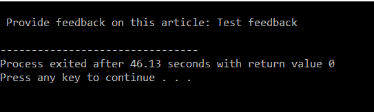
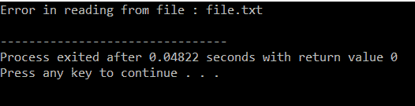
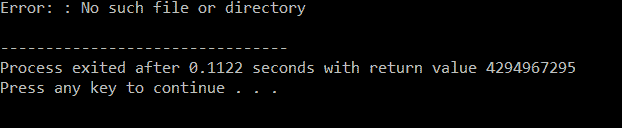

# C/c++中文件操作时的错误处理

> 原文:[https://www . geesforgeks . org/file-operations-in-c/](https://www.geeksforgeeks.org/error-handling-during-file-operations-in-c-c/)期间的错误处理

在 C++中[从文件中读取数据](https://www.geeksforgeeks.org/cpp-program-read-file-word-word/)或[向文件中写入数据](https://www.geeksforgeeks.org/readwrite-structure-file-c/)时，很容易出现[错误](https://www.geeksforgeeks.org/core-dump-segmentation-fault-c-cpp/)。例如，由于以下原因可能会出现错误:

*   当试图读取超出指示器的文件时。
*   当试图读取不存在的文件时。
*   尝试使用尚未打开的文件时。
*   当试图以适当的模式使用文件时，即，将数据写入已打开进行读取的文件。
*   写入写保护文件时，即试图写入只读文件时。

未能检查错误，则程序可能表现异常，因此未检查的错误可能导致程序过早终止或不正确的输出。

以下是 C/C++中[文件操作](https://www.geeksforgeeks.org/basics-file-handling-c/)时的一些[错误处理](https://www.geeksforgeeks.org/error-handling-c-programs/)功能:

### **铁（）：**

在 C/C++中，库函数 [ferror()](https://www.geeksforgeeks.org/error-handling-c-programs/) 用于检查流中的错误。它的原型写为:

> int ferror(FILE * stream)；

**ferror()** 功能检查流中的任何错误。如果没有发生错误，则返回零值，如果有错误，则返回非零值。除非通过 **clearerr()** 功能清除，否则错误指示将持续到文件关闭。

下面是实现使用 **ferror()** 的程序:

## C

```
// C program to illustrate the
// use of ferror()
#include <stdio.h>
#include <stdlib.h>

// Driver Code
int main()
{
    FILE* fp;

    // If a file is opened which does
    // not exist, then it will be an
    // error and corresponding errno
    // value will be set
    char feedback[100];

    int i;
    fp = fopen("GeeksForGeeks.TXT", "w");

    if (fp == NULL) {
        printf("\n The file could "
               "not be opened");
        exit(1);
    }

    printf("\n Provide feedback on "
           "this article: ");
    fgets(feedback, 100, stdin);

    for (i = 0; i < feedback[i]; i++)
        fputc(feedback[i], fp);

    // Error writing file
    if (ferror(fp)) {
        printf("\n Error writing in file");
        exit(1);
    }

    // Close the file pointer
    fclose(fp);
}
```

## C++

```
// C++ program to illustrate the
// use of ferror()
#include <bits/stdc++.h>

// Driver Code
int main()
{
    FILE* fp;

    // If a file is opened which does
    // not exist, then it will be an
    // error and corresponding errno
    // value will be set
    char feedback[100];

    int i;
    fp = fopen("GeeksForGeeks.TXT", "w");

    if (fp == NULL) {
        printf("\n The file could "
               "not be opened");
        exit(1);
    }

    printf("\n Provide feedback on "
           "this article: ");
    fgets(feedback, 100, stdin);

    for (i = 0; i < feedback[i]; i++)
        fputc(feedback[i], fp);

    // Error writing file
    if (ferror(fp)) {
        printf("\n Error writing in file");
        exit(1);
    }

    // Close the file pointer
    fclose(fp);
}
```

**输出:**

[](https://media.geeksforgeeks.org/wp-content/uploads/20210113150937/Screenshot93.png)

**说明:**执行完这段代码后“提供这篇文章的反馈:”会显示在屏幕上，给出一些反馈后“几秒钟后进程退出，返回值 0”会显示在屏幕上。

### **清除错误():**

函数 **clearerr()** 用于清除流的文件结束和错误指示符。其原型可以给出为:

> void clear err(FILE * stream)；

**clearerr()** 清除流所指向的流的错误。使用该功能是因为错误指示器不会自动清除。一旦设置了特定流的错误指示器，对该流的操作将继续返回错误值，直到调用 **clearerr()** 、 **fseek()** 、 **fsetpos()** 或 **rewind()** 为止。

下面是实现 **clearerr()** 使用的程序:

## C

```
// C program to illustrate the
// use of clearerr()
#include <errno.h>
#include <stdio.h>
#include <stdlib.h>

// Driver Code
int main()
{
    FILE* fp;
    char feedback[100];

    char c;

    fp = fopen("file.txt", "w");

    c = fgetc(fp);
    if (ferror(fp)) {
        printf("Error in reading from"
               " file : file.txt\n");
    }
    clearerr(fp);

    if (ferror(fp)) {
        printf("Error in reading from "
               "file : file.txt\n");
    }

    // close the file
    fclose(fp);
}
```

## C++

```
// C++ program to illustrate the
// use of clearerr()
#include <bits/stdc++.h>

// Driver Code
int main()
{
    FILE* fp;
    char feedback[100];

    char c;

    fp = fopen("file.txt", "w");

    c = fgetc(fp);
    if (ferror(fp)) {
        printf("Error in reading from"
               " file : file.txt\n");
    }
    clearerr(fp);

    if (ferror(fp)) {
        printf("Error in reading from "
               "file : file.txt\n");
    }

    // close the file
    fclose(fp);
}
```

**输出:**

[](https://media.geeksforgeeks.org/wp-content/uploads/20210113152723/Screenshot94.png)

函数 **perror()** 代表打印错误。在出现错误的情况下，程序员可以使用 **perror()** 函数来确定已经发生的错误类型。当调用 **perror()** 时，它会显示一条消息，描述在库函数调用或[系统调用](https://www.geeksforgeeks.org/introduction-of-system-call/)期间发生的最新错误。其原型可以给出为:

> 见 perro(char * msg)；

*   **perror()** 取一个参数，该参数指向一个可选的用户定义的消息。首先打印该消息，然后是一个冒号和描述最近错误的实现定义的消息。
*   如果在实际上没有发生错误的情况下调用 **perror()** ，则显示“无错误”。
*   要记住的最重要的一点是，调用 **perror()** 并且不处理错误情况，那么完全由程序采取行动。例如，程序可以提示用户做一些事情，例如终止程序。
*   通常，程序的活动将通过检查 **errno** 的值和错误的性质来确定。
*   为了使用外部常量 **errno** ，必须包含头文件 errno。H

下面给出的程序说明了 **perror()** 的使用。这里，假设文件**“file . txt”**不存在。

## C

```
// C program to illustrate the
// use of perror()
#include <errno.h>
#include <stdio.h>
#include <stdlib.h>

// Driver Code
int main()
{
    FILE* fp;

    // First rename if there is any file
    rename("file.txt", "newfile.txt");

    // Now try to open same file
    fp = fopen("file.txt", "r");

    if (fp == NULL) {

        perror("Error: ");
        return (-1);
    }

    // Close the file pointer
    fclose(fp);

    return (0);
}
```

## C++

```
// C++ program to illustrate the
// use of perror()
#include <bits/stdc++.h>
#include <errno.h>

// Driver Code
int main()
{
    FILE* fp;

    // First rename if there is any file
    rename("file.txt", "newfile.txt");

    // Now try to open same file
    fp = fopen("file.txt", "r");

    if (fp == NULL) {

        perror("Error: ");
        return (-1);
    }

    // Close the file pointer
    fclose(fp);

    return (0);
}
```

**输出:**

[](https://media.geeksforgeeks.org/wp-content/uploads/20210113161800/Screenshot95.png)