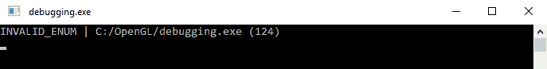

# OpenGL 中的错误处理

> 原文:[https://www.geeksforgeeks.org/error-handling-in-opengl/](https://www.geeksforgeeks.org/error-handling-in-opengl/)

[OpenGL](https://www.geeksforgeeks.org/getting-started-with-opengl/) API 的许多特性都非常有用和强大。但是， **OpenGL** 程序很有可能包含错误。因此，学习 OpenGL 程序中的错误处理变得很重要。OpenGL 和 GLU 库有一种记录错误的简单方法。当 OpenGL 程序在调用基本库例程或 GLU 例程时遇到错误，它会在内部记录一个错误代码，导致错误的例程会被忽略。虽然，OpenGL 在任何给定时间只记录一个错误代码。OpenGL 使用自己的方法来检测错误。一旦出现错误，在程序明确查询 OpenGL 错误状态之前，不会记录其他错误代码。

**语法:**

> 格伦姆码；
> 码= glgeterror()；

该[函数](https://www.geeksforgeeks.org/functions-in-c/)调用返回当前错误代码并清除内部错误标志:

*   如果返回值等于 **GLNOERROR** OpenGL 符号常量，一切都好。
*   如果有任何其他返回值，则表明出现了问题。

基本的 [OpenGL 库](https://www.geeksforgeeks.org/getting-started-with-opengl/)为代表不同误差条件的多个符号常数提供了定义。GLU 库也定义了一些错误代码，但是大多数都有几乎没有意义的名字，比如**glunorbserror 1**、**glunorbserror 2**等等。

GLU 库包含一个函数，为 GLU 和 GL 的每个错误返回一个描述性字符串。要使用它，首先检索当前的错误代码，然后将其作为参数传递给该函数。返回值可以使用类似 [fprintf()函数](https://www.geeksforgeeks.org/fprintf-in-c/)的 C 标准库函数打印出来。

下面是实现上述方法的代码片段:

## C

```
#include <stdio.h>
GLenum code;

const GLubyte* string;
code = glGetError();
string = gluErrorString(code);
fprintf(stderr, "OpenGL error: %s\n", string);
```

**解释:**由**gluerrostring**返回的值指向位于 GLU 库中的一个字符串。因为它不是一个动态分配的[字符串，所以它不能被程序显式解除分配。另外，它不能被程序修改(因此，字符串声明上的 const 修饰符)。在程序中将这些函数调用封装成一个通用的错误报告函数是非常容易的。](https://www.geeksforgeeks.org/what-is-dynamic-memory-allocation/)

下面给出的函数将检索当前错误代码，打印描述性错误字符串，并将代码返回给调用例程:

## C

```
// C program for the above approach
#include <stdio.h>

GLenum errorCheck()
{
    GLenum code;
    const GLubyte* string;
    code = glGetError();
    if (code != GL_NO_ERROR) {
        string = gluErrorString(code);
        fprintf(stderr, "OpenGL error: %s\n", string);
    }
    return code;
}
```

**说明:**默认情况下， **glGetError** 只打印错误号，除非错误代码已经记忆，否则不容易理解。因此，编写一个小的助手函数来轻松地打印出错误字符串以及错误检查函数的调用位置通常是有意义的:

> GLenum glcherror _(const char * file，int line)
> {
> GLenum error code；
> while ((errorCode = glGetError())！= GL_NO_ERROR)
> {
> 标准::字符串错误；
> 开关(error code)
> {
> case GL _ INVALID _ ENUM:error =“INVALID _ ENUM”；打破；
> 案例 GL_INVALID_VALUE:错误=“INVALID _ VALUE”；打破；
> 案例 GL_INVALID_OPERATION:错误=“INVALID _ OPERATION”；打破；
> 案例 GL_STACK_OVERFLOW:错误=“STACK _ OVERFLOW”；打破；
> 案例 GL _ STACK _ UNDERFLOW:错误=“STACK _ EXFLOW”；打破；
> 案例 GL_OUT_OF_MEMORY:错误=“OUT _ OF _ MEMORY”；打破；
> case GL _ INVALID _ frame buffer _ OPERATION:error =“INVALID _ frame buffer _ OPERATION”；打破；
> }
> std::cout < <错误<<“|”<<文件<<”(<<行<<)<<STD::endl；
> }
> 返回错误代码；
> }
> #定义 glcherror()glcherror _(_ _ FILE _ _，__LINE__)

如果这些**glcherror**调用中的任何一个被分组到我们的数据库中，那么更精确地知道哪个**glcherror**调用返回了错误是有帮助的。

> glBindBuffer(GL_VERTEX_ARRAY，vbo)：
> glcheck error()；

**输出示例:**

> 