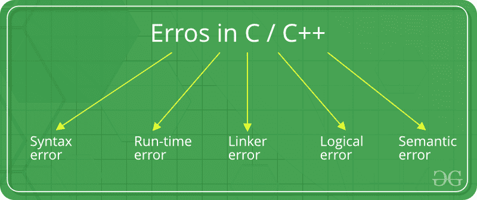

# C/c++

中的错误

> 原文:[https://www.geeksforgeeks.org/errors-in-cc/](https://www.geeksforgeeks.org/errors-in-cc/)

错误是用户执行的非法操作，导致程序异常运行。
在程序编译或执行之前，编程错误通常不会被发现。有些错误会阻止程序被编译或执行。因此，应该在编译和执行之前删除错误。
最常见的错误可大致分类如下。

**错误类型:**



1.  **语法错误:**当你**违反编写 C/C++语法的规则**时出现的错误称为语法错误。此编译器错误表明在编译代码之前必须修复一些问题。所有这些错误都被编译器检测到，因此被称为编译时错误。
    最常见的语法错误是:
    *   缺少括号( **}** )
    *   打印变量值而不声明它
    *   缺少分号，如下所示:

## C++

```
// C++ program to illustrate
// syntax error

#include <iostream>
using namespace std;

void main()
{
    int x = 10;
    int y = 15;

    cout << " "<< (x, y) // semicolon missed
}

// This code is contributed by shivanisinghss2110
```

## C

```
// C program to illustrate
// syntax error
#include<stdio.h>
void main()
{
    int x = 10;
    int y = 15;

    printf("%d", (x, y)) // semicolon missed
}
```

**错误:**

```
error: expected ';' before '}' token
```

*   基本结构的语法写错了。例如:while 循环

## C++

```
// C++ program to illustrate
// syntax error
#include <iostream>
using namespace std;

int main(void)
{
    // while() cannot contain "." as an argument.
    while(.)
    {
        cout <<"hello";
    }
    return 0;
}

// This code is contributed by shivanisinghss2110
```

## C

```
// C program to illustrate
// syntax error
#include<stdio.h>
int main(void)
{
    // while() cannot contain "." as an argument.
    while(.)
    {
        printf("hello");
    }
    return 0;
}
```

**错误:**

```
error: expected expression before '.' token
     while(.) 
```

*   在给定的示例中，while 循环的语法不正确。这将导致语法错误。

1.  **运行时错误:**成功编译后程序执行(运行时)过程中出现的错误称为运行时错误。最常见的运行时错误之一是除以零，也称为除法错误。这些类型的错误很难找到，因为编译器不会指向错误发生的那一行。
    要了解更多信息，请运行下面给出的示例。

## C++

```
// C++ program to illustrate
// run-time error
#include <iostream>
#include <bits/stdc++.h>
using namespace std;

void main()
{
    int n = 9, div = 0;

    // wrong logic
    // number is divided by 0,
    // so this program abnormally terminates
    div = n/0;

   cout << "result = "<< div;
}

// This code is contributed by shivanisinghss2110
```

## C

```
// C program to illustrate
// run-time error
#include<stdio.h>
void main()
{
    int n = 9, div = 0;

    // wrong logic
    // number is divided by 0,
    // so this program abnormally terminates
    div = n/0;

    printf("result = %d", div);
}
```

**错误:**

```
warning: division by zero [-Wdiv-by-zero]
     div = n/0;
```

1.  在给定的例子中，存在除以零的误差。这是一个运行时错误的例子，即运行程序时发生的错误。
2.  **链接器错误:**当编译后我们使用 *Ctrl+F9* 键(运行)将不同的对象文件与 main 的对象链接时，会出现这些错误。这些是无法生成程序的可执行文件时产生的错误。这可能是由于错误的函数原型，不正确的头文件。最常见的链接器错误之一是写 **Main()** 而不是 **main()** 。

## C++

```
// C++ program to illustrate
// linker error
#include <bits/stdc++.h>
using namespace std;

void Main() // Here Main() should be main()
{
    int a = 10;
    cout << " "<< a;
}

// This code is contributed by shivanisinghss2110
```

## C

```
// C program to illustrate
// linker error
#include<stdio.h>

void Main() // Here Main() should be main()
{
    int a = 10;
    printf("%d", a);
}
```

**错误:**

```
(.text+0x20): undefined reference to `main'
```

1.  **逻辑错误:**在编译和执行程序时，当给定某些输入值时，无法获得所需的输出。这些类型的错误提供不正确的输出，但看起来没有错误，被称为逻辑错误。这些是编程初学者最常见的错误之一。
    这些错误完全取决于程序员的逻辑思维，如果我们遵循执行路线并确定程序为什么走这条执行路线，就很容易发现这些错误。

## C++

```
// C++ program to illustrate
// logical error
int main()
{
    int i = 0;

    // logical error : a semicolon after loop
    for(i = 0; i < 3; i++);
    {
       cout << "loop ";
        continue;
    }
    return 0;
}

// This code is contributed by shivanisinghss2110.
```

## C

```
// C program to illustrate
// logical error
int main()
{
    int i = 0;

    // logical error : a semicolon after loop
    for(i = 0; i < 3; i++);
    {
        printf("loop ");
        continue;
    }
    getchar();
    return 0;
}
```

1.  无输出
2.  **语义错误:**当程序中编写的语句对编译器没有意义时，就会出现这个错误。

## C

```
// C program to illustrate
// semantic error
void main()
{
  int a, b, c;
  a + b = c; //semantic error
}
```

**错误:**

```
 error: lvalue required as left operand of assignment
 a + b = c; //semantic error
```

This article is contributed by **Krishna Bhatia**. If you like GeeksforGeeks and would like to contribute, you can also write an article using [write.geeksforgeeks.org](https://write.geeksforgeeks.org) or mail your article to review-team@geeksforgeeks.org. See your article appearing on the GeeksforGeeks main page and help other Geeks.Please write comments if you find anything incorrect, or you want to share more information about the topic discussed above.