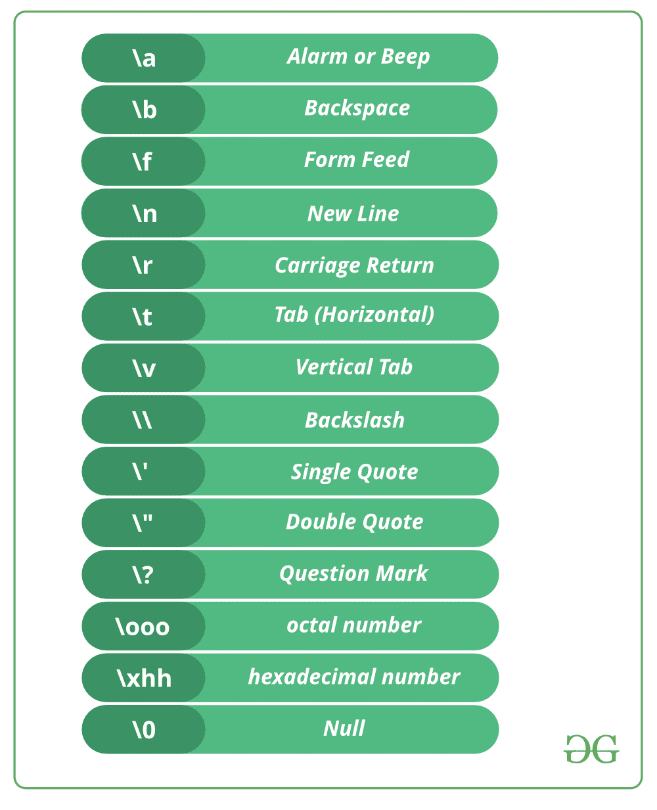

# C 中的转义序列

> 原文:[https://www.geeksforgeeks.org/escape-sequences-c/](https://www.geeksforgeeks.org/escape-sequences-c/)

在 C 编程语言中，字符集有 256 个字符。整个字符集分为两部分，即 ASCII 字符集和扩展 ASCII 字符集。但是除此之外，还有一些不属于任何字符集的字符，称为转义字符。

**转义序列列表**

[](https://media.geeksforgeeks.org/wp-content/cdn-uploads/20191129164033/C-CPP-Escape-Sequences.png)

**转义字符的一些编码示例**

```
// C program to illustrate
// \a escape sequence
#include <stdio.h>
int main(void)
{
    printf("My mobile number "
          "is 7\a8\a7\a3\a9\a2\a3\a4\a0\a8\a");
    return (0);
}
```

输出:

```
My mobile number is 7873923408.

```

```
// C program to illustrate
// \b escape sequence
#include <stdio.h>
int main(void)
{
    // \b - backspace character transfers
    // the cursor one character back with 
    // or without deleting on different 
    // compilers.
    printf("Hello Geeks\b\b\b\bF");
    return (0);
}
```

输出:

```
The output is dependent upon compiler.

```

```
// C program to illustrate
// \n escape sequence
#include <stdio.h>
int main(void)
{
    // Here we are using \n, which
    // is a new line character.
    printf("Hello\n");
    printf("GeeksforGeeks");
    return (0);
}
```

输出:

```
Hello
GeeksforGeeks
```

```
// C program to illustrate
// \t escape sequence
#include <stdio.h>
int
main(void)
{
    // Here we are using \t, which is
    // a horizontal tab character.
    // It will provide a tab space 
    // between two words.
    printf("Hello \t GFG");
    return (0);
}
```

输出:

```
Hello   GFG

```

转义序列“\t”在基于循环的[模式打印程序中经常使用。](https://www.geeksforgeeks.org/tag/pattern-printing/)

```
// C program to illustrate
// \v escape sequence
#include <stdio.h>
int main(void)
{
    // Here we are using \v, which
    // is vertical tab character.
    printf("Hello friends");

    printf("\v Welcome to GFG");

    return (0);
}
```

输出:

```
Hello Friends
Welcome to GFG

```

```
// C program to illustrate \r escape 
// sequence
#include <stdio.h>
int main(void)
{
    // Here we are using \r, which
    // is carriage return character.
    printf("Hello fri \r ends");
    return (0);
}
```

输出:(取决于编译器)

```
ends 

```

```
// C program to illustrate \\(Backslash)
// escape sequence to print backslash.
#include <stdio.h>
int main(void)
{
    // Here we are using \,
    // It contains two escape sequence 
    // means \ and \n.
    printf("Hello\\GFG");
    return (0);
}
```

输出:(取决于编译器)

```
Hello\GFG 

```

**解释:**它包含两个转义序列，表示它在打印后\编译器读取下一个\以及新的行字符，即\n，这将在下一行打印 GFG

```
// C program to illustrate \' escape
// sequence/ and \" escape sequence to
// print single quote and double quote.
#include <stdio.h>
int main(void)
{
    printf("\' Hello Geeks\n");
    printf("\" Hello Geeks");
    return 0;
}
```

输出:

```
' Hello Geeks
" Hello Geeks

```

```
// C program to illustrate
// \? escape sequence
#include <stdio.h>
int main(void)
{
    // Here we are using \?,  which is 
    // used for the presentation of trigraph
    // in the early of C programming. But
    // now we don't have any use of it.
    printf("\?\?!\n");
    return 0;
}
```

输出:

```
??!

```

```
// C program to illustrate \OOO escape sequence
#include <stdio.h>
int main(void)
{
    // we are using \OOO escape sequence, here 
    // each O in "OOO" is one to three octal 
    // digits(0....7).
    char* s = "A\0725";
    printf("%s", s);
    return 0;
}
```

输出:

```
A:5

```

**说明:**这里 000 是一到三个八进制数字(0…7)表示\之后必须至少有一个八进制数字，最多三个。这里 072 是八进制表示法，首先它被转换成十进制表示法，即 char ':'的 ASCII 值。\072 处有:输出为 A:5。

```
// C program to illustrate \XHH escape 
// sequence
#include <stdio.h>
int main(void)
{
    // We are using \xhh escape sequence.
    // Here hh is one or more hexadecimal
    // digits(0....9, a...f, A...F).
    char* s = "B\x4a";
    printf("%s", s);
    return 0;
}
```

输出:

```
BJ

```

**说明:**这里 hh 是一个或多个十六进制数字(0…9，a…f，A…F)。\x 后面可以有多个十六进制数。这里，' \x4a '是十六进制数，并且是单个字符。首先，它将被转换成十进制表示法，它是字符“J”的 ASCII 值。因此在\x4a 的地方，我们可以写 j，所以输出是 BJ。

本文由**比沙尔·库马尔·杜贝**供稿。如果你喜欢 GeeksforGeeks 并想投稿，你也可以使用[contribute.geeksforgeeks.org](http://www.contribute.geeksforgeeks.org)写一篇文章或者把你的文章邮寄到 contribute@geeksforgeeks.org。看到你的文章出现在极客博客主页上，帮助其他极客。

如果你发现任何不正确的地方，或者你想分享更多关于上面讨论的话题的信息，请写评论。