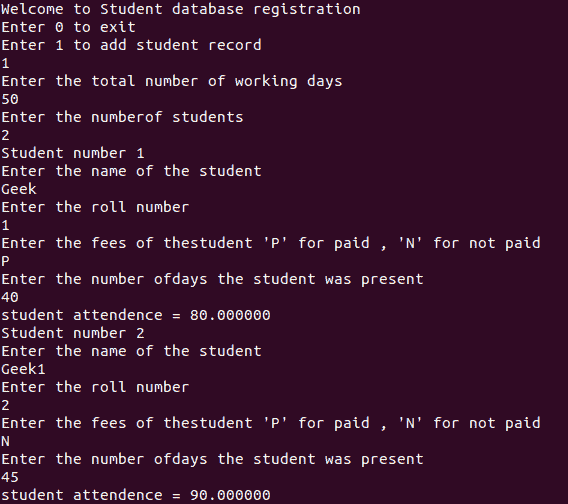
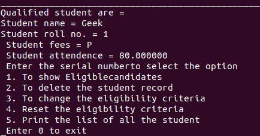
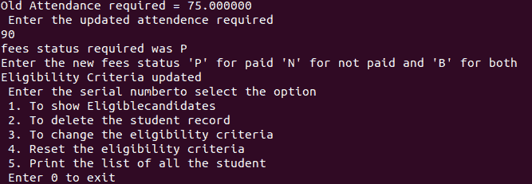
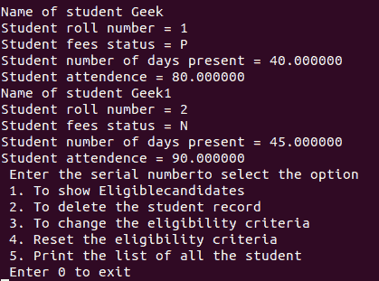
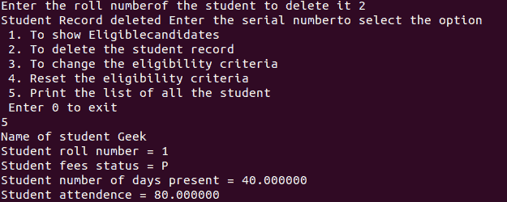

# C

中的考试管理系统

> 原文:[https://www . geesforgeks . org/考试-管理-系统-in-c/](https://www.geeksforgeeks.org/examination-management-system-in-c/)

**<u>问题陈述</u> :** 编写 [C 程序](https://www.geeksforgeeks.org/c-programming-language/)构建考试管理系统软件，可以进行以下操作:

*   添加/删除学生的详细信息
*   学生出勤监控
*   设置/编辑考试资格标准
*   检查合格学生的考试情况
*   打印学生的所有记录

**<u>逼近</u> :** 思路是每个操作形成一个单独的函数。所有功能与开关盒统一在一起，形成软件。下面是这些功能的图示:

1.  **执行():**该功能将显示软件的可用选项，并将使用[开关语句](https://www.geeksforgeeks.org/switch-statement-cc/)执行以下功能。
    **功能:**
    *   添加学生详细信息
    *   显示合格的学生
    *   删除学生记录
    *   更新资格标准
    *   打印学生的详细信息
2.  **add():** 从用户处获取数据并更新学生列表的功能。将学生添加到列表中时，检查学生的学号是否唯一。要添加的学生的详细信息如下:

*   学生姓名
*   辊号
*   费用状态
*   学生出勤记录

*   **eligibleStudents():** 此功能显示考试所需的前一次出勤率，并从用户处获取数据，更新考试资格。它还通过遍历学生记录列表来更新考试资格所需的费用状态，并且对于每个学生，检查出勤率是否高于学生的所需百分比和费用状态。*   **print_student():** 该函数遍历学生列表，打印学生的详细信息。*   **delete():** This function get the student roll number to delete the student record and update the student’s list.

    下面是说明上述功能的程序:

    ## 添加()

    ```cpp
    // Function that adds the student's
    // record in Examination Management
    // Project
    void add(struct student s[50])
    {
        printf("Enter the total ");

        printf("number of working days \n");
        scanf("%f", &tdays);

        printf("Enter the number"
               "of students \n");
        scanf("%d", &n);

        for (i = 0; i < n; i++) {

            printf("Student number %d \n",
                   (i + 1));

            printf("Enter the name of"
                   " the student \n");
            scanf("%s", s[i].name);

            printf("Enter the roll number \n");
            scanf(" %d", &s[i].rno);

            printf("Enter the fees of the"
                   "student 'P' for paid "
                   ", 'N' for not paid \n");
            scanf(" %c", &s[i].fees);

            printf("Enter the number of"
                   "days the student was "
                   "present \n");
            scanf("%f", &s[i].days);

            s[i].attend = (s[i].days
                           / tdays)
                          * 100;

            printf("student attendence"
                   " = %f \n",
                   s[i].attend);
        }
        execute();
    }
    ```

    ## 执行()

    ```cpp
    // Function to execute the Examination
    // Management System
    void execute()
    {
        printf("Enter the serial number "
               "to select the option \n");
        printf(" 1\. To show Eligible"
               "candidates \n");
        printf(" 2\. To delete the "
               "student record \n");
        printf(" 3\. To change the "
               "eligibility criteria \n");
        printf(" 4\. Reset the "
               "eligibility criteria \n");
        printf(" 5\. Print the list "
               "of all the student \n");
        printf(" Enter 0 to exit \n");
        scanf("%d", &option);

        // Switch Statement for choosing
        // the desired option for user
        switch (option) {
        case 1:
            eligibleStudents(s);
            execute();
            break;

        case 2:
            deleteRecord(s);
            execute();
            break;

        case 3:
            printf("Old Attendance "
                   "required = %f",
                   present);
            printf(
                "\n Enter the updated "
                "attendence required \n");
            scanf("%f", &present);
            printf("fees status required"
                   " was %c \n",
                   money);
            printf("Enter the new fees "
                   "status 'P' for paid 'N' "
                   "for not paid and "
                   "'B' for both \n");
            scanf("%c", &money);

            printf("Eligibility Criteria"
                   " updated \n");
            execute();
            break;

        case 4:
            present = 75.00;
            money = 'P';
            printf("Eligibility Criteria"
                   " reset \n");
            execute();
            break;

        case 5:
            printStudents(s);
            execute();
            break;

        case 6:
            execute();
            break;

        case 0:
            exit(0);

        default:
            printf("Enter number only"
                   " from 0 - 4 \n");
            execute();
        }
    }
    ```

    ## eligibleStudents()

    ```cpp
    // Function to print the student
    // details of the eligible students
    void eligibleStudents(struct student s[])
    {
        printf("________________"
               "________________"
               "_______________"
               "_____________ \n");
        printf("Qualified student are = \n");

        // Iterate over the list of the
        // students records
        for (i = 0; i < n; i++) {
            // Condition to check the
            // eligibility of the student
            if (s[i].fees == money || 'B' == money) {
                if (s[i].attend >= present) {
                    printf("Student name = %s \n",
                           s[i].name);

                    printf("Student roll no. = %d \n",
                           s[i].rno);

                    printf(" Student fees = %c \n",
                           s[i].fees);

                    printf(" Student attendence = %f \n",
                           s[i].attend);
                }
            }
        }
    }
    ```

    ## 删除()

    ```cpp
    // Function to delete any Student Record
    void delete (struct student s[])
    {
        int a = 0;
        printf("Enter the roll number of"
               "the student to delete it ");
        scanf("%d", &a);

        // Iterate over the student's
        // records to delete the Data
        for (i = 0; i <= n; i++) {
            // Check the current student
            // roll number is same as the
            // user input roll number
            if (s[i].rno == (a)) {

                // Update record at ith index
                // with (i + 1)th index
                for (j = i; j < n; j++) {
                    strcpy(s[j].name,
                           s[j + 1].name);

                    s[j].rno = s[j + 1].rno;
                    s[j].fees = s[j + 1].fees;
                    s[j].days = s[j + 1].days;
                    s[j].attend = s[j + 1].attend;
                }
                printf("Student Record deleted");
            }
        }
    }
    ```

    ## print_student()

    ```cpp
    // Function to print the students record
    void print_student(struct student s[])
    {
        // Iterate over the students
        // students records
        for (i = 0; i < n; i++) {
            printf("Name of student %s \n",
                   s[i].name);
            printf("Student roll number = %d \n",
                   s[i].rno);
            printf("Student fees status = %c \n",
                   s[i].fees);
            printf("student number of days "
                   "present = %d \n",
                   s[i].days);
            printf("Student attendence = %f \n",
                   s[i].attend);
        }
    }
    ```

    ## 完全码

    ```cpp
    // C program for the Examination
    // Management System
    #include <stdio.h>
    #include <stdlib.h>
    #include <string.h>

    int option = 0;
    int i = 0;
    int n = 0;
    int j = 0;
    float present = 75.00;
    char money = 'P';
    float tdays = 1;

    // Structure of Student
    struct student {
        char name[20];
        int rno;
        char fees;
        float days;
        float attend;
    } s[50];

    // Functions
    void add(struct student s[]);
    void eligibleStudents(struct student s[]);
    void execute();
    void printStudents(struct student s[]);
    void deleteRecord(struct student s[]);

    // Function to execute the software
    // for the student examination
    // registration system
    void execute()
    {
        printf(
            " Enter the serial number"
            "to select the option \n");
        printf(" 1\. To show Eligible"
               "candidates \n");
        printf(" 2\. To delete the "
               "student record \n");
        printf(" 3\. To change the "
               "eligibility criteria \n");
        printf(" 4\. Reset the "
               "eligibility criteria \n");
        printf(" 5\. Print the list "
               "of all the student \n");
        printf(" Enter 0 to exit \n");

        scanf("%d", &option);

        // Switch Statement for choosing
        // the desired option for the user
        switch (option) {
        case 1:
            eligibleStudents(s);
            execute();
            break;

        case 2:
            deleteRecord(s);
            execute();
            break;

        case 3:
            printf("Old Attendance "
                   "required = %f",
                   present);
            printf(
                "\n Enter the updated "
                "attendence required \n");
            scanf("%f", &present);
            printf("fees status required"
                   " was %c \n",
                   money);
            printf("Enter the new fees "
                   "status 'P' for paid 'N' "
                   "for not paid and "
                   "'B' for both \n");
            scanf("%c", &money);
            printf("Eligibility Criteria updated \n");
            execute();
            break;

        case 4:
            present = 75.00;
            money = 'P';
            printf("Eligibility creitria reset \n");
            execute();
            break;

        case 5:
            printStudents(s);
            execute();
            break;

        case 6:
            execute();
            break;

        case 0:
            exit(0);

        default:
            printf("Enter number only from 0-4 \n");
            execute();
        }
    }

    // Function to print the students record
    void printStudents(struct student s[])
    {
        // Loop to iterate over the students
        // students records
        for (i = 0; i < n; i++) {

            printf("Name of student %s \n",
                   s[i].name);
            printf("Student roll number = %d \n",
                   s[i].rno);
            printf("Student fees status = %c \n",
                   s[i].fees);
            printf("Student number of days "
                   "present = %f \n",
                   s[i].days);
            printf("Student attendence = %f \n",
                   s[i].attend);
        }
    }

    // Function to Student Record
    void deleteRecord(struct student s[])
    {
        int a = 0;
        printf("Enter the roll number of "
               "the student to delete it ");
        scanf("%d", &a);

        // Loop to iterate over the students
        // records to delete the Data
        for (i = 0; i <= n; i++) {
            // Condition to check the current
            // student roll number is same as
            // the user input roll number
            if (s[i].rno == (a)) {

                // Update record at ith index
                // with (i + 1)th index
                for (j = i; j < n; j++) {
                    strcpy(s[j].name, s[j + 1].name);
                    s[j].rno = s[j + 1].rno;
                    s[j].fees = s[j + 1].fees;
                    s[j].days = s[j + 1].days;
                    s[j].attend = s[j + 1].attend;
                }
                printf("Student Record deleted");
            }
        }
    }

    // Function to print the student
    // details of the eligible students
    void eligibleStudents(struct student s[])
    {
        printf("________________"
               "________________"
               "_______________"
               "_____________ \n");
        printf("Qualified student are = \n");

        // Iterate over the list
        // of the students records
        for (i = 0; i < n; i++) {
            // Check for the eligibility
            // of the student
            if (s[i].fees == money || 'B' == money) {
                if (s[i].attend >= present) {
                    printf("Student name = %s \n",
                           s[i].name);
                    printf("Student roll no. = %d \n",
                           s[i].rno);
                    printf(" Student fees = %c \n",
                           s[i].fees);
                    printf(" Student attendence = %f \n",
                           s[i].attend);
                }
            }
        }
    }

    // Function to add the students record
    void add(struct student s[50])
    {
        printf("Enter the total ");
        printf("number of working days \n");
        scanf("%f", &tdays);

        printf("Enter the number");
        printf("of students \n");
        scanf("%d", &n);

        for (i = 0; i < n; i++) {

            printf("Student number %d \n",
                   (i + 1));

            printf("Enter the name of"
                   " the student \n");
            scanf("%s", s[i].name);

            printf("Enter the roll number \n");
            scanf(" %d", &s[i].rno);

            printf("Enter the fees of the"
                   "student 'P' for paid "
                   ", 'N' for not paid \n");
            scanf(" %c", &s[i].fees);

            printf("Enter the number of"
                   "days the student was "
                   "present \n");
            scanf("%f", &s[i].days);

            s[i].attend = (s[i].days
                           / tdays)
                          * 100;
            printf("student attendence = %f \n",
                   s[i].attend);
        }
        execute();
    }

    // Driver Code
    int main()
    {
        printf("Welcome to Student "
               "database registration \n");

        printf("Enter 0 to exit \n");
        printf("Enter 1 to add student"
               " record \n");

        scanf("%d", &option);

        // Switch Statements
        switch (option) {
        case 0:
            exit(0);

        case 1:
            add(s);
            break;

        default:
            printf("Only enter 0 or 1");
            execute();
        }
        return 0;
    }
    ```

    **输出:**
    以下是上述功能的输出:

    *   **添加学生详情:**
        [](https://media.geeksforgeeks.org/wp-content/uploads/20200921052823/Screenshotfrom20200921052749.png)
    *   **符合条件的学生:**
        [](https://media.geeksforgeeks.org/wp-content/uploads/20200921052936/Screenshotfrom20200921052916.png)
    *   **合格标准:**
        [](https://media.geeksforgeeks.org/wp-content/uploads/20200921053117/Screenshotfrom20200921053055.png)
    *   **打印学生详情:**
        [](https://media.geeksforgeeks.org/wp-content/uploads/20200921053229/Screenshotfrom20200921053158.png)
    *   **删除学生记录:**
        [](https://media.geeksforgeeks.org/wp-content/uploads/20200921053343/Screenshotfrom20200921053321.png)