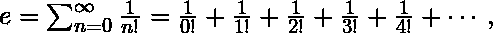

# exp()函数 C++

> 原文:[https://www.geeksforgeeks.org/exp-function-cpp/](https://www.geeksforgeeks.org/exp-function-cpp/)

C++中的 **exp()** 函数返回给定参数的指数([欧拉数](https://en.wikipedia.org/wiki/E_(mathematical_constant)) ) e(或 2.71828)。

> *返回指数 e 的语法:
> 结果=exp()*

**参数:**
函数可以取任意值，即参数中的正、负或零，并返回 int、double 或 float 或 long double 的结果。

**返回值:**
exp()函数返回[0，inf]范围内的值。

**错误:**
当我们在 exp 函数中传递一个以上的参数时，它会显示错误

**应用:**
下面给出的是 **exp()** 函数的应用示例

```cpp
#include <bits/stdc++.h>
using namespace std;

// function to explain use of exp() function
double application(double x)
{
    double result = exp(x);
    cout << "exp(x) = " << result << endl;
    return result;
}

// driver program
int main()
{
    double x = 10;
    cout << application(x);
    return 0;
}
```

**输出:**

```cpp
exp(x) = 22026.5

```

**e(数学常数)的应用:**

*   **复利:**以 1 美元开始并提供年利率为 R 的账户，在 t 年后将通过连续复利产生 e <sup>Rt</sup> 美元(这里 R 是以百分比表示的利率的十进制等价物，因此对于 5%的利息，R = 5/100 = 0.05)
*   以下表达式的值为
    
*   如果一个赌徒在一场每场都有百万分之一胜算的游戏中尝试了一百万次，他/她永远不会赢的概率接近 1/e。
*   数字 e 是无穷级数
    的和

资料来源:wiki