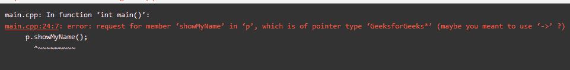

# 表达式在 C++中必须有类类型错误

> 原文:[https://www . geesforgeks . org/expression-必有类-type-error-in-c/](https://www.geeksforgeeks.org/expression-must-have-class-type-error-in-c/)

**表达式必须有类类型**是当**点(。)**运算符用于访问对象的属性，用于指向对象的指针。

[**圆点('.')运算符**](https://www.geeksforgeeks.org/dot-operator-in-c-c/) 基本上用于访问对象的字段和方法，但是当在该条件下在指向对象的指针上使用一个**点运算符**时，会显示错误**“表达式必须有类”**类型。

当**点('.')运算符**用在类类型对象的指针上，条件是**点('.')运算符**试图查找指针类型的字段和方法，但实际上它们并不存在，因此我们会得到这个错误。

下面是说明上述错误的代码:

## C++

```
// C++ program to illustrate the
// Expression must have class
// type error
#include <iostream>
using namespace std;

// Class
class GeeksforGeeks {
public:
    // Function to display message
    void showMyName()
    {
        cout << "Welcome to GeeksforGeeks!";
    }
};

// Driver Code
int main()
{
    // Object of the class
    GeeksforGeeks* p = new GeeksforGeeks();

    // Member function call
    p.showMyName();

    return 0;
}
```

**输出:**
[](https://media.geeksforgeeks.org/wp-content/cdn-uploads/20210114084336/Screenshot-117.png)

**如何解决这个错误？**
为解决上述错误，思路是在不使用[新运算符](https://www.geeksforgeeks.org/new-vs-operator-new-in-cpp/)的情况下初始化类，即不将对象初始化为**“class name * obj = new class name()”**，而是将其初始化为**“class name obj”**，使用**点(')访问类的成员函数)操作员**。下面是同样的程序来说明:

## C++

```
// C++ program to illustrate how to
// solve Expression must have class
// type error
#include <iostream>
using namespace std;

// Class
class GeeksforGeeks {
public:
    // Function to display message
    void showMyName()
    {
        cout << "Welcome to GeeksforGeeks!";
    }
};

// Driver Code
int main()
{
    // Object of the class
    GeeksforGeeks p;

    // Member function call
    p.showMyName();

    return 0;
}
```

**Output:**

```
Welcome to GeeksforGeeks!

```