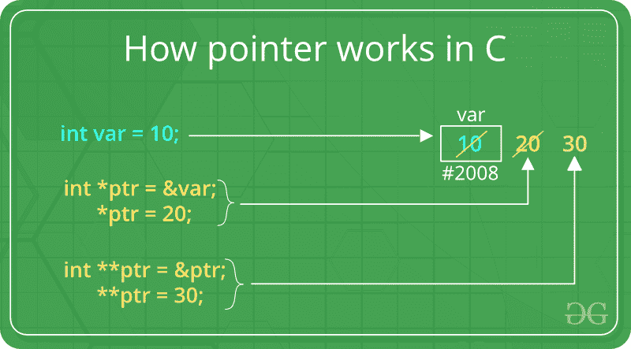

# C/c++中指针的特性和使用

> 原文:[https://www . geesforgeks . org/features-and-use-in-c-c/](https://www.geeksforgeeks.org/features-and-use-of-pointers-in-c-c/)

[指针](https://www.geeksforgeeks.org/pointers-in-c-and-c-set-1-introduction-arithmetic-and-array/)存储变量地址或存储位置。

**语法:**

```
datatype *var_name; 

```

**示例:**指针“ptr”保存整数变量的地址或保存其值可通过“ptr”作为整数值访问的存储器的地址

```
int *ptr;  

```

[](https://www.geeksforgeeks.org/pointers-in-c-and-c-set-1-introduction-arithmetic-and-array/)

**指针的特征:**

1.  指针节省内存空间。
2.  指针的执行时间更快，因为数据是用地址操作的，即直接访问
    存储单元。
3.  使用指针可以有效地访问内存。指针也分配和释放内存。因此可以说指针的内存是动态分配的。
4.  指针用于数据结构。它们对于表示二维和多维
    数组很有用。
5.  任何类型的数组都可以在指针的帮助下被访问，而不用考虑它的下标范围。
6.  指针用于文件处理。
7.  指针用于动态分配内存。
8.  在 C++中，声明为基类的指针可以访问派生类的对象。但是，指向派生类的指针不能访问基类的对象。

**指针的使用:**

1.  通过引用传递参数
2.  用于[访问数组元素](https://www.geeksforgeeks.org/arrays-in-c-cpp/)
3.  至[返回多个值](https://www.geeksforgeeks.org/how-to-return-multiple-values-from-a-function-in-c-or-cpp/)
4.  [动态内存分配](https://www.geeksforgeeks.org/dynamic-memory-allocation-in-c-using-malloc-calloc-free-and-realloc/)
5.  到[实现数据结构](https://www.geeksforgeeks.org/data-structures/)
6.  在内存地址有用的地方进行系统级编程