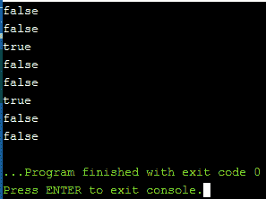

# c++ 20 的特性

> 原文:[https://www.geeksforgeeks.org/features-of-c-20/](https://www.geeksforgeeks.org/features-of-c-20/)

[C++](https://www.geeksforgeeks.org/c-plus-plus/) 有每 3 年以标准的形式引入新的改进和特性的传统。随着最后一个标准在 2017 年作为 C++ 17 发布，C++20 将成为最新的标准。下面是 C++ 20 的一些主要特性:

*   C++概念库
*   三向比较
*   地图包含
*   基于范围的 for 循环
*   新标识符(导入、模块)
*   日历和时区库
*   标准::字符串函数
*   数组有界/无界
*   标准::to_array
*   可能和不太可能的属性

### **<u>C++概念库</u>** :

概念库提供基本库概念的定义，可用于执行[模板参数](https://www.geeksforgeeks.org/templates-cpp/)的编译时验证，并基于类型的属性执行函数调度。这些概念为程序中的教育推理提供了基础。

这一部分有大约 15 个概念应该是不言自明的。这些概念表达了类型、类型分类和基本类型属性之间的关系。

```cpp
Defined in header <concepts>
Defined in namespace std

```

*   **整型**:指定一个类型是整型。
*   **有符号 _ 积分**:指定类型是有符号的积分类型。
*   **无符号 _ 整型**:指定类型是无符号的整型。
*   **浮点**:指定类型是浮点类型。
*   **相同 _ 与**相同:指定一种类型与另一种类型相同。
*   **从**派生:指定一个类型从另一个类型派生。
*   **可转换为**:指定一个类型可以隐式转换为另一个类型。
*   **common_with** :指定两种类型共享一个公共类型。

**语法:**

> 模板 <class t="">概念积分= is _ integral _ v<T>；</class>
> 
> 模板 <class t="">概念符号 _ 积分=积分<T>&T5】是 _ 符号 _ v<T>；</class>
> 
> 模板 <class t="">概念无符号 _ 积分=积分<T>T4&！带符号 _ 积分<T>；</class>
> 
> 模板 <class t="">概念浮点= is _ floating _ point _ v<T>；</class>

### :

三向比较运算符表达式的形式如下:

```cpp
lhs <=> rhs 

```

宇宙飞船操作符看起来像<=>，它的官方 C++名字是**三路比较操作符**。之所以这样叫，是因为它是通过比较两个对象，然后将结果与 0 进行比较来使用的:

```cpp
(x <=> y) < 0 is true if x < y
(x <=> y) > 0 is true if x > y
(x <=> y) == 0 is true if x and y are equal/equivalent.

```

三向比较运算符不仅可以表示对象之间的顺序和相等性，还可以表示关系的特征。宇宙飞船操作员是 C++非常受欢迎的补充。它在如何定义我们的关系方面给了我们更多的表达能力，允许我们编写更少的代码来定义它们，并避免了手动实现一些比较运算符对其他运算符的一些性能缺陷。

**程序 1:**

## C++

```cpp
// C++ program to illustrate the
// above concepts
#include <bits/stdc++.h>
#include <compare>
using namespace std;

// Driver Code
int main()
{
    int a = 91, b = 110;
    auto ans1 = a <= > b;

    if (ans1 < 0) {
        cout << "a < b\n";
    }
    else if (ans1 == 0) {
        cout << "a == b\n";
    }
    else if (ans1 > 0) {
        cout << "a > b\n";
    }

    vector<int> v1{ 3, 6, 9 };
    vector<int> v2{ 3, 6, 9 };
    auto ans2 = v1 <= > v2;

    if (ans2 < 0) {
        cout << "v1 < v2\n";
    }
    else if (ans2 == 0) {

        cout << "v1 == v2\n";
    }
    else if (ans2 > 0) {

        cout << "v1 > v2\n";
    }

    cout << endl;
}
```

**输出:**
[](https://media.geeksforgeeks.org/wp-content/cdn-uploads/20201231113408/Screenshot-101.png)

### **<u>地图/集合包含</u>** :

**语法:**

> std::map <key t="" compare="" allocator="">::包含</key>
> 
> std::set <t>::包含</t>

在 C++20 中，它提供了一种更简单的方法来检查关联容器(集合或映射)中是否存在键。它取代了[查找](https://www.geeksforgeeks.org/map-find-function-in-c-stl/)的内置功能。

**程序 2:**

## C++

```cpp
// C++ program to illustrate the
// above concepts
#include <iostream>
#include <map>

// Driver Code
int main()
{
    // Map
    std::map<int, char> M = { { 1, 'a' },
                              { 2, 'b' } };

    // Check if M has key 2
    if (M.contains(2)) {
        std::cout << "Found\n";
    }
    else {
        std::cout << "Not found\n";
    }
    return 0;
}
```

**输出:**
[](https://media.geeksforgeeks.org/wp-content/cdn-uploads/20201231113514/Screenshot-102.png)

### **<u>基于范围的循环初始化</u>** :

基于范围的循环的[在 C++17 中进行了更改，以允许](https://www.geeksforgeeks.org/range-based-loop-c/) [begin()和 end()](https://www.geeksforgeeks.org/vectorbegin-vectorend-c-stl/) 表达式具有不同的类型，在 C++20 中，引入了 **init 语句**来初始化循环范围中的变量。它允许我们初始化我们希望在范围声明本身中循环通过的容器。

**语法:**

> for (init-statement(可选)range _ declaration:range _ expression)
> {
> 
> /*循环体*/

**程序 3:**

## C++

```cpp
// C++ program to illustrate the
// above concepts
#include <iostream>
using namespace std;

// Driver Code
int main()
{

    for (std::vector v{ 1, 2, 3 }; auto& e : v) {
        std::cout << e;
    }
}
```

**输出:**
[](https://media.geeksforgeeks.org/wp-content/cdn-uploads/20201231113559/Screenshot-103.png)

### **<u>新标识符(导入，模块)</u>** :

*   [模块](https://www.geeksforgeeks.org/dividing-a-large-file-into-separate-modules-in-c-c-java-and-python/)帮助将大量代码划分为逻辑部分。模块承诺更快的编译时间，隔离宏，并使头文件冗余。
*   它们表达了代码的逻辑结构，有助于摆脱丑陋的宏变通方法。模块与名称空间正交。导入模块的顺序没有区别。
*   模块使您能够表达代码的逻辑结构。您可以明确指定是否应该导出名称。此外，您可以将几个模块捆绑到一个更大的模块中，并且可以将它们作为一个逻辑包提供。
*   有了模块，现在就不需要将源代码分成接口和实现部分了。

**程序 4:**

## C++

```cpp
// C++ program to illustrate the
// above concepts
// helloworld.cpp module declaration
export module helloworld;

// Import declaration
import<iostream>;

// Export declaration
export void hello()
{
    std::cout << "Hello world!\n";
}
```

## C++

```cpp
// main.cpp import declaration
import helloworld;

// Driver Code
int main()
{
    hello();
}
```

**输出:**
[](https://media.geeksforgeeks.org/wp-content/cdn-uploads/20201231113621/Screenshot-104.png)

### **<u>日历和时区库</u>** :

C++ 11/14 的[计时库](https://www.geeksforgeeks.org/chrono-in-c/)扩展了日历和时区功能。日历由代表一年、一个月、工作日中的一天或一个月中的第 n 个工作日的类型组成。这些基本类型可以与复杂类型组合，例如**年 _ 月**、**年 _ 月 _ 日**、**年 _ 月 _ 日 _ 末**、**年 _ 月 _ 日**、**年 _ 月 _ 日 _ 末**。为了方便指定时间点，运算符“/”被重载。此外，我们将得到 20 个新的 C++文本:d 代表一天，y 代表一年。

由于扩展了**计时库**，以下功能易于实现:

*   得到一个月的最后一天。
*   获取两个日期之间的天数。
*   打印不同时区的当前时间。

**语法:**

```cpp
Defined in header <chrono>
Defined in namespace std::chrono

```

**示例:**

```cpp
auto date1 = 2020y/sep/8;
auto date2 = 21d/oct/2018;
auto date3 = jan/27/2019;

```

### **<u>std::string 函数</u>** :

**以**(“后缀”)结尾:检查字符串是否以给定的后缀结尾。
**以**(“前缀”)开头:检查字符串视图是否以给定的前缀开头。

**程序 5:**

## C++

```cpp
// C++ program to illustrate the
// above concepts
#include <iostream>
using namespace std;

// Driver Code
int main()
{
    std::string str = "GeeksforGeeks";

    // Check string str starts_with Geeks
    if (str.starts_with("Geeks")) {
        std::cout << "true" << endl;
    }
    else {
        std::cout << "false" << endl;
    }

    // Check string str ends_with Geeks
    if (str.ends_with("for")) {

        std::cout << "true" << endl;
    }
    else {

        std::cout << "false" << endl;
    }
}
```

**输出:**
[](https://media.geeksforgeeks.org/wp-content/cdn-uploads/20201231113649/Screenshot-105.png)

### **<u>阵有界/无界</u>** :

*   检查 T 是否为未知界的数组类型，如果 T 为未知界的数组类型，则提供等于**真**的成员常数值。否则，值等于**假**。
*   检查 T 是否为已知界的数组类型，如果 T 为已知界的数组类型，则提供等于**真**的成员常数值。否则，值等于**假**。

**程序 6:**

## C++

```cpp
// C++ program to illustrate the
// above concepts
#include <iostream>
#include <type_traits>

// Class A
class A {
};

// Driver Code
int main()
{

    std::cout << std::is_unbounded_array_v<A> << '\n';
    std::cout << std::is_unbounded_array_v<A[3]> << '\n';
    std::cout << std::is_unbounded_array_v<int[]> << '\n';
    std::cout << std::is_unbounded_array_v<int> << '\n';
    std::cout << std::is_bounded_array_v<A> << '\n';
    std::cout << std::is_bounded_array_v<A[3]> << '\n';
    std::cout << std::is_bounded_array_v<float> << '\n';
    std::cout << std::is_bounded_array_v<int> << '\n';
}
```

**输出:**
[](https://media.geeksforgeeks.org/wp-content/cdn-uploads/20201231113705/Screenshot-106.png)

### **<u>std::to_array</u>** :

它将给定的数组/“类似数组”的对象转换为 [**std::array**](https://www.geeksforgeeks.org/stdarray-in-cpp/) 。它从一维内置数组 **a** 创建一个**标准::数组**。 **std::array** 的元素是从 **a** 的对应元素复制初始化的。不支持复制或移动多维内置数组。

**程序 7:**

## C++

```cpp
// C++ program to illustrate the
// above concepts
#include <iostream>
using namespace std;

// Driver Code
int main()
{
    // Returns std::array<char, 5>
    std::to_array("Geeks");

    std::to_array<int>(
        { 1, 2, 3 });

    int a[] = { 1, 2, 3 };

    // Returns std::array<int, 3>`
    std::to_array(a);
}
```

### **<u>可能和不太可能属性</u>** :

它向优化器提供了一个提示，即标记的语句很可能/不太可能执行它的主体。这两个属性都允许给优化器一个提示，无论执行路径是多还是少。

**程序 8:**

## C++

```cpp
// C++ program to illustrate the
// above concepts
#include <iostream>
using namespace std;

// Driver Code
int main()
{
    int n = 40;
    [[likely]] if (n < 100) { cout << n * 2; }

    [[unlikely]] while (n > 100)
    {
        n = n / 2;
        cout << n << endl;
    }

    n = 500;
    [[likely]] if (n < 100) { cout << n * 2; }

    [[unlikely]] while (n > 100)
    {
        n = n / 2;
        cout << n << endl;
    }
    return 0;
}
```

**Output:**
[](https://media.geeksforgeeks.org/wp-content/cdn-uploads/20201231113730/Screenshot-107.png)

**<u>引用</u> :** [C++ 20](https://en.wikipedia.org/wiki/C%2B%2B20) ， [CPP 引用](https://en.cppreference.com/w/cpp/20)。