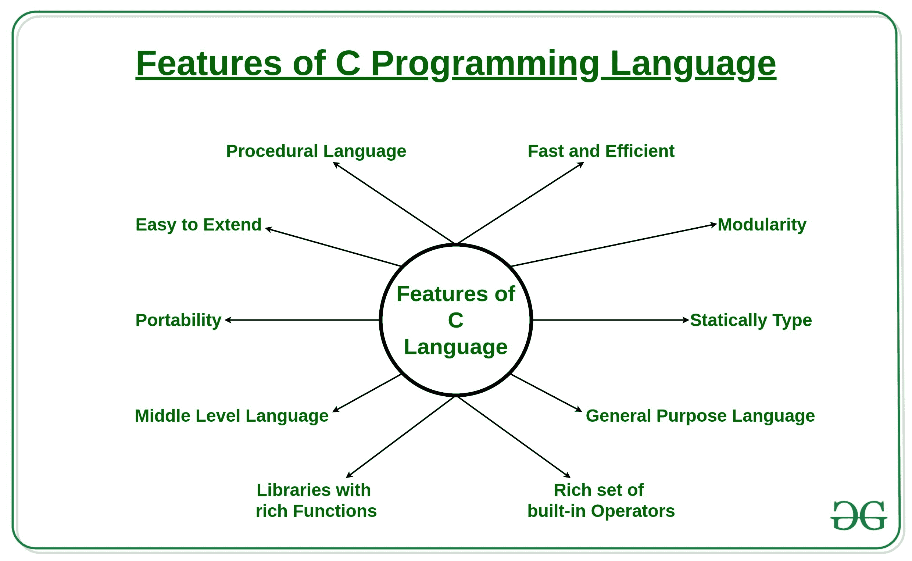

# C 编程语言的特点

> 原文:[https://www . geesforgeks . org/features-of-c-programming-language/](https://www.geeksforgeeks.org/features-of-c-programming-language/)

[C](https://www.geeksforgeeks.org/c-language-set-1-introduction/) 是一种过程编程语言。它最初是由丹尼斯·里奇在 1972 年开发的。它主要是作为编写操作系统的系统编程语言开发的。C 语言的主要特点包括对内存的低级访问、一组简单的关键字和简洁的风格，这些特点使 C 语言适合像操作系统或编译器开发这样的系统编程。

**C 编程语言特点:**

1.  过程语言
2.  快速高效
3.  模块性
4.  静态类型
5.  通用语言
6.  丰富的内置运算符集
7.  功能丰富的图书馆
8.  中级语言
9.  轻便
10.  易于扩展

让我们一个一个来看特点:

1.  **Procedural Language:** In a procedural language like C step by step predefined instructions are carried out. C program may contain more than one function to perform a particular task. New people to programming will think that this is the only way a particular programming language works. There are other programming paradigms as well in the programming world. Most of the commonly used paradigm is an object-oriented programming language. 
2.  **Fast and Efficient:** Newer languages like java, python offer more features than c programming language but due to additional processing in these languages, their performance rate gets down effectively. C programming language as the been middle-level language provides programmers access to direct manipulation with the computer hardware but higher-level languages do not allow this. That’s one of the reasons C language is considered the first choice to start learning programming languages. It’s fast because statically typed languages are faster than dynamically typed languages. 
3.  **Modularity:** The concept of storing C programming language code in the form of libraries for further future uses is known as modularity. This programming language van does very little on its own most of its power is held by its libraries. C language has its own library to solve common problems like in this we can use a particular function by using a header file stored in its library. 
4.  **Statically Type:** C programming language is a statically typed language. Meaning the type of variable is checked at the time of compilation but not at run time. This means each time a programmer type a program they have to mention the type of variables used. 
5.  **通用语言:**从系统编程到照片编辑软件，各种应用都使用 C 编程语言。使用它的一些常见应用如下:
    *   [操作系统](https://www.geeksforgeeks.org/operating-systems/) : Windows、 [Linux](https://www.geeksforgeeks.org/linux-vs-unix/) 、iOS、[安卓](https://www.geeksforgeeks.org/android-app-development-fundamentals-for-beginners/)、OXS
    *   [数据库](https://www.geeksforgeeks.org/dbms/) : PostgreSQL、Oracle、 [MySQL](https://www.geeksforgeeks.org/sql-tutorial/) 、MS SQL Server 等。
6.  **Rich set of built-in Operators:** It is a diversified language with a rich set of built-in [operators](https://www.geeksforgeeks.org/operators-c-c/) which are used in writing complex or simplified C programs. 
7.  **Libraries with rich Functions:** Robust libraries and [functions in C](https://www.geeksforgeeks.org/functions-in-c/) help even a beginner coder to code with ease. 
8.  **Middle-Level Language:** As it is a middle-level language so it has the combined form of both capabilities of assembly language and features of the [high-level language](https://www.geeksforgeeks.org/difference-between-high-level-and-low-level-languages/). 
9.  **Portability:** C language is lavishly portable as programs that are written in C language can run and compile on any system with either none or small changes. 
10.  **Easy to Extend:** Programs written in C language can be extended means when a program is already written in it then some more features and operations can be added to it.