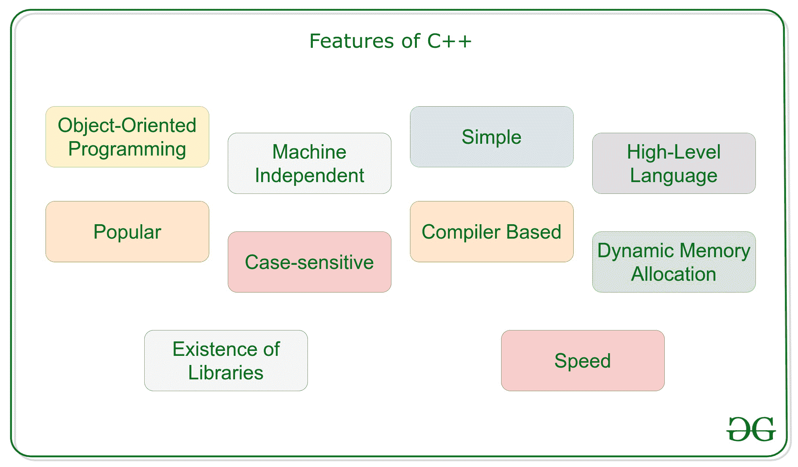
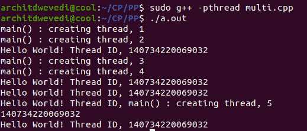

# c++的特性

> 原文:[https://www.geeksforgeeks.org/features-of-c/](https://www.geeksforgeeks.org/features-of-c/)

[**C++**](https://www.geeksforgeeks.org/c-plus-plus/) 是一种通用编程语言，它是作为 [C 语言](https://www.geeksforgeeks.org/c-language-set-1-introduction/)的增强而开发的，以包括[面向对象范例](https://www.geeksforgeeks.org/object-oriented-programming-in-cpp/)。是一个祈使句和一个**编译的**语言。



### <u>面向对象编程</u>

C++是一种面向对象的编程语言，不像 C 是一种[过程编程语言](https://www.geeksforgeeks.org/differences-between-procedural-and-object-oriented-programming/)。这是 **C++** 最重要的特点。它可以在编程时创建/销毁对象。此外，它还可以创建蓝图，通过蓝图可以创建对象。在这篇[文章](https://www.geeksforgeeks.org/object-oriented-programming-in-cpp/)中，我们已经讨论了 C++中的面向对象编程概念。

面向对象编程语言的概念:

*   [级](https://www.geeksforgeeks.org/c-classes-and-objects/)
*   目标
*   [封装](https://www.geeksforgeeks.org/encapsulation-in-c/)
*   [多态性](https://www.geeksforgeeks.org/polymorphism-in-c/)
*   [继承](https://www.geeksforgeeks.org/inheritance-in-c/)
*   [抽象](https://www.geeksforgeeks.org/abstraction-in-c/)

### <u>机器独立</u>

一个 C++可执行文件不是[平台独立的](https://www.geeksforgeeks.org/writing-os-independent-code-cc/)(在 Linux 上编译的程序不会在 Windows 上运行)，但是它们是机器独立的。

让我们借助一个例子来理解 C++的这个特性。假设你写了一段代码，可以在 Linux/Windows/Mac OSx 上运行，使得 C++机器独立，但是 C++的可执行文件不能在不同的操作系统上运行。

### <u>简单</u>

它是一种简单的语言，可以将程序分解成逻辑单元和部分，具有丰富的库支持和多种数据类型。此外，C++的自动关键字使生活变得更容易。

**[**汽车关键词**](https://www.geeksforgeeks.org/type-inference-in-c-auto-and-decltype/)**

**自动的想法是形成 C++编译器，在编译时推导数据类型，而不是每次都让你声明数据类型。请记住，没有初始值设定项就不能声明某些东西。编译器一定有办法推断出你的类型。**

## **C++**

```cpp
// C++ program for using auto keyword

#include <bits/stdc++.h>
using namespace std;

// Driver Code
int main()
{

    // Variables
    auto an_int = 26;
    auto a_bool = false;
    auto a_float = 26.24;
    auto ptr = &a_float;

    // Print typeid
    cout << typeid(a_bool).name() << "\n";
    cout << typeid(an_int).name() << "\n";
    return 0;
}
```

****Output:** 

```cpp
b
i
```** 

### **[<u>高级语言</u>](https://www.geeksforgeeks.org/difference-between-high-level-and-low-level-languages/)**

**C++是一种高级语言，不像 C 是一种中级编程语言。它使用 C++工作变得更容易，因为它是一种高级语言，因为它与人类可理解的英语密切相关。**

### **<u>热门</u>**

**C++可以是支持面向对象编程特性的许多其他编程语言的基础语言。**比雅尼·斯特劳斯特鲁普**发现有史以来第一个缺乏模拟的面向对象语言 Simulink 67，决定开发 C++。**

### **<u>区分大小写</u>**

**很明显，C++是一种区分大小写的编程语言。例如， **cin** 用于从[输入流](https://www.geeksforgeeks.org/basic-input-output-c/)中获取输入。但是如果**“CIN”**不行的话。像 HTML 和 MySQL 这样的其他语言不区分大小写。**

### **<u>基于编译器的</u>**

**C++是一种基于编译器的语言，不像 Python。也就是说，C++程序用来编译，它们的可执行文件用来运行它。因此 [C++是一种比 Java 和 Python](https://www.geeksforgeeks.org/c-vs-java-vs-python/) 相对更快的语言。**

### **[<u>动态内存分配</u>](https://www.geeksforgeeks.org/what-is-dynamic-memory-allocation/)**

**当程序在 C++中执行时，变量被分配到[动态堆空间](https://www.geeksforgeeks.org/memory-layout-of-c-program/)。在函数内部，变量在堆栈空间中分配。很多时候，我们事先并不知道在一个定义的变量中需要多少内存来存储特定的信息，并且所需内存的大小可以在运行时确定。**

### **<u>内存管理</u>**

*   **C++允许我们在运行时分配变量或数组的内存。这就是所谓的[动态内存分配](https://www.geeksforgeeks.org/c-language-2-gq/dynamic-memory-allocation-gq/)。**
*   **在其他编程语言中，如 [Java](https://www.geeksforgeeks.org/java/) 和 [Python](https://www.geeksforgeeks.org/python-programming-language/) ，编译器会自动管理分配给变量的内存。但是在 C++中却不是这样。**
*   **在 C++中，当内存无用时，必须手动取消分配动态分配的内存。**
*   **内存的分配和解除分配可以分别使用[新增和删除操作符](https://www.geeksforgeeks.org/new-and-delete-operators-in-cpp-for-dynamic-memory/)来完成。**

**下面是用 C++说明内存管理的程序:**

## **C++**

```cpp
// C++ implementation to illustrate
// the Memory Management

#include <cstring>
#include <iostream>
using namespace std;

// Driver Code
int main()
{
    int num = 5;
    float* ptr;

    // Memory allocation of
    // num number of floats
    ptr = new float[num];

    for (int i = 0; i < num; ++i) {
        *(ptr + i) = i;
    }

    cout << "Display the GPA of students:"
         << endl;
    for (int i = 0; i < num; ++i) {

        cout << "Student" << i + 1
             << ": " << *(ptr + i)
             << endl;
    }

    // Ptr memory is released
    delete[] ptr;

    return 0;
}
```

****Output:** 

```cpp
Display the GPA of students:
Student1: 0
Student2: 1
Student3: 2
Student4: 3
Student5: 4
```** 

### **[<u>多线程</u>](https://www.geeksforgeeks.org/multithreading-c-2/)**

*   **多线程是多任务处理的一种特殊形式，多任务处理是一种允许您的系统同时执行两个或多个程序的功能。一般来说，多任务处理有两种:[基于进程和基于线程的](https://www.geeksforgeeks.org/process-based-and-thread-based-multitasking/)。**
*   **基于进程的多任务处理程序的并发执行。基于线程的多任务处理处理等价程序的多道程序设计。**
*   **多线程程序包含两个或多个将同时运行的部分。这样一个程序的每一个部分都被称为一个[线程](https://www.geeksforgeeks.org/thread-in-operating-system/)，每个线程都定义了一个单独的执行路径。**
*   **C++不包含任何对多线程应用程序的内置支持。相反，它完全依赖操作系统来提供这一功能。**

**下面是用 C++ 说明[多线程的程序:](https://www.geeksforgeeks.org/multithreading-in-cpp/)**

## **C++**

```cpp
// C++ implementation to illustrate
// the working of Multi-threading

#include <cstdlib>
#include <iostream>
#include <pthread.h>

using namespace std;

#define NUM_THREADS 5

// Function to print Hello with
// the thread id
void* PrintHello(void* threadid)
{
    // Thread ID
    long tid;
    tid = (long)threadid;

    // Print the thread ID
    cout << "Hello World! Thread ID, "
         << tid << endl;

    pthread_exit(NULL);
}

// Driver Code
int main()
{

    // Create thread
    pthread_t threads[NUM_THREADS];
    int rc;
    int i;

    for (i = 0; i < NUM_THREADS; i++) {

        cout << "main() : creating thread, "
             << i << endl;

        rc = pthread_create(&threads[i],
                            NULL,
                            PrintHello,
                            (void*)&i);

        // If thread is not created
        if (rc) {
            cout << "Error:unable to"
                 << " create thread, "
                 << rc << endl;

            exit(-1);
        }
    }

    pthread_exit(NULL);
}
```

****输出:****

**[](https://media.geeksforgeeks.org/wp-content/cdn-uploads/20200910111517/Screenshot-from-2020-09-10-11-14-39.png)**

**本教程假设您在 Linux 操作系统上工作，我们将使用 POSIX 编写一个多线程 C++程序。POSIX Threads 或 Pthreads 提供的 API 可在许多类似 Unix 的 POSIX 系统上使用，如 FreeBSD、NetBSD、GNU/Linux、Mac OS X 和 Solaris。**