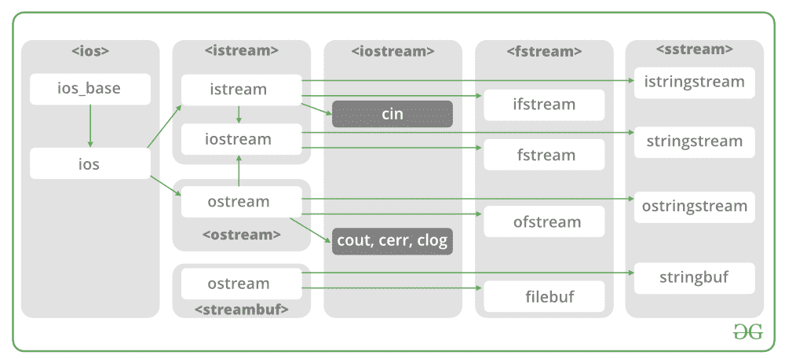

# 通过 C++类进行文件处理

> 原文:[https://www.geeksforgeeks.org/file-handling-c-classes/](https://www.geeksforgeeks.org/file-handling-c-classes/)

在 C++中，文件主要通过使用 fstream headerfile 中可用的三个类 fsstream、ifstream、ofstream 来处理。
**ofstream:** Stream 类写入文件
**ifstream:** Stream 类读取文件
**fsstream:**Stream 类读取/写入文件。



现在第一步是打开特定文件进行读或写操作。我们可以通过
1 打开文件。对象创建时在构造函数中传递文件名
2。使用开放方法

**例如**

> **使用构造函数**
> ifstream 打开文件(const char* filename，IOs _ base::Open mode mode = IOs _ base::in)；
> ifstream fin(文件名，openmode)默认为 open mode = IOs::in
> if stream fin(“文件名”)；
> 
> **使用打开方法**
> 打开文件，调用默认构造函数
> if stream fin；
> fin.open(文件名，openmode)
> fin.open(“文件名”)；

**模式:**

<figure class="table">

| Member constant | represent | visit |
| --- | --- | --- |
| In * | input | File open reading: the internal stream buffer supports input operation. |
| come out | output | File open for writing: the internal stream buffer supports output operation. |
| binary system | binary system | The operation is in binary mode instead of text mode. |
| Eat at the end. |  | The output position starts at the end of the file. |
| 应用 | add to | All output operations of occur at the end of the file and are appended to its existing contents. |
| trunc | cut off | Anything that existed before the file was opened will be discarded. |

</figure>

**默认打开模式:**

<figure class="table">T12】of stream

| 中频流 | IOs::in |
| IOs::out |
| fstream | IOs::in &#124; IOs::out |

</figure>

**问题陈述**:用 C++读写文件。
**例:**

```
Input : 
Welcome in GeeksforGeeks. Best way to learn things.
-1
Output : 
Welcome in GeeksforGeeks. Best way to learn things.
```

下面是使用流类的 **ifsream &实现。**

## C++

```
/* File Handling with C++ using ifstream & ofstream class object*/
/* To write the Content in File*/
/* Then to read the content of file*/
#include <iostream>

/* fstream header file for ifstream, ofstream,
  fstream classes */
#include <fstream>

using namespace std;

// Driver Code
int main()
{
    // Creation of ofstream class object
    ofstream fout;

    string line;

    // by default ios::out mode, automatically deletes
    // the content of file. To append the content, open in ios:app
    // fout.open("sample.txt", ios::app)
    fout.open("sample.txt");

    // Execute a loop If file successfully opened
    while (fout) {

        // Read a Line from standard input
        getline(cin, line);

        // Press -1 to exit
        if (line == "-1")
            break;

        // Write line in file
        fout << line << endl;
    }

    // Close the File
    fout.close();

    // Creation of ifstream class object to read the file
    ifstream fin;

    // by default open mode = ios::in mode
    fin.open("sample.txt");

    // Execute a loop until EOF (End of File)
    while (fin) {

        // Read a Line from File
        getline(fin, line);

        // Print line in Console
        cout << line << endl;
    }

    // Close the file
    fin.close();

    return 0;
}
```

下面是使用 **fstream 类**的实现。

## C++

```
/* File Handling with C++ using fstream class object */
/* To write the Content in File */
/* Then to read the content of file*/
#include <iostream>

/* fstream header file for ifstream, ofstream,
   fstream classes */
#include <fstream>

using namespace std;

// Driver Code
int main()
{
    // Creation of fstream class object
    fstream fio;

    string line;

    // by default openmode = ios::in|ios::out mode
    // Automatically overwrites the content of file, To append
    // the content, open in ios:app
    // fio.open("sample.txt", ios::in|ios::out|ios::app)
    // ios::trunc mode delete all content before open
    fio.open("sample.txt", ios::trunc | ios::out | ios::in);

    // Execute a loop If file successfully Opened
    while (fio) {

        // Read a Line from standard input
        getline(cin, line);

        // Press -1 to exit
        if (line == "-1")
            break;

        // Write line in file
        fio << line << endl;
    }

    // Execute a loop until EOF (End of File)
    // point read pointer at beginning of file
    fio.seekg(0, ios::beg);

    while (fio) {

        // Read a Line from File
        getline(fio, line);

        // Print line in Console
        cout << line << endl;
    }

    // Close the file
    fio.close();

    return 0;
}
```