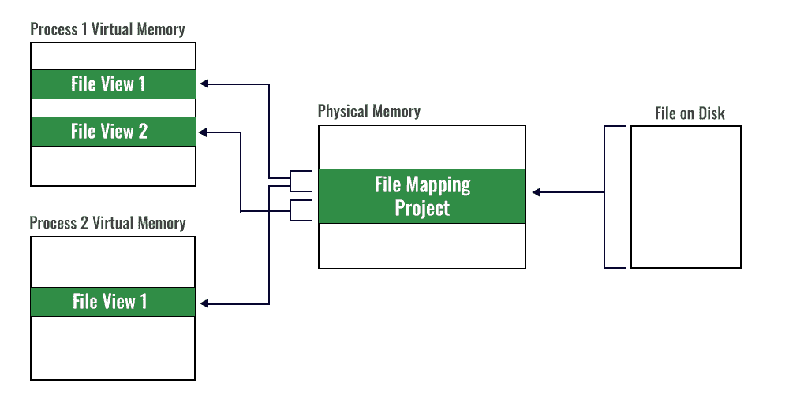

# c++应用程序中的文件映射

> 原文:[https://www . geesforgeks . org/file-mapping-in-CPP-applications/](https://www.geeksforgeeks.org/file-mapping-in-cpp-applications/)

文件映射是一个概念，其中可以为磁盘上的文件创建文件映射对象。此后，不同的进程可以在其虚拟地址空间中创建该文件映射对象的视图。进程可以在其虚拟地址空间中创建文件映射对象的一个或多个视图，并对其进行操作。下面是文件映射对象的工作图:



请记住以下要点

1.  该文件存在于运行进程的机器的磁盘上。
2.  文件映射对象存在于物理内存中。
3.  多个进程可以为同一个文件映射对象创建视图。
4.  文件映射对象可以包含整个文件或文件的一部分。同样，进程的文件视图可以包含整个文件映射对象或其一部分。
5.  所有副本都是一致的，并且**和**与磁盘上的相同。

**优势**

1.  当处理像数据库文件这样的大文件时，这是一个很大的帮助，因为不是整个文件都需要存在于物理内存中。
2.  多个进程可以使用磁盘上的文件进行读写操作。每个进程都可以创建一个新视图，取消当前文件视图的映射。

创建文件映射对象和文件视图的步骤

**步骤 1:** 创建或打开一个代表磁盘上文件的文件对象。这里，我们创建了一个新的文件对象，句柄为 **hFile** ，名称为**“数据文件. txt”**。

```
HANDLE CreateFileA(
  LPCSTR                lpFileName,
  DWORD                 dwDesiredAccess,
  DWORD                 dwShareMode,
  LPSECURITY_ATTRIBUTES lpSecurityAttributes,
  DWORD                 dwCreationDisposition,
  DWORD                 dwFlagsAndAttributes,
  HANDLE                hTemplateFile
);

// Can be used as 

HANDLE hFile = CreateFile(TEXT("datafile.txt"),
GENERIC_READ | GENERIC_WRITE,
0,          
// Open with exclusive access
NULL,
// No security attributes

// Creating a new temp file
CREATE_NEW,

// Delete the file after unmapping the view 
FILE_FLAG_DELETE_ON_CLOSE,   

NULL);
```

```
HANDLE CreateFileA(
  LPCSTR                lpFileName,
  DWORD                 dwDesiredAccess,
  DWORD                 dwShareMode,
  LPSECURITY_ATTRIBUTES lpSecurityAttributes,
  DWORD                 dwCreationDisposition,
  DWORD                 dwFlagsAndAttributes,
  HANDLE                hTemplateFile
);

// Can be used as 

HANDLE hFile = CreateFile(TEXT("datafile.txt"),
        GENERIC_READ | GENERIC_WRITE,
        0,          // open with exclusive access
        NULL,       // no security attributes
        CREATE_NEW, // creating a new temp file
        FILE_FLAG_DELETE_ON_CLOSE,         //delete the file after unmapping the view
        NULL);
```

**步骤 2:** 为文件创建一个映射对象，该对象包含如何访问文件及其大小的信息。因此，在创建上述文件后，我们使用它的句柄并在物理内存中创建它的映射。

```
HANDLE CreateFileMappingA(
  HANDLE                hFile,
  LPSECURITY_ATTRIBUTES lpFileMappingAttributes,
  DWORD                 flProtect,
  DWORD                 dwMaximumSizeHigh,
  DWORD                 dwMaximumSizeLow,
  LPCSTR                lpName
);

// Can be used as 

HANDLE hFileMapping = ::CreateFileMappingA(INVALID_HANDLE_VALUE, NULL, PAGE_READWRITE, 0, bufferSize, filename);
```

**步骤 3:** 将文件映射对象的全部或部分从物理内存映射到进程的虚拟地址空间。因此，在这里，我们创建了将由进程使用的映射文件的视图。

```
LPVOID MapViewOfFile(
  HANDLE hFileMappingObject,
  DWORD  dwDesiredAccess,
  DWORD  dwFileOffsetHigh,
  DWORD  dwFileOffsetLow,
  SIZE_T dwNumberOfBytesToMap
);

// Can be used as
void* p = ::MapViewOfFile(hFileMapping, FILE_MAP_ALL_ACCESS, 0, param1, param2);
```

**第四步:**清理

**4(A)** 从进程地址空间中取消映射文件映射对象。回溯以上步骤，首先，从进程的地址空间中移除文件视图。

```
BOOL UnmapViewOfFile(LPCVOID lpBaseAddress
);
// Can be used as
UnmapViewOfFile(p);
```

**4(B)** 关闭文件映射对象。此步骤从物理内存中删除文件映射。

```
CloseHandle(hFileMapping);
```

**4(C)** 关闭文件对象。在这里，关闭磁盘上打开的文件并释放句柄。由于在第一步中我们设置了标志**文件 _ 标志 _ 删除 _ 开启 _ 关闭**，该文件将在这一步后被删除。

```
CloseHandle(hFile);
```

> **注:**
> 
> 1.  按同样的顺序合上把手，否则会产生差异。
> 2.  尝试删除文件之前，请关闭所有打开的文件句柄。