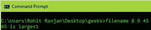
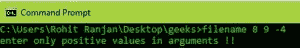
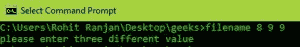

# C

中的命令行参数示例

> 原文:[https://www . geesforgeks . org/find-三个不同正数中最大的-使用命令行参数/](https://www.geeksforgeeks.org/find-largest-among-three-different-positive-numbers-using-command-line-argument/)

先决条件:[命令行参数](https://www.geeksforgeeks.org/command-line-arguments-in-c-cpp/)。

问题是使用命令行参数找到三个整数中最大的一个。

**备注:**

*   **命令行参数**在操作系统命令行外壳中的程序名称后面给出。为了传递命令行参数，我们通常使用两个参数来定义 main():第一个参数是命令行参数的数量，第二个参数是命令行参数的列表。

    ```
    int main(int argc, char *argv[]) { /* ... */ }
    ```

    *   **atoi** – Used to convert string number to integers

    例:

    ```
    Input  : filename 8 9 45
    Output : 45 is largest

    Input  : filename 8 9 9
    Output : Two equal number entered

    Input  : filename 8 -9 9
    Output : negative number entered

    ```

    在程序执行过程中，我们传递三个整数以及程序的文件名，然后我们会找到三个整数中最大的一个。
    **进场:**

    1.  如果两个条件中的任何一个满足，程序将“返回 1”:
        *   如果任意两个数字相同，打印语句“输入两个相等的数字”。
        *   如果任何数字为负数，打印“输入的负数”。
    2.  否则，如果输入三个不同的整数，则“返回 0”。

    为了更好的理解，在你的 linux 机器上运行这段代码。

    ```
    // C program for finding the largest integer
    // among three numbers using command line arguments
    #include<stdio.h>

    // Taking argument as command line
    int main(int argc, char *argv[]) 
    {
        int a, b, c;

        // Checking if number of argument is
        // equal to 4 or not.
        if (argc < 4 || argc > 5) 
        {
            printf("enter 4 arguments only eg.\"filename arg1 arg2 arg3!!\"");
            return 0;
        }

        // Converting string type to integer type
        // using function "atoi( argument)" 
        a = atoi(argv[1]); 
        b = atoi(argv[2]);
        c = atoi(argv[3]);

        // Checking if all the numbers are positive of not
        if (a < 0 || b < 0 || c < 0) 
        {
            printf("enter only positive values in arguments !!");
            return 1;
        }

        // Checking if all the numbers are different or not
        if (!(a != b && b != c && a != c)) 
        {
            printf("please enter three different value ");
            return 1;
        }
        else
        {
            // Checking condition for "a" to be largest
            if (a > b && a > c)             
                printf("%d is largest", a);

            // Checking condition for "b" to be largest    
            else if (b > c && b > a) 
                printf ("%d is largest", b);

            // Checking condition for "c" to be largest..
            else if (c > a && c > b) 
                printf("%d is largest ",c);
        }
        return 0;
    }
    ```

    **输出:**
    
    
    