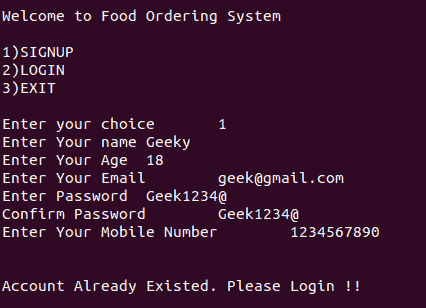

# C

中的订餐系统

> 原文:[https://www.geeksforgeeks.org/food-ordering-system-in-c/](https://www.geeksforgeeks.org/food-ordering-system-in-c/)

**先决条件:** [编程中的模块化方法](https://www.geeksforgeeks.org/modular-approach-in-programming/)

**<u>问题陈述</u> :** 编写 [C 程序](https://www.geeksforgeeks.org/c-programming-language/)实现订餐，功能如下:

*   登录和注册
*   按食物搜索
*   按酒店搜索
*   购物车和订单确认

**<u>方法和功能</u> :**

### **<u>注册功能</u>**

这是注册的主要功能，从这里我们调用 **account_check()** 函数来验证输入。以下是一些功能:

*   输入用户名、年龄、电子邮件、密码、确认密码和手机号码。
*   验证输入
    *   用户名必须包含字母。
    *   年龄必须大于且不等于 0。
    *   电子邮件必须包含@，逗号，长度应大于 5。
    *   密码长度必须在 8 到 12 之间，至少包含一个大写字母、小写字母、数字和特殊字符。密码和确认密码应该相同。
    *   手机号码应该包含数字和正好 10 位数字。

所有输入字段验证成功后，通过 **account_check()** 功能检查同一账户是否已经存在。

### **<u>登录功能</u>**

这个函数实现了我们项目的登录功能。登录时，会验证电子邮件和密码，并检查其是否已经注册。成功登录后，可以选择**搜索食物()**或**搜索酒店()**功能。

### **<u>酒店订单</u>**

在此功能中，食物订单是在选择任何酒店后下的。一旦选择了酒店，食物列表就会显示出它们各自的价格。一旦选择了食物，您需要进入选项**选择购物车**以成功订购食物。

在酒店订购之前，初始化一些默认酒店，我们通过 C 中的[结构在本地给出这些酒店，以供我们演示。一旦酒店及其各自的食物被动态初始化，它将显示酒店列表。](https://www.geeksforgeeks.org/structures-c/)

### **<u>按食物排序</u>**

一旦在上面的步骤中选择了酒店，选择食物并输入要订购的项目数量。一旦完成所有食物的选择，它将显示所选食物的总量。移至**选择购物车**成功订购食物。

### **T1】大车 T3】**

此功能执行以下操作:

*   显示订单的总成本。
*   确认您的订单，享受您的食物。

## 初始化

```cpp
// C program to initialize the Food
// Ordering System
// Initialization
#include <stdio.h>

// Structure to store the user details
// i.e., Signup details
struct details {
    char uname[100];
    int age;
    char password[100];
    char email[100];
    char mobile[10];
};

// Structure to store the hotels
// and their food details
struct hotels {
    char hotel[100];
    char first_food[20];
    char second_food[20];
    char third_food[20];
    char fourth_food[25];
    int first, second, third, fourth;
};

// Initialize the hotels and details
struct hotels m[5];
struct details s[100];

// Function to get the input for
// a new account
void signup();

// Function to check whether account
// is already existed or not
void account_check();

// Function to validate all input fields
int validate();
void login();
void cart();
void search_by_hotels();
void search_by_food();
void food_order(int food);

// Function to initialize the hotels and
// food structure dynamically
void hotel_initialize();
void hotels(int hotel_choice);

int flag = 1, i, j = 0, count = 0, caps = 0;
int small = 0, special = 0, numbers = 0;
int success = 0, x, choice;
char temp_name[100], temp_password1[100];
char temp_password2[100], temp_email[100];
char temp_mobile[100];

int temp_age, total = 0, food_choice, n;
int hotel_choice, search_choice, confirm;
int ch, food, hotel_id;
```

## 样板文件

```cpp
// C program to implement Boilerplate
// Code for the Food Ordering System
int main()
{
    while (1) {
        printf("\n\nWelcome to Food ");

        printf("Ordering System"
               "\n\n1)SIGNUP\n");
        printf("2)LOGIN\n3)EXIT\n\n");
        printf("Enter your choice\t");
        scanf("%d", &choice);

        // Switch Cases
        switch (choice) {

        // For Signup Function
        case 1: {
            signup();
            break;
        }

        // For Login Function
        case 2: {
            login();
            break;
        }
        case 3: {
            exit(1);
        }
        default: {
                printf("\nPlease Enter the "
                printf("valid choice\n");
                break;
        }
        }
    }
}
```

## 签约雇用

```cpp
// Function to create a new user for
// the Food ordering system
void signup()
{
    printf("Enter Your name\t");
    scanf("%s", temp_name);

    printf("Enter Your Age\t");
    scanf("%d", &temp_age);

    printf("Enter Your Email\t");
    scanf("%s", temp_email);

    printf("Enter Password\t");
    scanf("%s", temp_password1);

    printf("Confirm Password\t");
    scanf("%s", temp_password2);

    printf("Enter Your Mobile Number\t");
    scanf("%s", temp_mobile);

    // Function Call to validate
    // the user creation
    x = validate();
    if (x == 1)
        account_check();
}
```

## 使生效

```cpp
// Function to validate the user for
// the signup process
int validate()
{
    // Validate the name
    for (i = 0; temp_name[i] != '\0'; i++) {
        if (!((temp_name[i] >= 'a' && temp_name[i] <= 'z')
              || (temp_name[i] >= 'A'
                  && temp_name[i] <= 'Z'))) {
            printf("\nPlease Enter the"
            printf("valid Name\n");
            flag = 0;
            break;
        }
    }
    if (flag == 1) {
        count = 0;

        // Validate the Email ID
        for (i = 0;
             temp_email[i] != '\0'; i++) {
            if (temp_email[i] == '@'
                || temp_email[i] == '.')
                count++;
        }
        if (count >= 2
            && strlen(temp_email) >= 5) {
            // Validating the password
            // check if it matches with
            // correct password or not
            if (!strcmp(temp_password1,
                        temp_password2)) {
                if (strlen(temp_password1) >= 8
                    && strlen(temp_password1) <= 12) {
                    caps = 0;
                    small = 0;
                    numbers = 0;
                    special = 0;
                    for (i = 0;
                         temp_password1[i]
                         != '\0';
                         i++) {
                        if (temp_password1[i] >= 'A'
                            && temp_password1[i] <= 'Z')
                            caps++;
                        else if (temp_password1[i] >= 'a'
                                 && temp_password1[i]
                                        <= 'z')
                            small++;
                        else if (temp_password1[i] >= '0'
                                 && temp_password1[i]
                                        <= '9')
                            numbers++;
                        else if (temp_password1[i] == '@'
                                 || temp_password1[i] == '&'
                                 || temp_password1[i] == '#'
                                 || temp_password1[i]
                                        == '*')
                            special++;
                    }
                    if (caps >= 1 && small >= 1
                        && numbers >= 1 && special >= 1) {
                        // Validating the Input age
                        if (temp_age != 0 && temp_age > 0) {
                            // Validating the Input mobile
                            // number
                            if (strlen(temp_mobile) == 10) {
                                for (i = 0; i < 10; i++) {
                                    if (temp_mobile[i]
                                            >= '0'
                                        && temp_mobile[i]
                                               <= '9') {
                                        success = 1;
                                    }
                                    else {
                                        printf("\n\nPlease");
                                        printf("Enter Valid ");
                                        printf("Mobile "
                                               "Number\n\n");
                                        return 0;
                                        break;
                                    }
                                }

                                // Success is assigned with
                                // value 1, Once every
                                // inputs are correct.
                                if (success == 1)
                                    return 1;
                            }
                            else {
                                printf("\n\nPlease Enter the");
                                printf("10 digit mobile");
                                printf("number\n\n");
                                return 0;
                            }
                        }
                        else {
                            printf("\n\nPlease Enter ");
                            printf("the valid age\n\n");
                            return 0;
                        }
                    }
                    else {
                        printf("\n\nPlease Enter the");
                        printf("strong password, Your ");
                        printf("password must contain ");
                        printf("atleast one uppercase, ");
                        printf("Lowercase, Number and ");
                        printf("special character\n\n");
                        return 0;
                    }
                }
                else {
                    printf("\nYour Password is very");
                    printf("short\nLength must ");
                    printf("between 8 to 12\n\n");
                    return 0;
                }
            }
            else {
                printf("\nPassword "
                       "Mismatch\n\n");
                return 0;
            }
        }
        else {
            printf("\nPlease Enter Valid E-Mail\n\n");
            return 0;
        }
    }
}
```

## 应收帐款检查

```cpp
// Function to check if the account
// already exists or not
void account_check()
{
    for (i = 0; i < 100; i++) {
        // Check whether the email and
        // password are already matched
        // with existed account
        if (!(strcmp(temp_email,
                     s[i].email)
              && strcmp(temp_password1,
                        s[i].password))) {
            printf("\n\nAccount Already");
            printf("Existed. Please"
                   " Login !!\n\n");
            main();
            break;
        }
    }

    // If account does not already
    // existed, it creates a new
    // one with new inputs
    if (i == 100) {
        strcpy(s[j].uname, temp_name);
        s[j].age = temp_age;
        strcpy(s[j].password,
               temp_password1);
        strcpy(s[j].email, temp_email);
        strcpy(s[j].mobile, temp_mobile);
        j++;
        printf("\n\n\nAccount"
               " Successfully");
        printf("Created!!\n\n");
    }
}
```

## 注册

```cpp
// Function to Login the users
void login()
{
    printf("\n\nLOGIN\n\n");
    printf("\nEnter Your Email\t");
    scanf("%s", temp_email);

    printf("Enter Your Password\t");
    scanf("%s", temp_password1);

    for (i = 0; i < 100; i++) {
        // Check whether the input email
        // is already existed or not
        if (!strcmp(s[i].email, temp_email)) {
            // Check whether the password
            // is matched with email or not
            if (!strcmp(s[i].password, temp_password1)) {
                printf("\n\nWelcome %s, ");
                printf("Your are successfully ");
                printf("logged in\n\nWe Provide ");
                printf("two ways of search\n1) ");
                printf("Search By Hotels\n2) ");
                printf("Search by Food\n3) ");
                printf("Exit\n\nPlease Enter");
                printf("your choice\t", s[i].uname);
                scanf("%d", &search_choice);

                // Get the input whether
                // the user are going to search
                // /Order by hotels or search/
                // order by food
                switch (search_choice) {
                case 1: {
                    search_by_hotels();
                    break;
                }
                case 2: {
                    search_by_food();
                    break;
                }
                case 3: {
                    exit(1);
                }
                default: {
                    printf("Please Enter ");
                    printf("the valid choice\n\n");
                    break;
                }
                }
                break;
            }
            else {
                printf("\n\nInvalid Password! ");
                printf("Please Enter the ");
                printf("correct password\n\n");
                main();
                break;
            }
        }
        else {
            printf("\n\nAccount doesn't ");
            printf("exist, Please signup!!\n\n");
            main();
            break;
        }
    }
}
```

## 酒店初始化

```cpp
// Function that initializes the
// Hotels
void hotel_initialize()
{
    // Initialize the structure with
    // Aarya_bhavan hotel and some
    // foods name with their cost
    strcpy(m[1].hotel, "Aarya_Bhavan");
    strcpy(m[1].first_food, "Sandwich");
    strcpy(m[1].second_food, "Pizza");
    strcpy(m[1].third_food, "Fried_Rice");
    m[1].first = 70;
    m[1].second = 100;
    m[1].third = 95;

    // Initialize the structure with
    // Banu_Hotel and some foods name
    // and their respective costs
    strcpy(m[2].hotel, "Banu_Hotel");
    strcpy(m[2].first_food, "Parotta");
    strcpy(m[2].second_food, "Noodles");
    strcpy(m[2].third_food, "Chicken_Rice");
    m[2].first = 15;
    m[2].second = 75;
    m[2].third = 80;

    // Initialize the structure with
    // SR_Bhavan hotel and some foods
    // name and their respective costs
    strcpy(m[3].hotel, "SR_Bhavan");
    strcpy(m[3].first_food, "Chicken_Biriyani");
    strcpy(m[3].second_food, "Prawn");
    strcpy(m[3].third_food, "Faloda");
    m[3].first = 90;
    m[3].second = 120;
    m[3].third = 35;
}
```

## 按酒店搜索

```cpp
// Function that implements the
// functionality search by hotels
void search_by_hotels()
{
    hotel_initialize();
    printf("\n\nPlease Choose the");
    printf("hotels\n\n1) %s\n2) %s\n3) %s",
           m[1].hotel,
           m[2].hotel, m[3].hotel);
    printf("\n4) Exit\n\nPlease ");
    printf("select the hotel\t");

    scanf("%d", &hotel_choice);

    if (hotel_choice > 4) {
        printf("Please Enter the");
        printf("valid choice\n\n");
        search_by_hotels();
    }
    else if (hotel_choice == 4)
        exit(1);
    else
        hotels(hotel_choice);
}

void hotels(int hotel_choice)
{
    total = 0;
    while (1) {
        // Displays the list of foods
        // available in selected hotel
        printf("\n\nList of foods available");
        printf("in %s\n\n1) %s\tRs: %d\n2)",
               m[hotel_choice].hotel,
               m[hotel_choice].first_food,
               m[hotel_choice].first);

        printf("%s\tRs: %d\n3) %s\tRs: %d\n4)",
               m[hotel_choice].second_food,
               m[hotel_choice].second,
               m[hotel_choice].third_food,
               m[hotel_choice].third);

        printf("Cart\n5) Exit\n\nPlease Enter");
        printf("Your Choice\t");
        scanf("%d", &food_choice);

        // Get the input for no. of foods
        // to calculate the total amount
        if (food_choice == 1) {
            printf("Please Enter the ");
            printf("Count of %s\t",
                   m[hotel_choice].first_food);
            scanf("%d", &n);

            total = total
                    + (n * m[hotel_choice].first);
        }
        else if (food_choice == 2) {
            printf("Please Enter Count");
            printf("of %s\t",
                   m[hotel_choice].second_food);
            scanf("%d", &n);
            total = total
                    + (n * m[hotel_choice].second);
        }
        else if (food_choice == 3) {
            printf("Please Enter the Count");
            printf("of %s\t",
                   m[hotel_choice].third_food);
            scanf("%d", &n);
            total = total
                    + (n * m[hotel_choice].third);
        }

        // Once the user, completed their
        // order, they can go to cart
        // by giving choice as 4.
        else if (food_choice == 4) {
            cart();
        }
        else if (food_choice == 5) {
            search_by_hotels();
        }
        else {
            printf("Please Enter the");
            printf("valid Choice\n\n");
        }
    }
}
```

## 按食物搜索

```cpp
// Function to implement the
// search by food
void search_by_food()
{
    total = 0;

    // Initialize all the hotels
    // and their foods
    hotel_initialize();
    while (1) {
        printf("\n\nPlease choose the ");
        printf("food\n\n1) %s\t%d\n2) %s\t%d",
               m[1].first_food, m[1].first,
               m[1].second_food, m[1].second);

        printf("\n3) %s\t%d\n4) %s\t%d\n",
               m[1].third_food, m[1].third,
               m[2].first_food, m[2].first);

        printf("5) %s\t%d\n6) %s\t%d\n",
               m[2].second_food, m[2].second,
               m[2].third_food, m[2].third);
        printf("7) %s\t%d\n8) %s\t%d\n",
               m[3].first_food, m[3].first,
               m[3].second_food, m[3].second);
        printf("9) %s\t%d\n10) Cart\n",
               m[3].third_food,
               m[3].third);
        printf("11) Exit");

        printf("\nPlease Enter Your Choice\t");
        scanf("%d", &food);
        if (food > 10) {
            printf("Please Enter the ");
            printf("valid choice\n\n");
            search_by_food();
        }
        // Moves to the cart
        // functionality
        else if (food == 10)
            cart();
        else if (food == 11)
            exit(1);
        // Call food_order functionality
        // to get the no of foods and
        // to calculat the total
        // amount of the order.
        else
            food_order(food);
    }
}
```

## 手推车

```cpp
// Function to implement the cart
void cart()
{
    printf("\n\n\n\n--------------Cart");
    printf("----------------");
    printf("\nYour Total Order");
    printf("Amount is %d\n", total);
    printf("\n\nDo You wish to");
    printf("order (y=1/n=0):");
    scanf("%d", &ch);
    if (ch == 1) {
        printf("\n\nThank You for your");
        printf("order!! Your Food is on ");
        printf("the way. Welcome again!!\n\n");
        exit(1);
    }
    else if (ch == 0) {
        printf("Do You want to exit -1");
        printf("or Go back -0");
        scanf("%d", &confirm);
        if (confirm == 1) {
            printf("\n\nOops! Your order is");
            printf("cancelled!! Exiting..");
            printf("Thank You visit again!\n");
            exit(1);
        }
        else {
            printf("\n\nThank You\n\n");
            login();
        }
    }
    else {
        printf("\n\nPlease Enter the ");
        printf("correct choice\n\n");
        cart();
    }
}
```

## 完全码

```cpp
// C program to implement the Food
// Ordering System
#include <stdio.h>
#include <string.h>

// Structure to store the
// user details (Signup details)
struct details {
    char uname[100];
    int age;
    char password[100];
    char email[100];
    char mobile[10];
};

// Structure to store the
// hotels and their food details
struct hotels {
    char hotel[100];
    char first_food[20];
    char second_food[20];
    char third_food[20];
    char fourth_food[25];
    int first, second, third, fourth;
};

struct hotels m[5];
struct details s[100];

// Function to get the
// input for new account.
void signup();

// Function to check whether
// the account is already
// existed or not
void account_check();

// Function to validate
// all the input fields.
int validate();
void login();
void cart();
void search_by_hotels();
void search_by_food();
void food_order(int food);

// Function to initialize the
// hotels and food
// structure dynamically
void hotel_initialize();
void hotels(int hotel_choice);
int flag = 1, i, j = 0, count = 0, caps = 0;
int small = 0, special = 0, numbers = 0;
int success = 0, x, choice;
char temp_name[100], temp_password1[100];
char temp_password2[100], temp_email[100];
char temp_mobile[100];
int temp_age, total = 0, food_choice, n;
int hotel_choice, search_choice, confirm;
int ch, food, hotel_id;

// Boilerplate Code for the
// Food Ordering System
int main()
{
    while (1) {
        printf(""
               "\n\nWelcome to Food ");
        printf("Ordering System\n\n1)SIGNUP\n");
        printf("2)LOGIN\n3)EXIT\n\n");
        printf("Enter your choice\t");
        scanf("%d", &choice);
        switch (choice) {
        case 1: {
            signup();
            break;
        }
        case 2: {
            login();
            break;
        }
        case 3: {
            // exit(1);
            return 0;
        }
        default: {
            printf("\nPlease Enter the ");
            printf("valid choice\n");
            break;
        }
        }
    }
}

// Function to create a new
// user for the Food ordering
// system
void signup()
{
    printf("Enter Your name\t");
    scanf("%s", temp_name);

    printf("Enter Your Age\t");
    scanf("%d", &temp_age);

    printf("Enter Your Email\t");
    scanf("%s", temp_email);

    printf("Enter Password\t");
    scanf("%s", temp_password1);

    printf("Confirm Password\t");
    scanf("%s", temp_password2);

    printf("Enter Your Mobile Number\t");
    scanf("%s", temp_mobile);

    // Function Call to validate
    // the user creation
    x = validate();
    if (x == 1)
        account_check();
}

// Function to validate the user
// for signup process
int validate()
{
    // Validate the name
    for (i = 0; temp_name[i] != '\0'; i++) {
        if (!((temp_name[i] >= 'a' && temp_name[i] <= 'z')
              || (temp_name[i] >= 'A'
                  && temp_name[i] <= 'Z'))) {
            printf("\nPlease Enter the");
            printf("valid Name\n");
            flag = 0;
            break;
        }
    }
    if (flag == 1) {
        count = 0;

        // Validate the Email ID
        for (i = 0;
             temp_email[i] != '\0'; i++) {
            if (temp_email[i] == '@'
                || temp_email[i] == '.')
                count++;
        }
        if (count >= 2
            && strlen(temp_email) >= 5) {
            // Validating the Password and
            // Check whether it matches
            // with Conform Password
            if (!strcmp(temp_password1,
                        temp_password2)) {
                if (strlen(temp_password1) >= 8
                    && strlen(temp_password1) <= 12) {
                    caps = 0;
                    small = 0;
                    numbers = 0;
                    special = 0;
                    for (i = 0; temp_password1[i] != '\0';
                         i++) {
                        if (temp_password1[i] >= 'A'
                            && temp_password1[i] <= 'Z')
                            caps++;
                        else if (temp_password1[i] >= 'a'
                                 && temp_password1[i]
                                        <= 'z')
                            small++;
                        else if (temp_password1[i] >= '0'
                                 && temp_password1[i]
                                        <= '9')
                            numbers++;
                        else if (temp_password1[i] == '@'
                                 || temp_password1[i] == '&'
                                 || temp_password1[i] == '#'
                                 || temp_password1[i]
                                        == '*')
                            special++;
                    }
                    if (caps >= 1 && small >= 1
                        && numbers >= 1 && special >= 1) {
                        // Validating the Input age
                        if (temp_age != 0 && temp_age > 0) {
                            // Validating the Input mobile
                            // number
                            if (strlen(temp_mobile) == 10) {
                                for (i = 0; i < 10; i++) {
                                    if (temp_mobile[i]
                                            >= '0'
                                        && temp_mobile[i]
                                               <= '9') {
                                        success = 1;
                                    }
                                    else {
                                        printf("\n\nPlease");
                                        printf("Enter Valid ");
                                        printf("Mobile "
                                               "Number\n\n");
                                        return 0;
                                        break;
                                    }
                                }

                                // Success is assigned with
                                // value 1, Once every
                                // inputs are correct.
                                if (success == 1)
                                    return 1;
                            }
                            else {
                                printf("\n\nPlease Enter the");
                                printf("10 digit mobile");
                                printf("number\n\n");
                                return 0;
                            }
                        }
                        else {
                            printf("\n\nPlease Enter ");
                            printf("the valid age\n\n");
                            return 0;
                        }
                    }
                    else {
                        printf("\n\nPlease Enter the");
                        printf("strong password, Your ");
                        printf("password must contain ");
                        printf("atleast one uppercase, ");
                        printf("Lowercase, Number and ");
                        printf("special character\n\n");
                        return 0;
                    }
                }
                else {
                    printf("\nYour Password is very");
                    printf("short\nLength must ");
                    printf("between 8 to 12\n\n");
                    return 0;
                }
            }
            else {
                printf("\nPassword Mismatch\n\n");
                return 0;
            }
        }
        else {
            printf("\nPlease Enter"
                   " Valid E-Mail\n\n");
            return 0;
        }
    }
}

// Function to check if the account
// already exists or not
void account_check()
{
    for (i = 0; i < 100; i++) {
        // Check whether the email
        // and password are already
        // matched with existed account
        if (!(strcmp(temp_email, s[i].email)
              && strcmp(temp_password1,
                        s[i].password))) {
            printf("\n\nAccount Already");
            printf("Existed. Please Login !!\n\n");
            main();
            break;
        }
    }
    // if account does not already
    // existed, it creates a new
    // one with new inputs
    if (i == 100) {
        strcpy(s[j].uname, temp_name);
        s[j].age = temp_age;
        strcpy(s[j].password, temp_password1);
        strcpy(s[j].email, temp_email);
        strcpy(s[j].mobile, temp_mobile);
        j++;
        printf("\n\n\nAccount Successfully");
        printf("Created!!\n\n");
    }
}

// Function to Login the users
void login()
{
    printf("\n\nLOGIN\n\n");
    printf("\nEnter Your Email\t");
    scanf("%s", temp_email);
    printf("Enter Your Password\t");
    scanf("%s", temp_password1);
    for (i = 0; i < 100; i++) {
        // Check whether the input
        // email is already existed or not
        if (!strcmp(s[i].email, temp_email)) {
            // Check whether the password
            // is matched with the email or not
            if (!strcmp(s[i].password, temp_password1)) {
                printf("\n\nWelcome %s, ", s[i].uname);
                printf("Your are successfully ");
                printf("logged in\n\nWe Provide ");
                printf("two ways of search\n1) ");
                printf("Search By Hotels\n2) ");
                printf("Search by Food\n3) ");
                printf("Exit\n\nPlease Enter");
                printf("your choice\t");
                scanf("%d", &search_choice);

                // Getting the input whether
                // the user are going to search
                // /Order by hotels or search/
                // order by food.
                switch (search_choice) {
                case 1: {
                    search_by_hotels();
                    break;
                }
                case 2: {
                    search_by_food();
                    break;
                }
                case 3: {
                    // exit(1);
                    return;
                }
                default: {
                    printf("Please Enter ");
                    printf("the valid choice\n\n");
                    break;
                }
                }
                break;
            }
            else {
                printf("\n\nInvalid Password! ");
                printf("Please Enter the ");
                printf("correct password\n\n");
                main();
                break;
            }
        }
        else {
            printf("\n\nAccount doesn't ");
            printf("exist, Please signup!!\n\n");
            main();
            break;
        }
    }
}

// Function to implement the Hotel
// initialzer
void hotel_initialize()
{
    // Initializing the structure
    // with Aarya_bhavan hotel and
    // some foods name and
    // their respective costs.
    strcpy(m[1].hotel, "Aarya_Bhavan");
    strcpy(m[1].first_food, "Sandwich");
    strcpy(m[1].second_food, "Pizza");
    strcpy(m[1].third_food, "Fried_Rice");
    m[1].first = 70;
    m[1].second = 100;
    m[1].third = 95;

    // Initializing the structure with
    // Banu_Hotel and some foods name
    // and their respective costs.
    strcpy(m[2].hotel, "Banu_Hotel");
    strcpy(m[2].first_food, "Parotta");
    strcpy(m[2].second_food, "Noodles");
    strcpy(m[2].third_food, "Chicken_Rice");
    m[2].first = 15;
    m[2].second = 75;
    m[2].third = 80;

    // Initializing the structure with
    // SR_Bhavan hotel and some foods
    // name and their respective costs.
    strcpy(m[3].hotel, "SR_Bhavan");
    strcpy(m[3].first_food, "Chicken_Biriyani");
    strcpy(m[3].second_food, "Prawn");
    strcpy(m[3].third_food, "Faloda");
    m[3].first = 90;
    m[3].second = 120;
    m[3].third = 35;
}

// Function to implement the search
// by hotels
void search_by_hotels()
{
    hotel_initialize();
    printf(""
           "\n\nPlease Choose the");
    printf("hotels\n\n1) %s\n2) %s\n3) %s",
           m[1].hotel,
           m[2].hotel, m[3].hotel);
    printf("\n4) Exit\n\nPlease ");
    printf("select the hotel\t");
    scanf("%d", &hotel_choice);
    if (hotel_choice > 4) {
        printf("Please Enter the");
        printf("valid choice\n\n");
        search_by_hotels();
    }
    else if (hotel_choice == 4)
        // exit(1);
        return;
    else
        hotels(hotel_choice);
}

// Function to implement the hotel
void hotels(int hotel_choice)
{
    total = 0;
    while (1) {
        // Displays the list of
        // foods available in
        // selected hotel
        printf("\n\nList of foods available");

        printf("in %s\n\n1) %s\tRs: %d\n2)",
               m[hotel_choice].hotel,
               m[hotel_choice].first_food,
               m[hotel_choice].first);

        printf("%s\tRs: %d\n3) %s\tRs: %d\n4)",
               m[hotel_choice].second_food,
               m[hotel_choice].second,
               m[hotel_choice].third_food,
               m[hotel_choice].third);

        printf("Cart\n5) Exit\n\nPlease Enter");
        printf("Your Choice\t");
        scanf("%d", &food_choice);

        // Get the input for no
        // of foods to calculate
        // the total amount
        if (food_choice == 1) {
            printf("Please Enter the ");
            printf("Count of %s\t",
                   m[hotel_choice].first_food);
            scanf("%d", &n);
            total = total
                    + (n * m[hotel_choice].first);
        }
        else if (food_choice == 2) {
            printf("Please Enter the Count");
            printf("of %s\t",
                   m[hotel_choice].second_food);
            scanf("%d", &n);
            total = total
                    + (n * m[hotel_choice].second);
        }
        else if (food_choice == 3) {
            printf("Please Enter the Count");
            printf("of %s\t",
                   m[hotel_choice].third_food);
            scanf("%d", &n);
            total = total
                    + (n * m[hotel_choice].third);
        }

        // Once the user, completed their
        // order, they can go to cart
        // by giving choice as 4.
        else if (food_choice == 4) {
            cart();
        }
        else if (food_choice == 5) {
            search_by_hotels();
        }
        else {
            printf("Please Enter the");
            printf("valid Choice\n\n");
        }
    }
}

void search_by_food()
{
    total = 0;
    // Initialize all the
    // hotels and their foods
    hotel_initialize();
    while (1) {
        printf("\n\nPlease choose the ");
        printf("food\n\n1) %s\t%d\n2) %s\t%d",
               m[1].first_food, m[1].first,
               m[1].second_food, m[1].second);

        printf("\n3) %s\t%d\n4) %s\t%d\n",
               m[1].third_food, m[1].third,
               m[2].first_food, m[2].first);

        printf("5) %s\t%d\n6) %s\t%d\n",
               m[2].second_food, m[2].second,
               m[2].third_food, m[2].third);

        printf("7) %s\t%d\n8) %s\t%d\n",
               m[3].first_food, m[3].first,
               m[3].second_food, m[3].second);

        printf("9) %s\t%d\n10) Cart\n",
               m[3].third_food,
               m[3].third);
        printf("11) Exit");
        printf("\nPlease Enter Your Choice\t");
        scanf("%d", &food);
        if (food > 10) {
            printf("Please Enter the ");
            printf("valid choice\n\n");
            search_by_food();
        }
        // Moves to the cart
        // functionality
        else if (food == 10)
            cart();
        else if (food == 11)
            // exit(1);
            return;
        // Call food_order functionality
        // to get the no of foods and
        // to calculat the total
        // amount of the order.
        else
            food_order(food);
    }
}

// Function to implement the food
// order functionality
void food_order(int food)
{
    if (food >= 1 && food <= 3)
        hotel_id = 1;
    else if (food >= 4 && food <= 6)
        hotel_id = 2;
    else
        hotel_id = 3;
    if ((food % 3) == 1) {
        printf("Please Enter the");
        printf(" Count of %s\t",
               m[hotel_id].first_food);
        scanf("%d", &n);
        total = total + (n * m[hotel_id].first);
    }
    else if ((food % 3) == 2) {
        printf("Please Enter the ");
        printf("Count of %s\t",
               m[hotel_id].second_food);
        scanf("%d", &n);
        total = total + (n * m[hotel_id].second);
    }
    else if ((food % 3) == 0) {
        printf("Please Enter the ");
        printf("Count of %s\t",
               m[hotel_id].third_food);
        scanf("%d", &n);
        total = total + (n * m[hotel_id].third);
    }
}

// Function to implement the cart
void cart()
{
    printf("\n\n\n\n--------------Cart");
    printf("----------------");
    printf("\nYour Total Order");
    printf("Amount is %d\n", total);
    printf("\n\nDo You wish to");
    printf("order (y=1/n=0):");
    scanf("%d", &ch);
    if (ch == 1) {
        printf("\n\nThank You for your");
        printf("order!! Your Food is on ");
        printf("the way. Welcome again!!\n\n");
        // exit(1);
        return;
    }
    else if (ch == 0) {
        printf("Do You want to exit -1");
        printf("or Go back -0");
        scanf("%d", &confirm);
        if (confirm == 1) {
            printf("\n\nOops! Your order is");
            printf("cancelled!! Exiting..");
            printf("Thank You visit again!\n");
            // exit(1);
            return;
        }
        else {
            printf("\n\nThank You\n\n");
            login();
        }
    }
    else {
        printf("\n\nPlease Enter the ");
        printf("correct choice\n\n");
        cart();
    }
}
```

**<u>输出</u> :**

**样板代码:**


**注册:**


**登录:**


**验证:**

[](https://media.geeksforgeeks.org/wp-content/cdn-uploads/20201016122225/Screenshot-from-2020-10-16-12-16-52.png)

**账户检查:**

[](https://media.geeksforgeeks.org/wp-content/cdn-uploads/20201016122551/Screenshot-from-2020-10-16-12-25-22.png)

**按酒店搜索:**

[](https://media.geeksforgeeks.org/wp-content/cdn-uploads/20201016122720/Screenshot-from-2020-10-16-12-26-52.png)

**按食物搜索:**

[](https://media.geeksforgeeks.org/wp-content/cdn-uploads/20201016122918/Screenshot-from-2020-10-16-12-28-59.png)

**推车:**

[](https://media.geeksforgeeks.org/wp-content/cdn-uploads/20201016123030/Screenshot-from-2020-10-16-12-30-17.png)