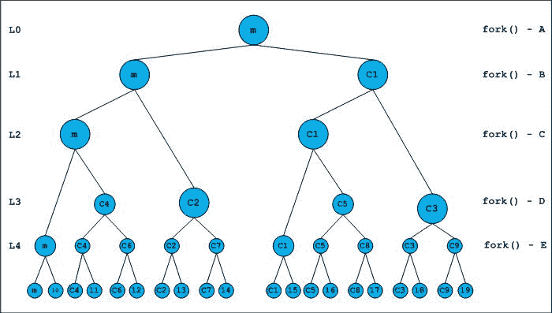

# 叉()和二叉树

> 原文:[https://www.geeksforgeeks.org/fork-and-binary-tree/](https://www.geeksforgeeks.org/fork-and-binary-tree/)

给定一个程序对 **fork()** 系统的调用。

```cpp
#include <stdio.h>
#include <unistd.h>
int main()
{
   fork();
   fork() && fork() || fork();
   fork();

   printf("forked\n");
   return 0;
}
```

执行上述程序后会衍生出多少进程？

一个 *fork()* 系统调用产卵过程作为生长二叉树的叶子。如果我们调用 fork()两次，会产生 2 <sup>2</sup> = 4 个进程。这 4 个过程构成了二叉树的叶子子树。一般来说，如果我们是级别 **l** ，并且 fork()被无条件调用，那么我们在级别( **l+1** )会有**2<sup>l</sup>T9】流程。它相当于一个二叉树中最大子节点数的级别( **l+1** )。**

作为另一个例子，假设我们已经无条件地调用了 fork()调用 3 次。我们可以用一个完整的三级二叉树来表示衍生过程。在第 3 级，我们将有 2 <sup>3</sup> = 8 个子节点，这对应于正在运行的进程数量。

**关于 C/C++逻辑运算符的一个注记:**

逻辑运算符&&的优先级高于||，并且具有从左到右的关联性。执行左操作数后，将估计最终结果，右操作数的执行取决于左操作数的结果以及操作类型。

在 AND (&&)的情况下，左操作数求值后，只有当左操作数求值为**非零**时，才会求值右操作数。在 OR (||)的情况下，左操作数求值后，只有当左操作数求值为**0**时，才会求值右操作数。

**fork()返回值:**

fork()的手册页引用了以下关于返回值的摘录，

"*成功后，父进程返回子进程的 PID，* *0 返回子进程。失败时，在父进程中返回-1，* *不创建子进程，并适当设置 errno。*”

PID 就像进程的句柄，表示为*无符号整数*。我们可以得出结论，fork()将在父级返回非零值，在子级返回零。让我们分析一下这个程序。为了便于标注，请如下所示标记每个分叉()

```cpp
#include <stdio.h>
int main()
{
   fork(); /* A */
   ( fork()  /* B */ &&
     fork()  /* C */ ) || /* B and C are grouped according to precedence */
   fork(); /* D */
   fork(); /* E */

   printf("forked\n");
   return 0;
}
```

下图提供了分叉新流程的图示。所有新创建的进程在树的右侧传播，父进程在树的左侧以连续的级别传播。

[](https://media.geeksforgeeks.org/wp-content/cdn-uploads/forkPuzzle.jpg)

前两个 fork()调用是无条件调用的。

在 0 级，我们只有主进程。main(图中的 m)将创建子 C1，两者都将继续执行。孩子们按照他们创作的先后顺序被编号。

在第 1 层，我们运行 m 和 C1，并准备执行 fork()–B(注意，B、C 和 D 被命名为&和||运算符的操作数)。初始表达式 B 将在该级别运行的每个子进程和父进程中执行。

在第 2 层，由于 m 和 C1 执行的 fork()–B，我们有 m 和 C1 作为父母，C2 和 C3 作为孩子。

fork()–B 的返回值在父级非零，在子级为零。由于第一个操作符是&&，由于返回值为零，C2 和 C3 的孩子**不会**执行下一个表达式(fork()- C)。父进程 m 和 C1 将继续使用 fork()–c .子进程 C2 和 C3 将直接执行 fork()–D，以评估逻辑或运算的值。

在第 3 级，我们有 m、C1、C2、C3 作为运行流程，C4、C5 作为子流程。表达式现在简化为((B && C) || D)，此时(B && C)的值是显而易见的。在父母身上是非零的，在孩子身上是零的。因此，知道整体 B && C || D 的结果的父母，将跳过 fork()–D 的执行。因为，在评估为零的孩子(B && C)中，他们将执行 fork()–D。我们应该注意，在 2 级创建的孩子 C2 和 C3，也将运行 fork()–D，如上所述。

在第 4 级，我们将有 m、C1、C2、C3、C4、C5 作为运行进程，C6、C7、C8 和 C9 作为子进程。所有这些进程都无条件执行 fork()–E，并生成一个子进程。

在第 5 级，我们将运行 20 个进程。程序(在 Ubuntu Maverick 上，GCC 4.4.5)打印了 20 次“分叉”。一次由根父(主)执行，其余由子执行。总的来说，将会产生 19 个进程。

**评价顺序备注:**

二进制运算符中表达式的求值顺序未指定。有关详细信息，请阅读帖子[操作数的评估顺序](https://www.geeksforgeeks.org/evaluation-order-of-operands/)。然而，逻辑运算符是一个例外。他们保证从左到右评估。

文基**投稿。如果你发现任何不正确的地方，或者你想分享更多关于上面讨论的话题的信息，请写评论。**