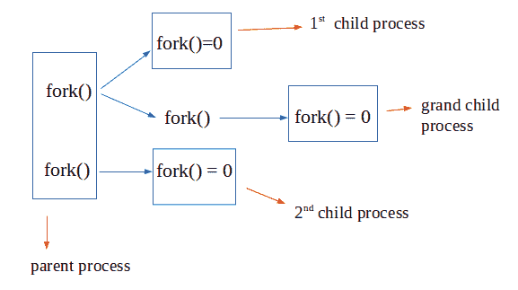

# fork()使用 wait()

从下向上执行进程

> 原文:[https://www . geeksforgeeks . org/fork-execute-processes-bottom-using-wait/](https://www.geeksforgeeks.org/fork-execute-processes-bottom-using-wait/)

[fork()](https://www.geeksforgeeks.org/fork-system-call/) 系统调用用于创建一个进程，一般称为子进程，创建它的进程称为父进程。现在，使用 fork()创建的所有进程同时运行。但是，如果我们希望创建的最后一个进程首先执行，并以这种方式自下而上执行，这样父进程最后执行，会怎么样呢？

这可以通过使用 [wait()](https://www.geeksforgeeks.org/wait-system-call-c/) 系统调用来完成。然后，父进程可以发出 wait()系统调用，在子进程执行时暂停父进程的执行，当子进程完成执行时，它将退出状态返回给操作系统。现在等待()挂起该进程，直到它的任何子进程完成执行。



**注意**:这是一个 linux 系统调用，所以必须在 linux 或者 unix 变体系统上执行。

```
// Program to demonstrate bottom to up execution
// of processes using fork() and wait()
#include <iostream>
#include <sys/wait.h> // for wait()
#include <unistd.h> // for fork()
int main()
{
    // creating 4 process using 2 fork calls
    // 1 parent : 2 child : 1 grand-child
    pid_t id1 = fork();
    pid_t id2 = fork();

    // parent process
    if (id1 > 0 && id2 > 0) {
        wait(NULL);
        wait(NULL);
        cout << "Parent Terminated" << endl;
    }

    // 1st child
    else if (id1 == 0 && id2 > 0) {

        // sleep the process for 2 seconds
        // to ensure 2nd child executes first
        sleep(2);
        wait(NULL);
        cout << "1st child Terminated" << endl;
    }

    // second child
    else if (id1 > 0 && id2 == 0) {
        // sleep the process for 1 second
        sleep(1);
        cout << "2nd Child Terminated" << endl;
    }

    // grand child
    else {
        cout << "Grand Child Terminated" << endl;
    }

    return 0;
}
```

输出:

```
Grand Child Terminated
2nd Child Terminated
1st child Terminated
Parent Terminated

```